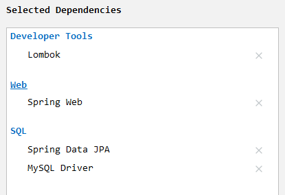
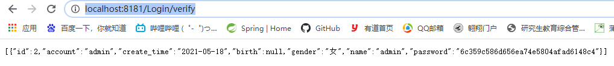

# PersonBlogServer-1

[TOC]

# 1、创建数据库

数据库创建用户表，并插入管理员用户。

```sql
create database `note`;
use `note`;
create table `user`(
	`id` int(20) not null AUTO_INCREMENT primary key COMMENT '用户ID',
    `account`varchar(50) default null COMMENT '用户登录账号',
    `create_time` datetime default null COMMENT '用户账号的创建时间',
    `birth` datetime default null COMMENT '用户出生年月日',
    `gender` varchar(10) default null COMMENT '用户性别',
    `name` varchar(50) default null COMMENT'用户姓名',
    `password` varchar(50) default null COMMENT'账户密码'
)engine=InnoDB default charset=utf8;

INSERT INTO `user`(`account`,`create_time`,`birth`,`gender`,`name`,`password`) VALUES
('admin','2021-05-18',null,'女','admin',MD5('12345z'));
```


# 2、新建SpringBoot项目

1. 初始化时添加的相关依赖

   

   

2. 创建好初始化的`SpringBoot`项目，配置数据库和端口号。

   ```yaml
   spring:
     datasource:
       url: jdbc:mysql://localhost:3306/note?useUnicode=true&characterEncoding=UTF-8
       username: root
       password: 123456
       driver-class-name: com.mysql.cj.jdbc.Driver
     jpa:
       show-sql: true
       properties:
         hibernate:
           format_sql: true
   
   server:
     port: 8181
   ```

3. 创建实体类。

   ```java
   @Entity
   @Data
   @AllArgsConstructor
   @NoArgsConstructor
   public class User {
       @Id
       private Integer id;
       private String account;
       private Date create_time;
       private Date birth;
       private String gender;
       private String name;
       private String password;
   }
   ```

4. 定义接口，由于使用了JPA，所有自带很多接口，直接继承即可。

   `src\main\java\com\zhang\note\repository\UserRepository.java`

   ```java
   public interface UserRepository extends JpaRepository<User,Integer> {
   }
   ```

5. 启动后台程序，浏览器中访问http://localhost:8181/Login/verify，查看数据。

   

# 3、解决跨域问题

在后台解决跨域问题：

在`src\main\java\com\zhang\note\config\CrosConfig.java`下创建`CrosConfig`类，实现`WebMvcConfigurer`接口，重写`addCorsMappings`方法。

```java
@Configuration
public class CrosConfig implements WebMvcConfigurer {
    @Override
    public void addCorsMappings(CorsRegistry registry) {
        registry.addMapping("/**")
                .allowedOriginPatterns("*")
                .allowedMethods("GET","HEAD","POST","PUT","DELETE","OPTIONS")
                .allowCredentials(true)
                .maxAge(3600)
                .allowedHeaders("*");
    }
}
```


# 注解含义

- `@repository`是用来注解接口


# 报错处理

## 1.	Error creating bean with name 'userRepository' defined in com.zhang.note.repository.UserRepository defined in @EnableJpaRepositories declared on JpaRepositoriesRegistrar.EnableJpaRepositoriesConfiguration: Invocation of init method failed; nested exception is java.lang.IllegalArgumentException: Not a managed type: class java.lang.Object

声明接口未加`<User,Integer>`，添加即可。

```java
public interface UserRepository extends JpaRepository<User,Integer> {
}
```


## 2.	java.lang.NullPointerException at com.zhang.note.repository.UserRepositoryTest.findAll(UserRepositoryTest.java:14)

空指针错误，注入bean未写@Autowired注解，没能自动注入。

```java
@Autowired
private UserRepository userRepository;
```