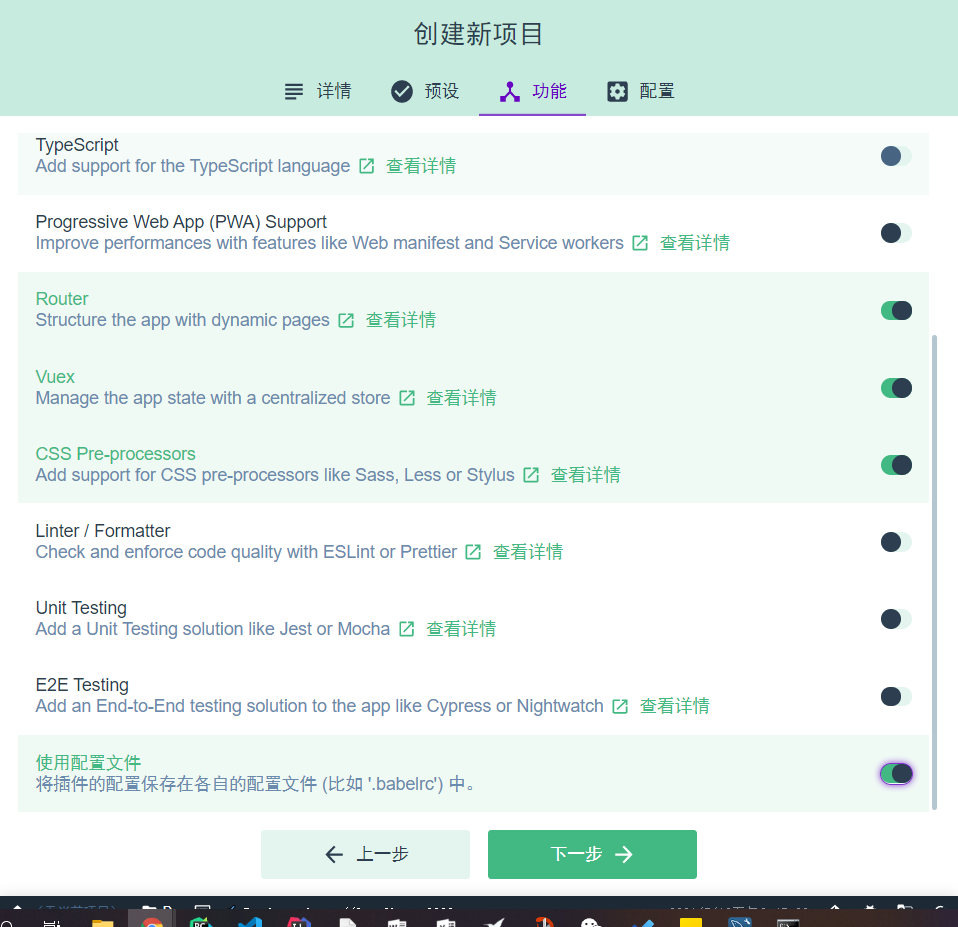
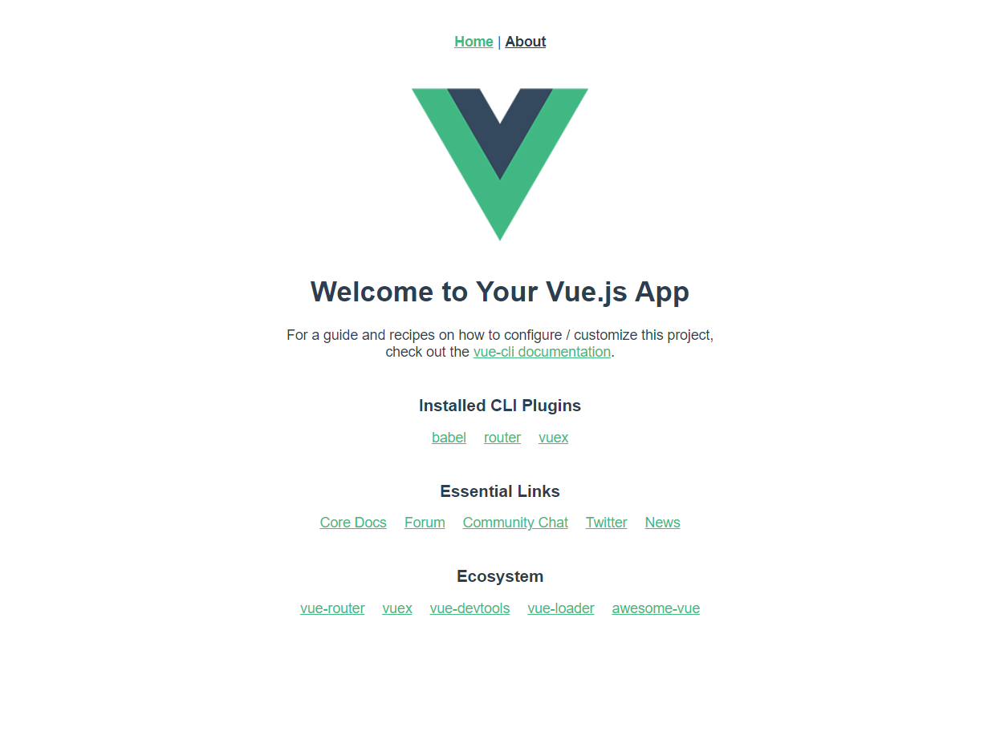
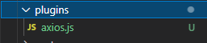

# Personal Blog 搭建指南

[TOC]


# 1、环境搭建

node verison：`12.16.2`

npm  verison：`6.14.4`

vue/cli : `4.5.13`


# 2、脚手架生成Vue3项目

​	在这之前，配置Node为国内镜像：

```shell
npm config set registry https://registry.npm.taobao.org
```

1. 安装vue-cli

   ```shell
   npm install -g @vue/cli
   ```

   安装成功后:

   ```shell
   vue -V
   @vue/cli 4.5.13
   ```

2. 创建Vue项目

   命令行启动UI创建Vue3项目。

   ```shell
   vue ui
   ```

   

   其中路由是否选择HTML5 History Mode，可以选也可以不选，在Router/index.js中可以进行设置。

3. 创建好的项目，使用VScode打开，输入`npm run serve`运行。

   

4. 前端Vue空项目搭建完成，项目目录如下。

   ```shell
     |__ .browserslistrc
     |__ .git
     |__ .gitignore
     |__ babel.config.js
     |__ node_modules
     |__ package-lock.json
     |__ package.json
     |__ public
       |__ favicon.ico
       |__ index.html
     |__ README.md
     |__ src
       |__ App.vue
       |__ assets
         |__ logo.png
       |__ components
         |__ HelloWorld.vue
       |__ main.js
       |__ router
         |__ index.js
       |__ store
         |__ index.js
       |__ views
         |__ About.vue
         |__ Home.vue
   
   ```


# 3、添加axios

1. 终端输入`vue add axios`

2. 文件目录中产生

   

   其中的语法为`Vue2`的语法，需要进行调整。

3. 打开`axios.js`，进行修改。

   ```js
   "use strict";
   
   //import Vue from 'vue';
   import axios from "axios";
   
   // Full config:  https://github.com/axios/axios#request-config
   // axios.defaults.baseURL = process.env.baseURL || process.env.apiUrl || '';
   // axios.defaults.headers.common['Authorization'] = AUTH_TOKEN;
   // axios.defaults.headers.post['Content-Type'] = 'application/x-www-form-urlencoded';
   
   let config = {
     // baseURL: process.env.baseURL || process.env.apiUrl || ""
     // timeout: 60 * 1000, // Timeout
     // withCredentials: true, // Check cross-site Access-Control
   };
   
   const _axios = axios.create(config);
   
   _axios.interceptors.request.use(
     function(config) {
       // Do something before request is sent
       return config;
     },
     function(error) {
       // Do something with request error
       return Promise.reject(error);
     }
   );
   
   // Add a response interceptor
   _axios.interceptors.response.use(
     function(response) {
       // Do something with response data
       return response;
     },
     function(error) {
       // Do something with response error
       return Promise.reject(error);
     }
   );
   
   export default _axios;
   
   ```

4. main.js中引入axios

   ```javascript
   import axios from 'axios';
   app.config.globalProperties.$axios = axios;
   ```

5. 调用方法

   ```js
   this.$axios.get('http://localhost:8181/Login/verify').then(function(resp){
           console.log(resp)
         })
   ```

   


# 报错排查

## 1、vue add axios 出现vue : 无法加载文件 c:\Users\Admin\AppData\Roaming\npm\vue.ps1，因为在此系统上禁止运行脚本。有关详细信息，请参阅 https:/go.microsoft.com/fwlink/?LinkID=135170 中的 about_Execution_Policies。
1. 查找到PowerShell，右击用管理员身份运行。
2. 输入`set-ExecutionPolicy RemoteSigned`
3. 选择a或者y都行。

## 2、跨域Access to XMLHttpRequest at 'http://localhost:8181/Login/verify' from origin 'http://localhost:8080' has been blocked by CORS policy: No 'Access-Control-Allow-Origin' header is present on the requested resource.

在后台解决跨域问题：

在`src\main\java\com\zhang\note\config\CrosConfig.java`下创建`CrosConfig`类，实现`WebMvcConfigurer`接口，重写`addCorsMappings`方法。

```java
@Configuration
public class CrosConfig implements WebMvcConfigurer {
    @Override
    public void addCorsMappings(CorsRegistry registry) {
        registry.addMapping("/**")
                .allowedOriginPatterns("*")
                .allowedMethods("GET","HEAD","POST","PUT","DELETE","OPTIONS")
                .allowCredentials(true)
                .maxAge(3600)
                .allowedHeaders("*");
    }
}
```

