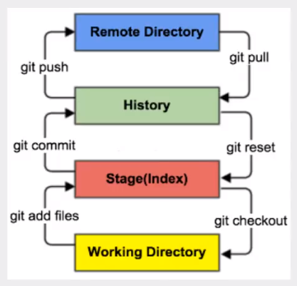

# Git学习

> 分布式版本控制系统

## 简单理论

四个工作区域：

- 工作目录
- 暂存区（Index\Stage）
- 仓库区（Repository）
- 远程仓库（Remote）




## 基本配置

`$ git config -l` 查看基础配置

> 本地存放位置 Git\etc\gitconfig中

```shell
$ git config -l
diff.astextplain.textconv=astextplain
filter.lfs.clean=git-lfs clean -- %f
filter.lfs.smudge=git-lfs smudge -- %f
filter.lfs.process=git-lfs filter-process
filter.lfs.required=true
http.sslbackend=openssl
http.sslcainfo=D:/Software/Git/mingw64/ssl/certs/ca-bundle.crt
core.autocrlf=true
core.fscache=true
core.symlinks=false
pull.rebase=false
credential.helper=manager-core
credential.https://dev.azure.com.usehttppath=true
init.defaultbranch=master
core.repositoryformatversion=0
core.filemode=false
core.bare=false
core.logallrefupdates=true
core.symlinks=false
core.ignorecase=true
```


`$ git config --global --list` 查看本地配置文件

> 本地存放位置 C:\Users\Admin\gitconfig中

> 第一次进入会显示如下，需要配置用户名和email

```shell
$ git config --global --list
fatal: unable to read config file 'C:/Users/Admin/.gitconfig': No such file or directory
```
> 配置用户名和邮箱

```shell
$ git config --global user.name "SlowHot"
$ git config --global user.email  "244167780@qq.com"
```


`ssh-keygen`绑定SSH公匙

```shell
$ ssh-keygen -t rsa 
Generating public/private rsa key pair.
Enter file in which to save the key (/c/Users/Admin/.ssh/id_rsa):
Enter passphrase (empty for no passphrase):
Enter same passphrase again:
Your identification has been saved in /c/Users/Admin/.ssh/id_rsa
Your public key has been saved in /c/Users/Admin/.ssh/id_rsa.pub
The key fingerprint is:
SHA256:vLaGaZt7hUVVXHSNKgqLw5j3DwqPSScs0+JcuUkz7lo Admin@DESKTOP-UKF002H
The key's randomart image is:
+---[RSA 3072]----+
|           ..o.+=|
|          .   o o|
|         .   .   |
|      ..  o .    |
|   + . oS+ .     |
| oo * . o..      |
|+ *E.o.oo.       |
|o==B=.=+o.       |
| +==o.+*o        |
+----[SHA256]-----+
```

> C:\Users\Admin\.ssh\id_rsa.pub中生成SHA256公匙。将公匙复制到GitHub的setting中，来绑定本地电脑。


## 工作流程

> 初始有两种选择选择1.创建一个本地仓库 或2.直接克隆

1. 本地仓库搭建

   ```shell
   $ git init
   ```
   
2. 直接克隆clone

   ```shell
   $ git clone [url]
   ```

3. 查看工作文件夹中的文件状态(有新增文件Untracked files)

   ```shell
    $ git status [filename]
    On branch master
   Your branch is up to date with 'origin/master'.
   
   Untracked files:
     (use "git add <file>..." to include in what will be committed)
           "Git\345\255\246\344\271\240.md"
   
   nothing added to commit but untracked files present (use "git add" to track)
   
   ```

4. 添加文件

   ```shell
   $ git add .
   ```

5. 再次查看文件状态（Changes to be committed）

   ```shell
   $ git status
   On branch master
   Your branch is up to date with 'origin/master'.
   
   Changes to be committed:
     (use "git restore --staged <file>..." to unstage)
           new file:   "Git\345\255\246\344\271\240.md"
   
   ```

6. 提交到本地仓库

   ```shell
   $ git commit -m "commit message"
   [master 7665630] commit message
    1 file changed, 119 insertions(+)
    create mode 100644 "Git\345\255\246\344\271\240.md"
   
   ```

7. 查看文件状态(nothing to commit)

   ``` shell
   $ git status
   On branch master
   Your branch is ahead of 'origin/master' by 1 commit.
     (use "git push" to publish your local commits)
   
   nothing to commit, working tree clean
   
   ```

8. Push到远程仓库

   ```shell
   $ git push
   Enumerating objects: 4, done.
   Counting objects: 100% (4/4), done.
   Delta compression using up to 8 threads
   Compressing objects: 100% (3/3), done.
   Writing objects: 100% (3/3), 1.67 KiB | 1.67 MiB/s, done.
   Total 3 (delta 0), reused 0 (delta 0), pack-reused 0
   To github.com:NPU-FanZhang/JavaNote.git
      9a7a3c8..7665630  master -> master
   
   ```

9. Pull从远程仓库更新（Pull）

   ``` shell
   $ git pull
   Already up to date.
   ```

10. 下次打开项目前，进行远程仓库更新（Pull）

    ```shell
    $ git pull
    Already up to date.
    ```

