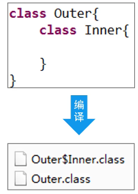

# 内部类、集合、IO

## 内部类

内部类就是`在一个类的内部再定义一个完整的类`。

特点：

- 编译后会生成独立的字节码文件。

  

- 内部类可以直接访问外部类的私有成员，而不破坏封装。

- 可以为外部类提供必要的内部功能组件。

- 创建内部类对象时，必须依赖外部类对象。

- 内部类也可以有访问修饰符，private、public

内部类包含： 

- 成员内部类

  

- 静态内部类

- 局部内部类

- 匿名内部类