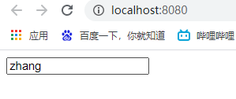
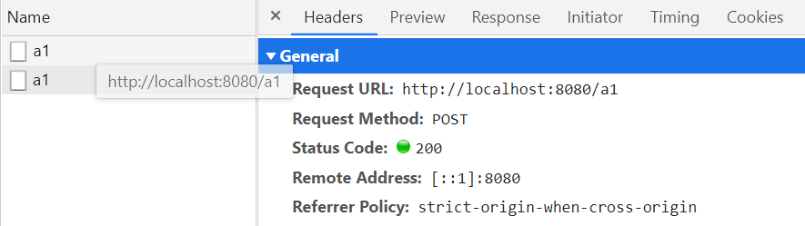
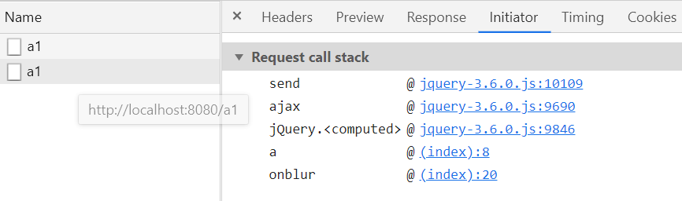
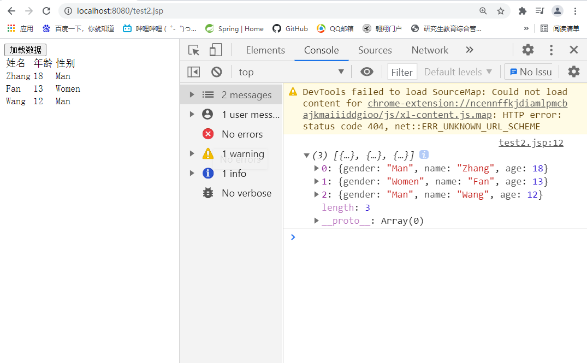
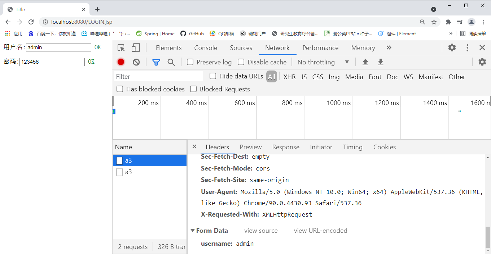

# JavaScript

> JavaScript（简称“JS”） 是一种具有函数优先的轻量级，解释型或即时编译型的编程语言。虽然它是作为开发Web页面的[脚本语言](https://baike.baidu.com/item/脚本语言/1379708)而出名，但是它也被用到了很多非浏览器环境中，JavaScript 基于原型编程、多范式的动态脚本语言，并且支持面向对象、命令式和声明式（如函数式编程）风格。

[TOC]


## 数据类型

`number` 

> `JS`不区分小数和整数
>
> 浮点数存在精度问题,一般使用如下方法解决：	
>
> ​		`Math.abs(1/3 - (1-2/3) < 0.0000001)`

``` javascript
NaN - not a number
//NaN与所有的数值都不相等，包括自己，只能使用isNaN(NaN)来测试
Infinity - 无穷大
```

`String`

``` javascript
    // ` 可以实现多行字符串
    var str = `sasd
                asd`
    //模板字符串
    var name = "0.0"
    let a = `you are ${name}`
    console.log(a)//you are 0.0
	
	//字符串可变性
    let student = "stuDent"
    student[0] = 1
    console.log(student)//stuDent string说明不可变

    console.log(student.toLowerCase())//student
    console.log(student.toUpperCase())//STUDENT
    console.log(student.indexOf('t'))//1
    console.log(student.substring(1,3))//tu
```

`Boolean`

> 只有`true  ` `false`

`逻辑运算符`

> `=` 赋值
>
> `==` 等于（类型不一样，值一样会判断为`true`）,例如 `1 == '1'`
>
> `===` 绝对等于 (类型一样，值一样，为`true`) 推荐

`null` `undefined`

> `null` - 空
>
> `undefined` - 未定义

`数组`

> 数组可以中可以不是同一类型数据，但不推荐这样使用
>
> 下标越界会显示`undefined`

``` javascript
var arr = [1,2,3,"hello",null,true];
new Array(1,2,3,"hello",null)
```

`对象`

```javascript
var Person = {
    name : "zhang",
    age:13,
    tage:['student','class1']
}
```

## 变量 `var`与`let`

> `ES5`之前使用`var`定义局部变量，`ES6`之后推荐使用`let`
>
> 严格检查模式只需要在代码第一行加上 `use strict`（ES6）


# Ajax

---

*Ajax即**Asynchronous Javascript And XML**（异步JavaScript和XML）*。

*使用Ajax技术网页应用能够快速地将增量更新呈现在用户界面上，而不需要重载（刷新）整个页面，这使得程序能够更快地回应用户的操作。*

*包括: HTML 或 XHTML, CSS, JavaScript, DOM, XML, XSLT, 以及最重要的XMLHttpRequest（XHR）。*

---

下载`jquery-3.6.0.js`，保存到`web\static\js\jquery-3.6.0.js`

在Spring中使用第三方库，要配置静态资源过滤`src\main\resources\applicationContext.xml`

```xml
<!--静态资源过滤-->
<mvc:default-servlet-handler/>
```

如果没启动成功，clean一下项目，重启Tomcat。

## 实现一个Ajax例子

`JSP`页面

```jsp
<%@ page contentType="text/html;charset=UTF-8" language="java" %>
<html>
  <head>
    <title>$Title$</title>
    <script src="${pageContext.request.contextPath}/static/js/jquery-3.6.0.js"></script>
    <script>
      function a() {
        $.post({
          url:"${pageContext.request.contextPath}/a1",
          data:{"name":$("#username").val()},
          success:function (data) {
            alert(data);
          }
        })
      }
    </script>
  </head>
  <body>
    <input type="text" id="username" onblur="a()" >
  </body>
</html>
```

`Controller`接口定义

```java
//类为@RestController
@RequestMapping("/a1")
public void a1(String name, HttpServletResponse response) throws IOException {
    System.out.println("a1=>"+name);
    if ("zhang".equals(name)){
        response.getWriter().print("true");
    }else {
        response.getWriter().print("false");
    }
}
```

启动



请求发送：



调用顺序如下：




## 实现Ajax加载数据的例子

`JSP`页面

```jsp
<%@ page contentType="text/html;charset=UTF-8" language="java" %>
<html>
<head>
    <title>Title</title>
    <script src="${pageContext.request.contextPath}/static/js/jquery-3.6.0.js"></script>
    <script>
        $(function () {
            $("#btn").click(function () {
                $.ajax({
                    url:"${pageContext.request.contextPath}/a2",
                    success:function (data) {
                        console.log(data);
                        var html ="";
                        for(let i = 0;i <data.length;i++){
                            html+=`<tr>`+
                                    `<td>`+data[i].name+`</td>`+
                                    `<td>`+data[i].age+`</td>`+
                                    `<td>`+data[i].gender+`</td>`+
                                `</tr>`;
                        }
                        $("#context").html(html);
                    }
                })
            })
        })
    </script>
</head>
<body>
<input type="button" value="加载数据" id="btn">
<table>
    <tr>
        <td>姓名</td>
        <td>年龄</td>
        <td>性别</td>
    </tr>
    <tbody id="context">
    </tbody>
</table>
</body>
</html>
```

`Controller`接口

```java
@RequestMapping("a2")
public List<User> a2(){
    List<User> userList= new ArrayList<User>();
    userList.add(new User("Man","Zhang",18));
    userList.add(new User("Women","Fan",13));
    userList.add(new User("Man","Wang",12));
    return userList;
}
```

效果:

初始为空，点击加载数据后发送请求加载。




## 动态验证登录账户

`JSP`页面

```jsp
<%@ page contentType="text/html;charset=UTF-8" language="java" %>
<html>
<head>
    <title>Title</title>
    <script src="${pageContext.request.contextPath}/static/js/jquery-3.6.0.js"></script>
    <script>
        function a1() {
            $.post({
                url:"${pageContext.request.contextPath}/a3",
                data:{"username":$("#name").val()},
                success:function (data) {
                    if (data.toString()==="OK"){
                        $("#userInfo").css("color","green");
                    }
                    $("#userInfo").html(data);
                }
            })
        };
        function a2() {
            $.post({
                url:"${pageContext.request.contextPath}/a3",
                data:{"pwd":$("#pwd").val()},
                success:function (data) {
                    if (data.toString()==="OK"){
                        $("#pwdInfo").css("color","green");
                    }
                    $("#pwdInfo").html(data);
                }
            })
        };
    </script>
</head>
<body>
<P>
    用户名:<input type="text" id="name" onblur="a1()">
    <span id="userInfo"></span>
</P>
<P>
    密码:<input type="text" id="pwd" onblur="a2()">
    <span id="pwdInfo"></span>
</P>
</body>
</html>
```

`Controller`接口

```java
@RequestMapping("/a3")
public String a3(String username,String pwd){
    String msg="";
    if (username!=null){
        if ("admin".equals(username)){
            msg="OK";
        }
        else {
            msg="用户名不存在";
        }
    }
    if (pwd != null){
        if ("123456".equals(pwd)){
            msg="OK";
        }
        else {
            msg="密码有误";
        }
    }
    return msg;
}
```

结果



乱码的话，需要在`src\main\resources\applicationContext.xml`中配置乱码过滤：

```xml
<mvc:annotation-driven>
    <mvc:message-converters>
        <bean class="org.springframework.http.converter.StringHttpMessageConverter">
            <constructor-arg value="UTF-8"/>
        </bean>
        <bean class="org.springframework.http.converter.json.MappingJackson2HttpMessageConverter">
            <property name="objectMapper">
                <bean class="org.springframework.http.converter.json.Jackson2ObjectMapperFactoryBean">
                    <property name="failOnEmptyBeans" value="false"/>
                </bean>
            </property>
        </bean>
    </mvc:message-converters>
</mvc:annotation-driven>
```

