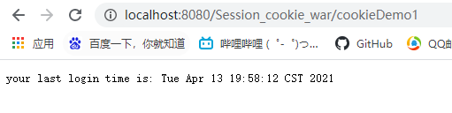
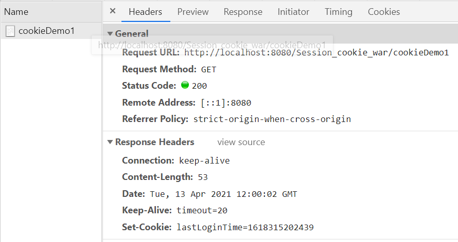
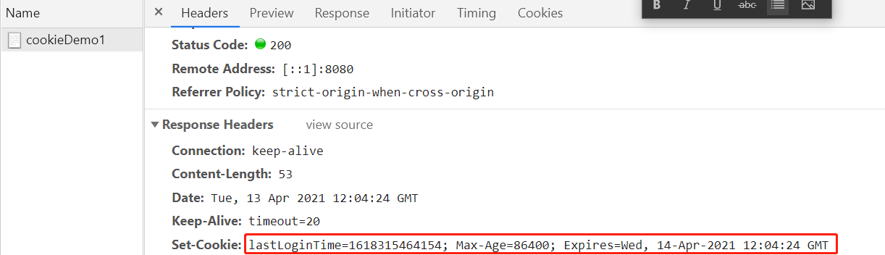
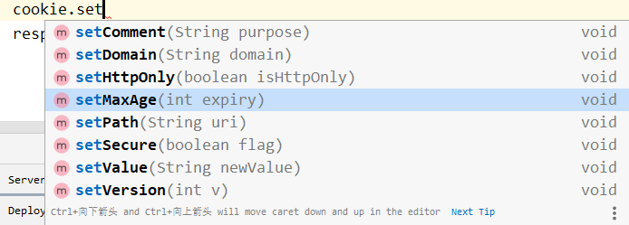
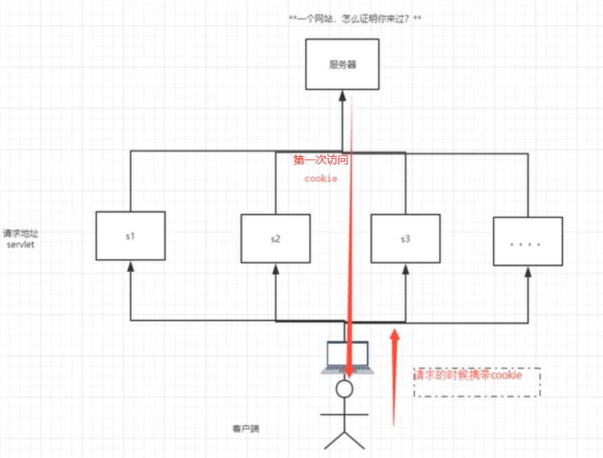
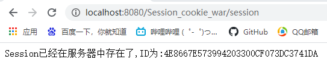
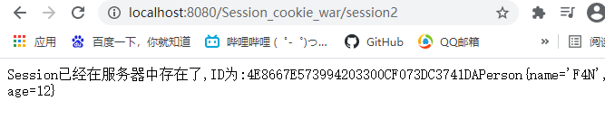
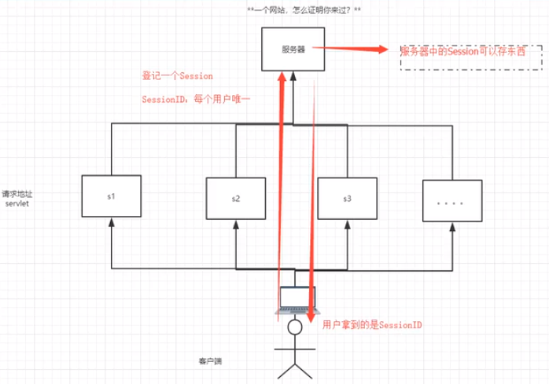

# Cookie、Session

[TOC]

一个网站，如何证明客户端访问过？

1. 服务器给客户端一个信件cookie，客户端下次访问服务器只需要带上cookie便可证明之前已经访问过。
2. 服务器登记过访问，下次只需要来进行session匹配。

## Cookie

> 1. 从请求中拿到cookie的信息
> 2. 服务器响应给客户端cookie
> 3. 本质就是一个键值对

### 通过Cookie实现保存上一次访问时间

```java
    //保存用户上一次访问时间
    @Override
    protected void doGet(HttpServletRequest req, HttpServletResponse resp) throws ServletException, IOException {
        //解决乱码
        req.setCharacterEncoding("utf-8");
        resp.setCharacterEncoding("utf-8");
		resp.setContentType("text/html;charset=utf-8");
        PrintWriter out = resp.getWriter();
        //cookie 服务器端从客户端获取
        //返回数组, 说明可能存在多个cookie
        Cookie[] cookies = req.getCookies();
        //判断cookie是否存在
        if(cookies!=null){
            out.write("your last login time is: ");
            for (int i = 0; i < cookies.length; i++) {
                Cookie cookie = cookies[i];
                //获取cookie名称
                if (cookie.getName().equals("lastLoginTime"))
                {
                    //获取cookie中的值
                    long lastLoginTime = Long.parseLong(cookie.getValue());
                    Date date = new Date(lastLoginTime);
                    out.write(String.valueOf(date));
                }
            }
        }else
        {
            out.write("this is your first login");
        }
        //服务器给客户端响应一个cookie
        Cookie cookie = new Cookie("lastLoginTime",System.currentTimeMillis()+"");
        //cookie的生存时长为一天
        cookie.setMaxAge(24*60*60);
        resp.addCookie(cookie);

    }
```

第一次进入不显示时间, 刷新后显示:



Cookie对应的值:



设置Cookie的生存时间后:




### Cookie的常用操作

```java
Cookie[] cookies = req.getCookies();//获取Cookie
cookie.getName()//获得Cookie中的key
cookie.getValue()//获得Cookie中的value
Cookie cookie = new Cookie("lastLoginTime",System.currentTimeMillis()+"");//新建一个Cookie
cookie.setMaxAge(24*60*60);//设置cookie的生存时长为一天
resp.addCookie(cookie);//响应给客户端
```

Cookie常用设置



### Cookie细节问题

- 一个Cookie只能保存一个信息;
- 一个Web站点可以给浏览器发送多个Cookie, 最多存放20多个Cookie；
- Cookie大小限制为4 Kb；
- 300个Cookie一般为浏览器上限。

**删除Cookie**

- 不设置有效期，关闭浏览器自动失效。
- 将Cookie有效期设置为0 ----------比较取巧


如果在Cookie中传输中文，为了避免网络传输的乱码问题，可以进行编码解码：

```java
URLEncoder.encode("张凡","utf-8")//编码
URLDecoder.decode(cookie.getValue(),"utf-8")//解码
```


### Cookie验证客户端是否访问过



## Session(重点)

> Session：在计算机中，尤其是在网络应用中，称为“会话控制”。
>
> - Session对象存储特定用户会话所需的属性及配置信息。
> - 当用户请求来自应用程序的 Web页时，如果该用户还没有会话，则Web服务器将自动创建一个 Session对象。
>
> - 这样，当用户在应用程序的Web页之间跳转时，存储在Session对象中的变量将不会丢失，而是在整个用户会话中一直存在下去。
>
> - 当会话过期或被放弃后，服务器将终止该会话。Session 对象最常见的一个用法就是存储用户的首选项。例如，如果用户指明不喜欢查看图形，就可以将该信息存储在Session对象中。
>
> - 注意会话状态仅在支持cookie的浏览器中保留

### Session的使用

获取session并保存属性setAttribute

```java
    @Override
    protected void doGet(HttpServletRequest req, HttpServletResponse resp) throws ServletException, IOException {
        //解决乱码
        req.setCharacterEncoding("utf-8");
        resp.setCharacterEncoding("utf-8");
        resp.setContentType("text/html;charset=utf-8");

        //得到session
        HttpSession session = req.getSession();

        //session 中保存数据
        session.setAttribute("name",new Person("F4N",12));

        //获取sessionID
        String sessionId = session.getId();

        //判断session是否为新建的
        if(session.isNew())
        {
            resp.getWriter().write("session创建成功,ID为:" +sessionId);
        }else
        {
            resp.getWriter().write("Session已经在服务器中存在了,ID为:"+sessionId);
        }

//        session做了什么事情
//        Cookie cookie = new Cookie("JSESSIONID",sessionId);
//        resp.addCookie(cookie);
    }
```



可以在另外一个Servlet接口中获取刚才设置的属性

```java
//得到session
HttpSession session = req.getSession();

Person name = (Person)session.getAttribute("name");
resp.getWriter().write("Session已经在服务器中存在了,ID为:"+session.getId());
resp.getWriter().write(name.toString());
```



移除属性和注销session

```java
//得到session
HttpSession session = req.getSession();
session.removeAttribute("name");
session.invalidate();//注销session,但服务器会自动重建一个
```


`web.xml`中设置session的失效时间

```xml
<!--  设置session失效时间-->
  <session-config>
<!--    1分钟后自动失效,以分钟为单位-->
    <session-timeout>1</session-timeout>
  </session-config>
```


### Session与Cookie区别

- Cookie是把用户的数据写给用户的浏览器，浏览器保存（可以保存多个）
- Session是把用户的数据写到用户独占Session中，服务器端保存（保存重要信息，减少服务器资源的浪费）
- Session对象由服务器创建；

使用场景:

- 保存用户的登录信息
- 购物车信息
- 整个网站中经常使用的数据,我们讲它保存在session中

### Session验证客户是否访问过

