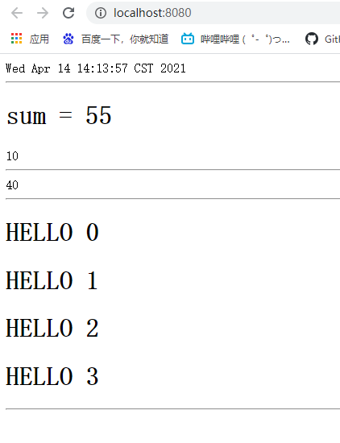
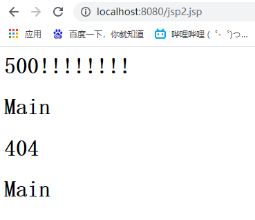
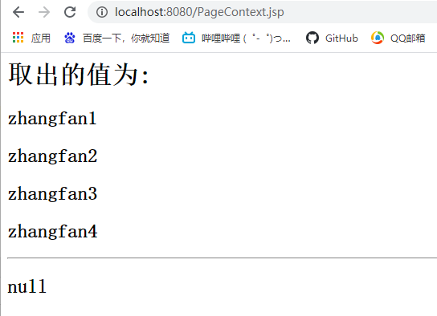

# JSP

> 什么是JSP？
>
> ​		Java Server Page : Java服务器端页面，也和Servlet一样，用于动态Web技术。

[TOC]

## 1. JSP特点

- 写JSP就像写HTML
- 与HTML区别
  - HTML只能给用户提供静态数据
  - JSP页面中可以嵌入JAVA代码，为用户提供动态数据
- 同样缺点就是不能前后端分离开发


## 2. JSP原理

JSP是如何执行的?

​		服务器内部会创建一个工作目录，生成将JSP代码生成对应的JAVA代码

- Tomcat目录在

  `D:\apache-tomcat-9.0.45-windows-x64\apache-tomcat-9.0.45\work\Catalina\localhost`

- IDEA目录在

  `C:\Users\Admin\AppData\Local\JetBrains\IntelliJIdea2020.1\tomcat\Unnamed_EmptyServlet\work\Catalina\localhost\Request_war\org\apache\jsp`

**浏览器向服务器发送请求，不管访问什么资源，其实都在访问Servlet！**

JSP最终也会被转换成一个Java类！

```java
public final class index_jsp extends HttpJspBase implements JspSourceDependent, JspSourceImports
```

JSP本质上是一个Java类，`_jspService`为最主要的函数，JSP的页面都会渲染到`_jspService`中。

```java
//初始化
public void _jspInit() 
//销毁
public void _jspDestroy()
//服务JSPService
public void _jspService(HttpServletRequest request, HttpServletResponse response) throws IOException, ServletException
```

JSP生成的类的主要作用:

1. 判断请求

2. 内置一些对象

   ```java
   final javax.servlet.jsp.PageContext pageContext;//页面上下文
   javax.servlet.http.HttpSession session = null;	//session
   final javax.servlet.ServletContext application;	//application
   final javax.servlet.ServletConfig config;		//config
   javax.servlet.jsp.JspWriter out = null;			//out
   final java.lang.Object page = this;				//page当前
   javax.servlet.jsp.JspWriter _jspx_out = null;	
   javax.servlet.jsp.PageContext _jspx_page_context = null;
   HttpServletRequest request						//请求
   HttpServletResponse response					//响应
   ```

3. 输出页面前，增加的代码

   ```java
   response.setContentType("text/html;charset=UTF-8");
   pageContext = _jspxFactory.getPageContext(this, request, response,
            null, true, 8192, true);
   _jspx_page_context = pageContext;
   application = pageContext.getServletContext();
   config = pageContext.getServletConfig();
   session = pageContext.getSession();
   out = pageContext.getOut();
   _jspx_out = out;
   ```

4. 以上的这些对象中，可以在jsp页面中直接使用。

5. jsp页面中的Java代码会原封不动的编译到Jsp.class中

6. html代码输出为下面这种形式

   ```java
   out.write("<h1>Login</h1>\n");
   ```
   
   以这样的形式,输出到客户端。


## 3. JSP基本语法

​	JSP作为Java技术的一种扩展应用，它拥有一些自己的扩充语法，支持所有Java语法。

###  1. JSP表达式

```jsp
<!--  HTML注释  会输出到客户端--%>
<%--  --%> //JSP注释   不会输出到客户端
<%= 变量或表达式 %>
<%--Jsp脚本片段--%>
<%! 代码段 %>
<%@page isErrorPage="true" %>//显示的声明为错位页面
<%@page pageEncoding="utf-8" %>
```

例子:

```jsp
<%@ page contentType="text/html;charset=UTF-8" language="java" %>
<html>
  <head>
    <title>$Title$</title>
  </head>
  <body>
  <!--  HTML注释  会输出到客户端--%>
  <%--  JSP注释   不会输出到客户端--%>

  <%--JSP表达式,将程序的输出,输出到客户端
      <%= 变量或表达式 %>
  --%>
  <%= new java.util.Date()%>
  <hr>
  <%--Jsp脚本片段--%>
  <%
    int sum = 0;
    for (int i = 1;i<=10;i++)
    {
      sum+=i;
    }
    out.println("<h1>sum = "+sum+"</h1>");
  %>
  <%
    int x = 10;
    out.println(x);
  %>
  <hr>
  <%
    int y = 30;
    out.println(x+y);
  %>
  <hr>
  <%--在代码中嵌入HTML元素--%>
  <%
    for (int i = 0; i < 4 ; i++) {
  %>
  <h1>HELLO  <%= i%></h1>
  <%
    }
  %>
  <hr>
<%--  JSP声明 <%! 代码段 %> 定义的代码会在_jspService外,其他的会声明到_jspService方法内--%>
  <%!
    static {
      System.out.println("Loading Servlet");
    }
    private int global = 0;
    public void zhang(){
      System.out.println("FUCK");
    }
  %>
  </body>
</html>
```

效果如下:



### 2. 定制错误页面

1. 在web.xml中配置

   ```xml
   <error-page>
    <error-code>500</error-code>
    <location>/error/e500.jsp</location>
   </error-page>
   <error-page>
    <error-code>404</error-code>
    <location>/error/e404.jsp</location>
   </error-page>
   ```

2. 在页面头部配置

   ```jsp
   <%@ page errorPage="error/e500.jsp" %>
   ```


### 3.Jsp标签

```jsp
<%--会将两个页面合二为一--%>
<%@include file="error/e500.jsp" %>
<h1>Main</h1>

<%--JSP标签,拼接页面,本质还是两个页面--%>
<jsp:include page="error/e404.jsp" />
<h1>Main</h1>
```

结果:



### 4. 九个内置对象

- PageContext  存信息
- Request  存信息
- Response
- Session  存信息
- Application [ServletContext] 存信息
- Config [ServletConfig]
- Out
- Page  几乎不用
- Exception

内置对象的使用:

```jsp
<body>
<%
    pageContext.setAttribute("name1","zhangfan1");  //保存的数据只在一个页面中有效
    request.setAttribute("name2","zhangfan2");      //保存的数据只在一次请求中有效, 请求转发会携带这个数据
    session.setAttribute("name3","zhangfan3");      //保存的数据只在一次会话中有效, 从打开浏览器到关闭浏览器
    application.setAttribute("name4","zhangfan4");  //保存的数据只在服务器中有效, 从打开浏览器到关闭服务器
%>
<%--脚本片段中的代码会原封不动的生成到JSP.java中--%>
<%
    //从pageContext中取出
    String name1 = (String)pageContext.getAttribute("name1");
    String name2 = (String)pageContext.findAttribute("name2");
    String name3 = (String)pageContext.findAttribute("name3");
    String name4 = (String)pageContext.findAttribute("name4");
    String name5 = (String)pageContext.findAttribute("name5");//不存在
%>
<h1>取出的值为:</h1>
<h2>${name1}</h2>
<h2>${name2}</h2>
<h2>${name3}</h2>
<h2>${name4}</h2>
<h2>${name5}</h2>
<hr>
<h2><%= name5%></h2>

</body>
```

效果:




`request`:客户端向服务器发送请求,产生的数据,用户看完就没用了,比如:新闻

`session`:客户端向服务器发送请求,产生的的数据，用户用完一会还有用，比如：购物车

`application`：客户端向服务器发送请求，产生的数据，一个用户用完了，其他用户还能使用，比如：聊天记录


### 5.JSP标签、JSTL标签，EL表达式

使用EL表达式和JSTL标签需要在`web.xml`中先导入包

```xml
<dependency>
    <groupId>javax.servlet.jsp.jstl</groupId>
    <artifactId>javax.servlet.jsp.jstl-api</artifactId>
    <version>1.2.2</version>
</dependency>
<dependency>
    <groupId>taglibs</groupId>
    <artifactId>standard</artifactId>
    <version>1.1.2</version>
</dependency>
```

#### JSP标签

有一部分在上面

```jsp
<jsp:forward page="PageContext.jsp">
    <jsp:param name="name1" value="value1"/>
    <jsp:param name="name2" value="value2"/>
</jsp:forward>
```


#### EL表达式 :${}

-  获取数据
- 执行运算
- 获取Web开发的常用对象


#### JSTL标签

JSTL标签的使用,就是为了弥补HTML标签的不足，它自定义了许多标签，标签的功能和JAVA代码一致。

- 核心标签库
- 格式化输出标签
- SQL标签等


## 4. JavaBean

JavaBean就是实体类

JavaBean有特定的写法:

- 必须有一个无参构造
- 属性必须私有化
- 属性必须有对应的get/set方法

一般JavaBean用来和数据库的字段做对象关系映射(ORM)

- 表-->类
- 字段-->属性
- 行记录-->对象


