# JavaWeb笔记-Servlet

---

[TOC]

> - Servlet是SUN公司开发动态web的一门技术
> - Sun公司在这些API中提供了一个接口叫做Servlet,如果你想开发一个Servlet程序,只需要完成两个小步骤:
>   - 编写一个类,实现Servlet接口
>   - 把开发好的Java类部署到Web服务器中
>
> 把实现了Servlet接口的Java程序叫做: Servlet

## 1. 新建一个Maven项目

- 创建一个空的Maven项目, 然后配置依赖, Servlet项目需要添加两个依赖

  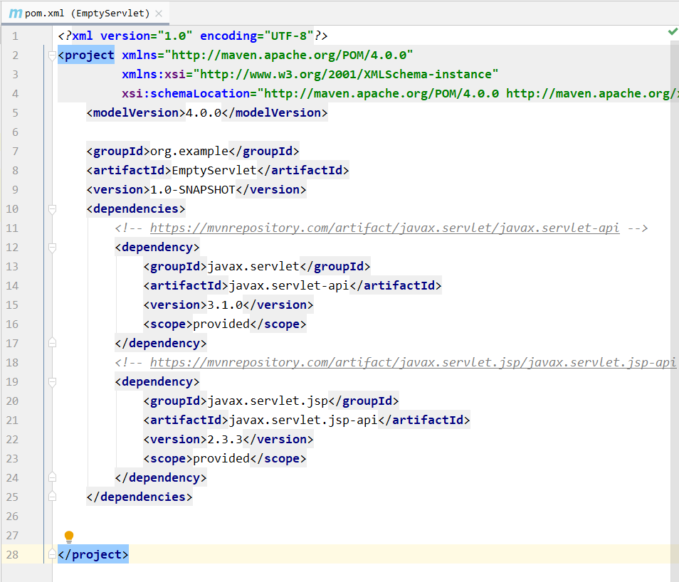

  > 配置时注意Maven仓库的问题, 我自己并没有能将依赖下载本地仓库的指定目录下, 只下载到了默认路径下, 路径配置在`D:\maven\conf\settings.xml`中

## 2. 创建Servlet Module

- 创建之后的项目属于刚才创建的空项目的子项目

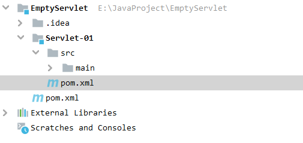

1. 关于父子项目的理解:

   父项目的`pom.xml`会出现:

   ```xml
   <modules>
       <module>Servlet-01</module>
   </modules>
   ```

   子项目可能会出现:

   ```xml
   <parent>
       <artifactId>javaweb-01</artifactId>
       <groupId>com.example</groupId>
       <version>1.0-SNAPSHOT</version>
   </parent>
   ```

   父项目的jar包, 子项目可以直接使用, 反之不行

   ```java
   son extends father
   ```

2. Maven环境优化

   1. 修改web.xml为最新(Tomcat中的web.xml)

   2. 将Maven项目的结构搭建完整

      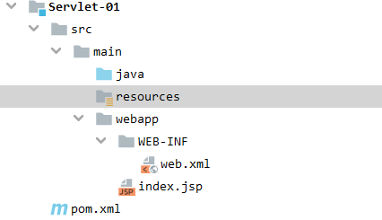

3. 编写一个Servlet程序

   1. 新建class, 实现Servlet接口类

      文件结构如下:

      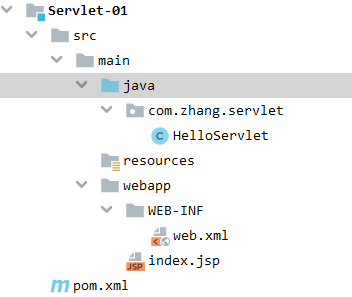

      接口类的实现原理如下:

      ```java
      public class HelloServlet extends HttpServlet {
          //继承HttpServlet的原因是因为整个包的继承关系为:
          //Servlet->GenericServlet->HttpServlet->自己定义的HelloServlet
          // 由于get或者Post只是请求实现的方式不同,可以相互调用,业务逻辑相同
          @Override
          protected void doGet(HttpServletRequest req, HttpServletResponse resp) throws ServletException, IOException {
              super.doGet(req, resp);
          }
      
          @Override
          protected void doPost(HttpServletRequest req, HttpServletResponse resp) throws ServletException, IOException {
              super.doPost(req, resp);
          }
      }
      ```

   2. 在`webapp/WEB-INF/web.xml`编写Servlet的映射

      为什么需要映射:我们所写的是Java程序, 但是要浏览器访问,  浏览器需要链接web服务器, 所以我们需要在web服务中注册我们所写的Servlet, 还需要给他一个浏览器能够访问的路径

      ```xml
      <?xml version="1.0" encoding="UTF-8"?>
      
      <web-app xmlns="http://xmlns.jcp.org/xml/ns/javaee"
               xmlns:xsi="http://www.w3.org/2001/XMLSchema-instance"
               xsi:schemaLocation="http://xmlns.jcp.org/xml/ns/javaee
                            http://xmlns.jcp.org/xml/ns/javaee/web-app_4_0.xsd"
               version="4.0"
               metadata-complete="true">
      
        <servlet>
      <!--    Servlet名称-->
          <servlet-name>hello</servlet-name>
      <!--    Servlet的实现位置-->
          <servlet-class>com.zhang.servlet.HelloServlet</servlet-class>
        </servlet>
        <servlet-mapping>
      <!--    路径所调用的Servlet名称-->
          <servlet-name>hello</servlet-name>
      <!--    浏览器输入的路径-->
          <url-pattern>/Fuck</url-pattern>
        </servlet-mapping>
      
      </web-app>
      ```

   3. 配置Tomcat

      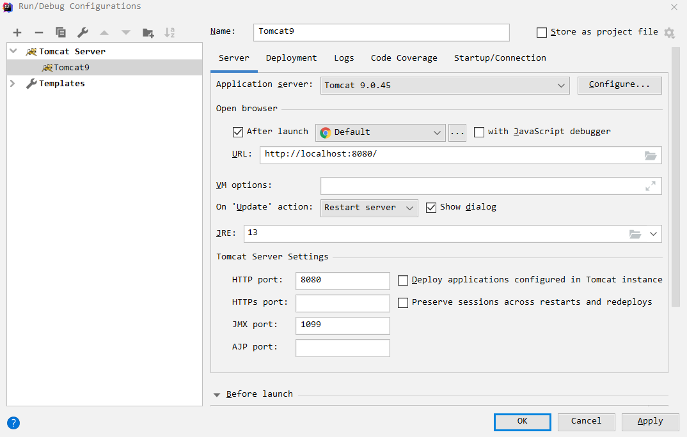

      ​	注意项目配置的路径。
      
   4. 运行Tomcat, 访问`http://localhost:8080/Servlet_01_war/Fuck`

## 3. Servlet原理

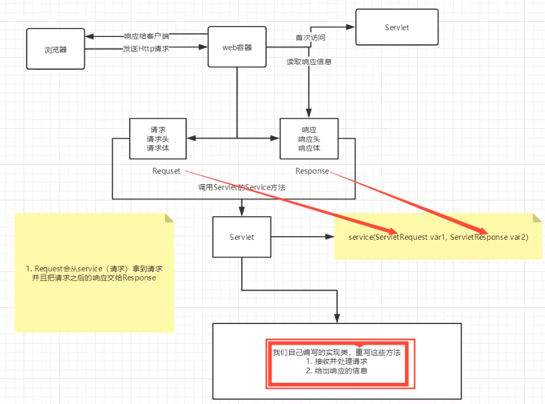


## 4. Mapping问题

- 一个Servlet可以指定一个或多个路径, 也可以指定通配符

  ```xml
  <?xml version="1.0" encoding="UTF-8"?>
  
  <web-app xmlns="http://xmlns.jcp.org/xml/ns/javaee"
           xmlns:xsi="http://www.w3.org/2001/XMLSchema-instance"
           xsi:schemaLocation="http://xmlns.jcp.org/xml/ns/javaee
                        http://xmlns.jcp.org/xml/ns/javaee/web-app_4_0.xsd"
           version="4.0"
           metadata-complete="true">
      
      <servlet>
          <!--    Servlet名称-->
          <servlet-name>hello</servlet-name>
          <!--    Servlet的实现位置-->
          <servlet-class>com.zhang.servlet.HelloServlet</servlet-class>
      </servlet>
      
      <servlet-mapping>
          <!--    路径所调用的Servlet名称-->
          <servlet-name>hello</servlet-name>
          <!--    浏览器输入的路径-->
          <url-pattern>/Fuck</url-pattern>
      </servlet-mapping>
      
      <!--    通配符-->
      <servlet-mapping>
          <!--    路径所调用的Servlet名称-->
          <servlet-name>hello</servlet-name>
          <!--    浏览器输入的路径-->
          <url-pattern>/Fuck/*</url-pattern>
      </servlet-mapping>
  
      <!-- 多个路径-->
      <servlet-mapping>
          <!--    路径所调用的Servlet名称-->
          <servlet-name>hello</servlet-name>
          <!--    浏览器输入的路径-->
          <url-pattern>/Fuck/Fuck</url-pattern>
      </servlet-mapping>
      <servlet-mapping>
          <!--    路径所调用的Servlet名称-->
          <servlet-name>hello</servlet-name>
          <!--    浏览器输入的路径-->
          <url-pattern>/Fuck/Fuck2</url-pattern>
      </servlet-mapping>
  
  </web-app>
  ```

- 默认请求路径

  ```xml
  <!--    通配符-->
  <servlet-mapping>
      <!--    路径所调用的Servlet名称-->
      <servlet-name>hello</servlet-name>
      <!--    浏览器输入的路径-->
      <url-pattern>/*</url-pattern>
  </servlet-mapping>
  ```

- 自定义后缀

  ```xml
  <!--    自定义后缀
      注意:*前面不能加任何的路径-->
  <servlet-mapping>
      <!--    路径所调用的Servlet名称-->
      <servlet-name>hello</servlet-name>
      <!--    浏览器输入的路径-->
      <url-pattern>*.zhang</url-pattern>
  </servlet-mapping>
  ```

---

**Mapping优先级问题**

指定了固有映射路径的优先级最高,如果找不到会走默认的处理请求。

```java
public class error  extends HttpServlet {
    @Override
    protected void doGet(HttpServletRequest req, HttpServletResponse resp) throws ServletException, IOException {
        resp.setContentType("text/html");
        resp.setCharacterEncoding("utf-8");
        PrintWriter writer = resp.getWriter();
        writer.print("<h1>404<h1>");
    }

    @Override
    protected void doPost(HttpServletRequest req, HttpServletResponse resp) throws ServletException, IOException {
        doGet(req, resp);
    }
}
```

```xml
<servlet>
    <!--    Servlet名称-->
    <servlet-name>error</servlet-name>
    <!--    Servlet的实现位置-->
    <servlet-class>com.zhang.servlet.error</servlet-class>
</servlet>
<servlet-mapping>
    <!--    路径所调用的Servlet名称-->
    <servlet-name>error</servlet-name>
    <!--    浏览器输入的路径-->
    <url-pattern>/*</url-pattern>
</servlet-mapping>
```

效果:

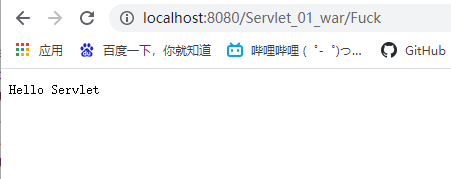

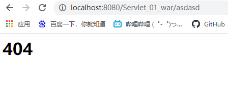

## 5. ServletContext

> WEB容器启动的时候, 他会为每个WEB程序都创建一个对应的ServletContext对象, 可以通过它来共享数据

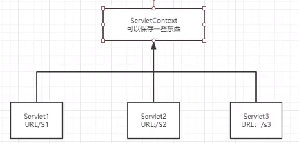

doGet方法的一些内置方法:

```java
//        this.getInitParameter()   获取初始化参数
//        this.getServletConfig()   获取Servlet配置 在web.xml中也有
//        this.getServletContext()  获取Servlet上下文对象--重点
```

------

数据共享方法举例:

- 在`helloServlet`中设置数据

  ```java
  public class helloServlet extends HttpServlet {
      @Override
      protected void doGet(HttpServletRequest req, HttpServletResponse resp) throws ServletException, IOException {
  //        this.getInitParameter()   获取初始化参数
  //        this.getServletConfig()   获取Servlet配置 在web.xml中也有
  //        this.getServletContext()  获取Servlet上下文--重点
          ServletContext servletContext = this.getServletContext();
          String userName = "张凡";
  //        将一个数据保存在了ServletContext中了,可以在其他程序中获取
          servletContext.setAttribute("Name",userName);
          System.out.println("hello!!!!!!!");
      }
  
      @Override
      protected void doPost(HttpServletRequest req, HttpServletResponse resp) throws ServletException, IOException {
          doGet(req, resp);
      }
  }
  ```

- 在`getContext`中获取对象:

  ```java
  public class getContext extends HttpServlet {
      @Override
      protected void doGet(HttpServletRequest req, HttpServletResponse resp) throws ServletException, IOException {
          ServletContext servletContext = this.getServletContext();
          String name =(String)servletContext.getAttribute("Name");
  
          resp.setContentType("text/html");
          resp.setCharacterEncoding("utf-8");
          resp.getWriter().print("姓名"+name);
      }
      @Override
      protected void doPost(HttpServletRequest req, HttpServletResponse resp) throws ServletException, IOException {
          doGet(req, resp);
      }
  }
  ```

测试效果:需要先访问`http://localhost:8080/Servlet_02_war/hello`然后再访问`http://localhost:8080/Servlet_02_war/getContext`,结果:

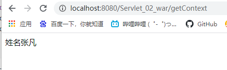

------

获取初始化参数:

- 初始化:

  ```xml
  <context-param>
      <param-name>url</param-name>
      <param-value>jdbc:mysql://localhost:3306/mybatis</param-value>
  </context-param>
  ```

- 获取:

  ```java
  @Override
  protected void doGet(HttpServletRequest req, HttpServletResponse resp) throws ServletException, IOException {
      ServletContext servletContext = this.getServletContext();
      String url = servletContext.getInitParameter("url");
      resp.getWriter().print(url);
  }
  ```

------

请求转发:

- 配置转发

  ```java
  public class demo4 extends HttpServlet {
      @Override
      protected void doGet(HttpServletRequest req, HttpServletResponse resp) throws ServletException, IOException {
          System.out.println("enter demo04");
          ServletContext servletContext = this.getServletContext();
  //        RequestDispatcher requestDispatcher = servletContext.getRequestDispatcher("/GetServlet");//转发的请求路径
  //        requestDispatcher.forward(req,resp);//调用forward方法实现请求转发
  //        上面两行代码等价于下面这一行代码
          servletContext.getRequestDispatcher("/GetServlet").forward(req,resp);
  
      }
      @Override
      protected void doPost(HttpServletRequest req, HttpServletResponse resp) throws ServletException, IOException {
          doGet(req, resp);
      }
  }
  ```

- 效果如下:

  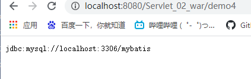

  访问`demo04`转到了`GetServlet`,但路由地址不会变化

---

读取资源文件:

- 在resources目录下新建properties

发现:都被打包到了同一目录下:classes ,我们俗称这个路径为classPath

在resources下新建db.properties:

```properties
username=root
password=123456
```

在doGet方法中读取:

```java
@Override
protected void doGet(HttpServletRequest req, HttpServletResponse resp) throws ServletException, IOException {
    System.out.println("enter demo05");
    InputStream resourceAsStream = this.getServletContext().getResourceAsStream("/WEB-INF/classes/db");

    Properties properties = new Properties();
    properties.load(resourceAsStream);
    String userName = properties.getProperty("username");
    String passWord = properties.getProperty("password");
    resp.getWriter().print("username = " +userName+" passWord = "+  passWord);

}
```

效果如下:

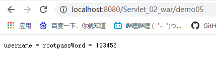


## 6. HttpServletResponse

> Web服务器接收到客户端的http请求, 针对这个请求, 分别创建一个代表请求的`HttpServletRequest`对象和一个代表响应的`HttpServletResponse`对象。
>
> - 如果需要获取客户端请求过来的参数:`HttpServletRequest`
> - 如果要给客户端响应一些信息:`HttpServletResponse`

### 1.简单分类

向浏览器发送数据

```java
public ServletOutputStream getOutputStream() throws IOException;
public PrintWriter getWriter() throws IOException;
```

负责向浏览器发送响应头

```java
public void setDateHeader(String name, long date);
public void setIntHeader(String name, int value);
public void setStatus(int sc);
public void setContentType(String type);
public void setBufferSize(int size);
public void setContentLength(int len);
public String getCharacterEncoding();
```

响应状态码

```java
public static final int SC_NOT_FOUND = 404;
public static final int SC_ACCEPTED = 202;
public static final int SC_HTTP_VERSION_NOT_SUPPORTED = 505;
public static final int SC_GATEWAY_TIMEOUT = 504;
```

### 2.常见应用

1. 向浏览器输出消息

   ``` java
   public ServletOutputStream getOutputStream() throws IOException;
   public PrintWriter getWriter() throws IOException;
   ```

2. 下载文件

   1. 获取下载文件的路径
   2. 或许下载文件名
   3. 让浏览器支持我们所下载的东西
   4. 获取下载文件的输入流
   5. 创建缓冲区
   6. 获取OutputStream对象
   7. 将FileOutputStream流写入到buffer缓冲区中
   8. 使用OutputStream将缓冲区的数据输出到客户端
   
   ```java
   public class FileDownload extends HttpServlet {
       @Override
       protected void doGet(HttpServletRequest req, HttpServletResponse resp) throws ServletException, IOException {
   //        1. 获取下载文件的路径
           String realPath = "E:\\JavaProject\\EmptyServlet\\response\\target\\classes\\wall.jpg";
           System.out.println("download file url:"+realPath);
   //        2. 或许下载文件名 获取路径最后一个斜杠位置+1 就是文件名的起始位置
           String fileName = realPath.substring((realPath.lastIndexOf("\\") + 1));
   //        3. 让浏览器支持我们所下载的东西
           resp.setHeader("Content-Disposition","attachment;fileName = "+ URLEncoder.encode(fileName,"UTF-8"));
   //        4. 获取下载文件的输入流
           FileInputStream in = new FileInputStream(realPath);
   //        5. 创建缓冲区
           int len = 0;
           byte[] buffer = new byte[1024];
   //        6. 获取OutputStream对象
           ServletOutputStream outputStream = resp.getOutputStream();
   //        7. 将FileOutputStream流写入到buffer缓冲区中,使用OutputStream将缓冲区的数据输出到客户端
           while ((len = in.read(buffer))>0)
           {
               outputStream.write(buffer,0,len);
           }
           outputStream.close();
           in.close();
       }
   }
   ```
   
3. 实现验证码

   


## 7.HttpServletRequest


