# JavaWeb笔记

> Java Web，是用Java技术来解决相关web互联网领域的技术栈。web包括：web服务端和web客户端两部分。Java在客户端的应用有Java Applet，不过使用得很少，Java在服务器端的应用非常的丰富，比如[Servlet](https://baike.baidu.com/item/Servlet/477555)，[JSP](https://baike.baidu.com/item/JSP/141543)、第三方框架等等。

[TOC]

## Web请求流程

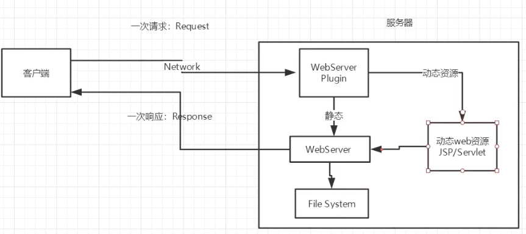

## WEB服务器

> 语言:
>
> - **ASP**
> - **PHP**
> - **JSP/Servlet**

### Tomcat

> Tomcat是Apache 软件基金会（Apache Software Foundation）的Jakarta 项目中的一个核心项目最新的Servlet 和JSP 规范总是能在Tomcat 中得到体现，成为目前比较流行的Web 应用服务器。Tomcat 服务器是一个免费的开放源代码的Web 应用服务器，属于轻量级应用[服务器](https://baike.baidu.com/item/服务器)，在中小型系统和并发访问用户不是很多的场合下被普遍使用，是开发和调试JSP 程序的首选。
>
> 对于一个初学者来说，可以这样认为，当在一台机器上配置好Apache 服务器，可利用它响应[HTML](https://baike.baidu.com/item/HTML)（[标准通用标记语言](https://baike.baidu.com/item/标准通用标记语言/6805073)下的一个应用）页面的访问请求。实际上Tomcat是Apache 服务器的扩展，但运行时它是独立运行的，所以当你运行tomcat 时，它实际上作为一个与Apache 独立的进程单独运行的。
>
> 当配置正确时，Apache 为HTML页面服务，而Tomcat 实际上运行JSP 页面和Servlet

#### 配置和启动

1. 下载[Tomcat](https://tomcat.apache.org/download-10.cgi)

2. 解压 

   > Tomcat文件夹目录:
   >
   > 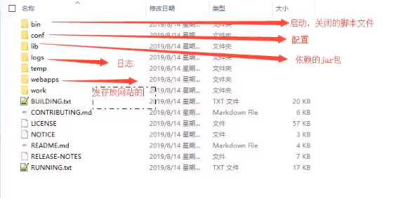

3. 可能遇到的问题:

   > 1. 配置JAVA_HOME。
   >
   > 2. 闪退问题，配置问题，JDK和JRE的环境变量要配好，最好是系统和用户环境都配置。
   >
   > 3. 乱码问题， 
   
4. 配置

   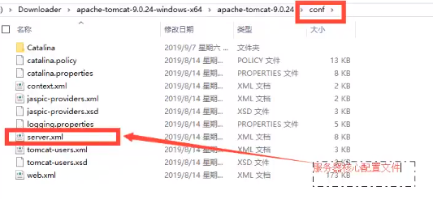

   可以配置启动的端口号：

   ```html
       <Connector port="8080" protocol="HTTP/1.1"
                  connectionTimeout="20000"
                  redirectPort="8443" />
   ```

   配置主机名称：

   ``` html
         <Host name="localhost"  appBase="webapps"
               unpackWARs="true" autoDeploy="true">
          <!-- 需要额外再配置host文件 -->   
   ```

5. 将自己写的网站写到Tomcat指定文件夹下

   `D:\apache-tomcat-10.0.5-windows-x64\apache-tomcat-10.0.5\webapps`

6. 启动Tomcat

   `D:\apache-tomcat-10.0.5-windows-x64\apache-tomcat-10.0.5\bin\startup.bat`

7. 关闭Tomcat

   `D:\apache-tomcat-10.0.5-windows-x64\apache-tomcat-10.0.5\bin\shutdown.bat`


## HTTP、HTTPS

> 超文本传输协议（Hypertext Transfer Protocol，HTTP）是一个简单的请求-响应协议，它通常运行在[TCP](https://baike.baidu.com/item/TCP/33012)之上。它指定了客户端可能发送给服务器什么样的消息以及得到什么样的响应。请求和响应消息的头以[ASCII](https://baike.baidu.com/item/ASCII/309296)形式给出；而消息内容则具有一个类似[MIME](https://baike.baidu.com/item/MIME/2900607)的格式。这个简单模型是早期[Web](https://baike.baidu.com/item/Web/150564)成功的有功之臣，因为它使开发和部署非常地直截了当。
>
> HTTP规范定义了9种请求方法，每种请求方法规定了客户和服务器之间不同的信息交换方式，常用的请求方法是GET和POST。服务器将根据客户请求完成相应操作，并以应答块形式返回给客户，最后关闭连接。
>
> **HTTP**
>
> - 端口号80
>
> **HTTPS**
>
> - 端口号443

### 请求

```js
Request URL: https://www.baidu.com/
Request Method: GET
Status Code: 200 OK
Remote Address: 14.215.177.38:443
Referrer Policy: unsafe-url
```

```java
Accept:支持的数据类型
Accept-Encoding: gzip, deflate, br //支持的编码格式
Accept-Language: zh-CN,zh;q=0.9 //语言环境
Cache-Control: max-age=0		//缓存控制
Connection: keep-alive			
Host: www.baidu.com				//主机
Upgrade-Insecure-Requests: 1
User-Agent: Mozilla/5.0 (Windows NT 10.0; Win64; x64) AppleWebKit/537.36 (KHTML, like Gecko) Chrome/89.0.4389.114 Safari/537.36
```

**请求行**

- 请求行中的请求方式：GET
- 请求方式：**GET、POST**、HEAD、DELETE、TRACT
  - GET：请求可携带参数较少，大小有限制，会在浏览器URL地址栏显示内容，不安全，但高效
  - POST: 请求可携带参数没有限制，大小没有限制，不会在浏览器URL地址栏显示内容，安全，但不高效


### 响应

``` java
Bdpagetype: 1
Bdqid: 0xd50a77f3000314ac
Cache-Control: private			//缓存控制
Connection: keep-alive			//连接	
Content-Encoding: gzip			
Content-Type: text/html;charset=utf-8		//编码类型
Date: Fri, 09 Apr 2021 07:40:03 GMT
Expires: Fri, 09 Apr 2021 07:39:10 GMT
Server: BWS/1.1
Set-Cookie: BDSVRTM=0; path=/
Set-Cookie: BD_HOME=1; path=/
Set-Cookie: H_PS_PSSID=33802_33821_33742_33344_31254_33691_33855_26350_22159; path=/; domain=.baidu.com
Strict-Transport-Security: max-age=172800
Traceid: 1617954003042253978615351214165406717100
Transfer-Encoding: chunked
X-Ua-Compatible: IE=Edge,chrome=1
```


HTTP状态码共分为5种类型：

| 分类 | 分类描述                                       |
| :--- | :--------------------------------------------- |
| 1xx  | 信息，服务器收到请求，需要请求者继续执行操作   |
| 2xx  | 成功，操作被成功接收并处理                     |
| 3xx  | 重定向，需要进一步的操作以完成请求             |
| 4xx  | 客户端错误，请求包含语法错误或无法完成请求     |
| 5xx  | 服务器错误，服务器在处理请求的过程中发生了错误 |


## 网站的访问流程

1. 输入网址，回车

2. 查找本地的 `C:\Windows\System32\drivers\etc\hosts`配置文件下有没有域名的映射：

   1. 有，直接返回对应的ip地址中进行web程序访问

      ```shell
      # localhost name resolution is handled within DNS itself.
      #	127.0.0.1       localhost
      #	::1             localhost
      ```

   2. 无，DNS服务器去查找域名IP

## Maven

> Maven 约定 < 配置
>
> 为什么使用Maven技术?
>
> ​		JavaWeb开发过程中,常常要导入很多jar包, 需要我们手动导入; Maven就是项目架构管理工具 

1. 下载与安装[Maven](https://maven.apache.org/)

2. 解压安装

3. 配置环境变量

   - `M2_HOME `   Maven下的bin目录`D:\apache-maven-3.8.1\bin`
   - `MAVEN_HOME`   Maven目录
   - `path`配置  `%Maven_HOME%\bin`

4. 测试是否配置成功

   ```shell
   C:\Users\Admin>mvn -version
   Apache Maven 3.8.1 (05c21c65bdfed0f71a2f2ada8b84da59348c4c5d)
   Maven home: D:\apache-maven-3.8.1\bin\..
   Java version: 13.0.1, vendor: Oracle Corporation, runtime: D:\JDK
   Default locale: zh_CN, platform encoding: GBK
   OS name: "windows 10", version: "10.0", arch: "amd64", family: "windows"
   ```

5. 配置阿里镜像

   `D:\apache-maven-3.8.1\conf\setting.xml`中配置`mirror`

   ```xml
   <mirrors>
       <!-- mirror
        | Specifies a repository mirror site to use instead of a given repository. The repository that
        | this mirror serves has an ID that matches the mirrorOf element of this mirror. IDs are used
        | for inheritance and direct lookup purposes, and must be unique across the set of mirrors.
        |
       <mirror>
         <id>mirrorId</id>
         <mirrorOf>repositoryId</mirrorOf>
         <name>Human Readable Name for this Mirror.</name>
         <url>http://my.repository.com/repo/path</url>
       </mirror>
        -->
       <mirror>
            <id>nexus-aliyun</id>
            <mirrorOf>*</mirrorOf>
            <name>Nexus aliyun</name>
            <url>http://maven.aliyun.com/nexus/content/groups/public</url>
      </mirror> 
       <!-- <mirror>
         <id>maven-default-http-blocker</id>
         <mirrorOf>external:http:*</mirrorOf>
         <name>Pseudo repository to mirror external repositories initially using HTTP.</name>
         <url>http://0.0.0.0/</url>
         <blocked>true</blocked>
       </mirror> -->
     </mirrors>
   ```

6. 建立本地仓库`localRepository`

   maven文件夹下创建maven-repo文件夹,然后在`D:\apache-maven-3.8.1\conf\setting.xml`中`settings`中配置`localRepository`

   ```xml
   <localRepository>D:\apache-maven-3.8.1\maven-repo</localRepository>
   ```

   

### 创建Maven项目

> 可以选择模板Maven项目,也可以创建一个空的Maven项目,这里创建的是一个模板项目

1. 新建模板Maven项目

   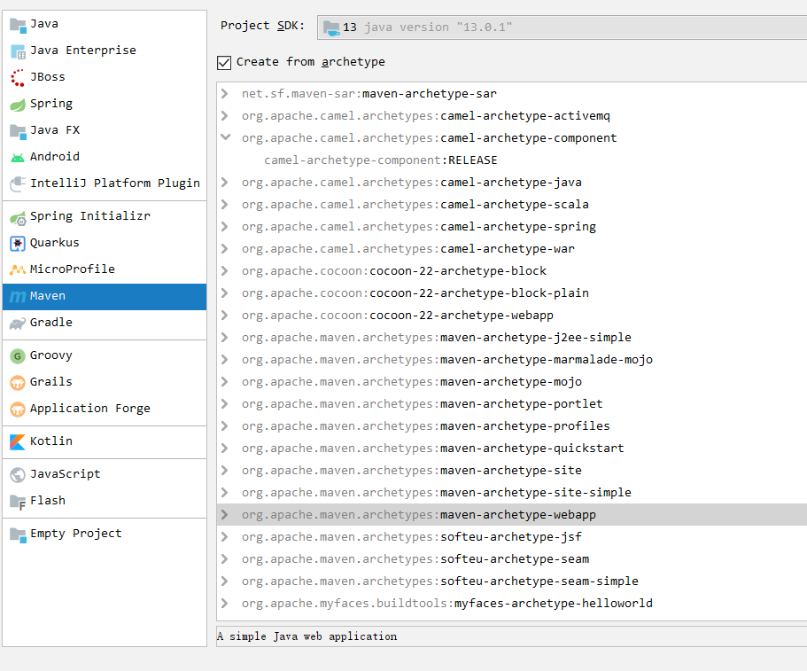

2. 选择自己配置的xml和仓库

   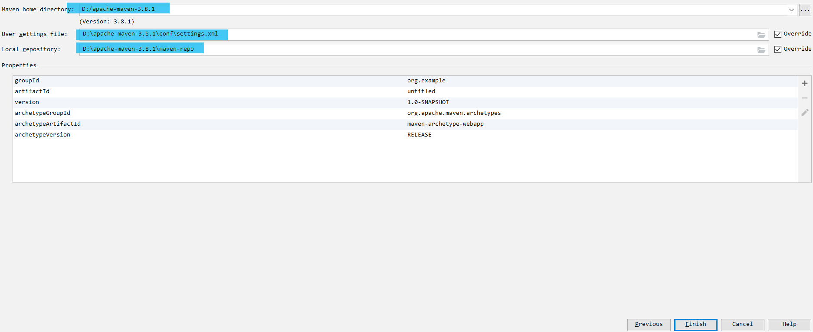

3. 等待下载仓库中的jar包等

   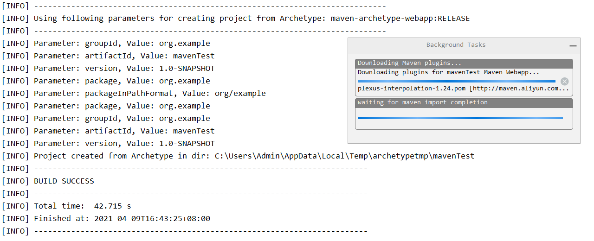

   ------

   - 新建maven项目时，Run中报警告：`No archetype found in remote catalog. Defaulting to internal catalog.`【在远程目录中没有找到原型。默认为内部编录。】

     ​		可以不用管【因为使用了maven模版构建项目，要从网上获取模版，然而没有找到这个模版或者网络慢，导致获取失败 】，选择File ---> 再选择Close Project，关闭项目后重启就可以了。

4. 初始化完毕

   检查一下设置:

   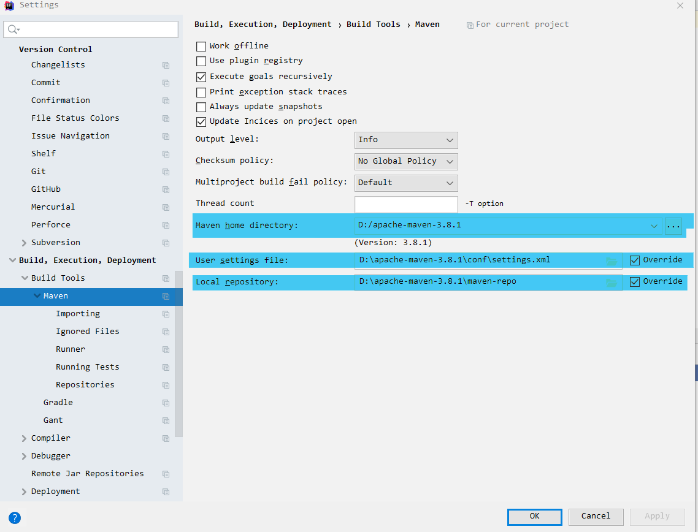

5. 空项目的初始目录如下:

   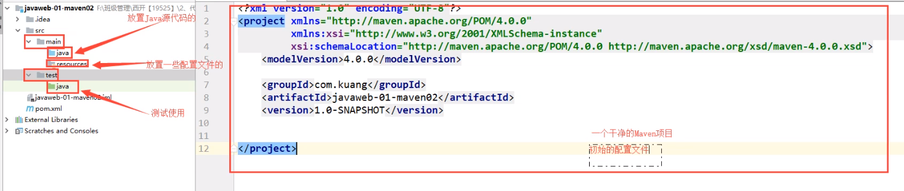


### IDEA配置Tomcat

1. 添加Tomcat启动

   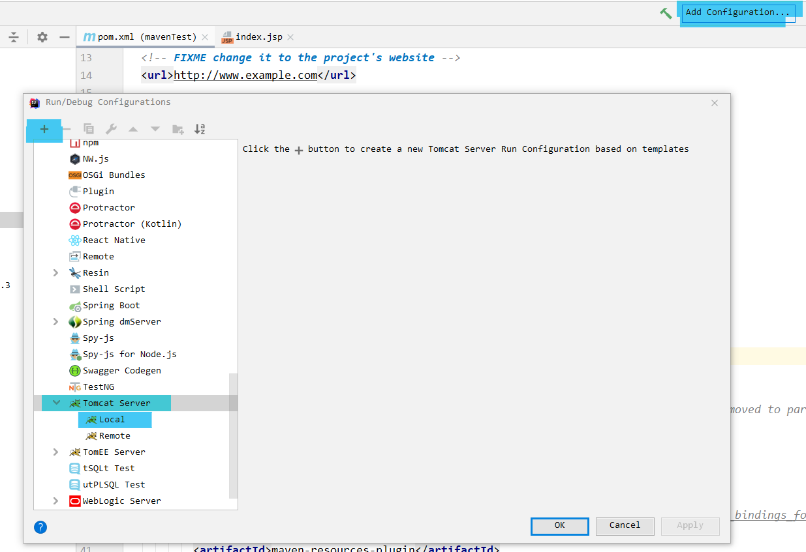

2. 配置Tomcat

   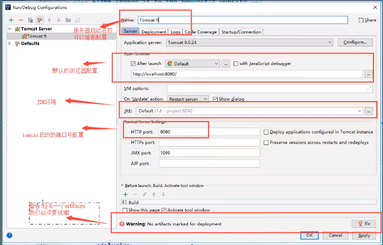
   
3. 运行Tomcat

   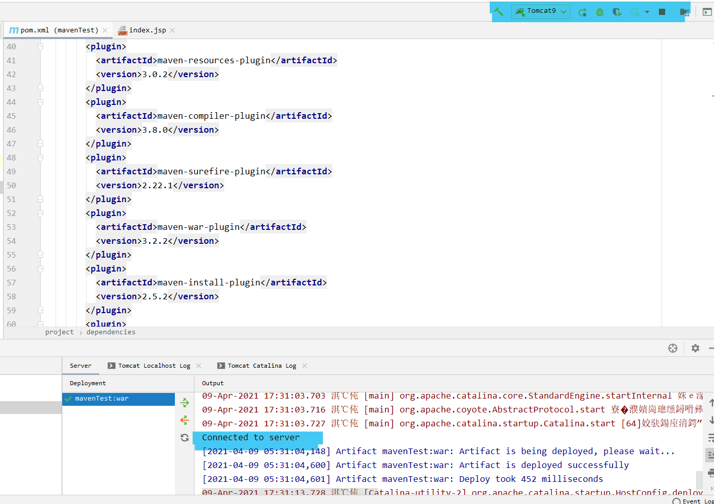


### Maven项目结构

------

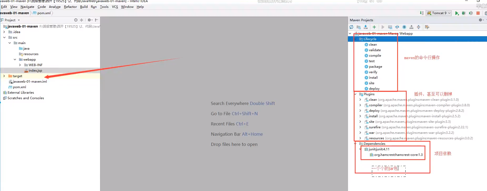


核心配置文件 `pom.xml`

```xml
<?xml version="1.0" encoding="UTF-8"?>
<!--Maven版本及-->
<project xmlns="http://maven.apache.org/POM/4.0.0" xmlns:xsi="http://www.w3.org/2001/XMLSchema-instance"
  xsi:schemaLocation="http://maven.apache.org/POM/4.0.0 http://maven.apache.org/xsd/maven-4.0.0.xsd">
  <modelVersion>4.0.0</modelVersion>
<!--  配置的GAV -->
  <groupId>org.example</groupId>
  <artifactId>mavenTest</artifactId>
  <version>1.0-SNAPSHOT</version>
<!--  打包方式
  jar:Java应用
  war:JavaWeb应用
-->
  <packaging>war</packaging>

  <name>mavenTest Maven Webapp</name>
  <!-- FIXME change it to the project's website -->
  <url>http://www.example.com</url>
<!--配置-->
  <properties>
<!--    项目的默认构建编码-->
    <project.build.sourceEncoding>UTF-8</project.build.sourceEncoding>
<!--    代码版本-->
    <maven.compiler.source>1.7</maven.compiler.source>
    <maven.compiler.target>1.7</maven.compiler.target>
  </properties>
<!--项目依赖-->
<!--  Maven添加依赖之后,会自动下载这个jar包,而且其高级之处在于,他会自动导入这个jar包说对应的其他jar包-->
  <dependencies>
<!--    具体依赖的jar包-->
    <dependency>
      <groupId>junit</groupId>
      <artifactId>junit</artifactId>
      <version>4.11</version>
      <scope>test</scope>
    </dependency>
  </dependencies>
<!--项目构建用的东西-->
  <build>
    <finalName>mavenTest</finalName>
<!--    使用的插件-->
    <pluginManagement><!-- lock down plugins versions to avoid using Maven defaults (may be moved to parent pom) -->
      <plugins>
        <plugin>
          <artifactId>maven-clean-plugin</artifactId>
          <version>3.1.0</version>
        </plugin>
      </plugins>
    </pluginManagement>
  </build>
</project>
```


 Maven由于约定大于配置的原因,可能导致我们写的配置文件,无法被导出或者生效的问题,解决方法是在`bulid`下面添加`resource`:

```xml
<build>
        <resources>
            <resource>
                <directory>src/main/resources</directory>
                <excludes>
                    <exclude>**/*.properties</exclude>
                    <exclude>**/*.xml</exclude>
                </excludes>
                <filtering>true</filtering>
            </resource>
            <resource>
                <directory>src/main/java</directory>
                <includes>
                    <include>**/*.properties</include>
                    <include>**/*.xml</include>
                </includes>
                <filtering>true</filtering>
            </resource>
        </resources>
  </build>
```

   


