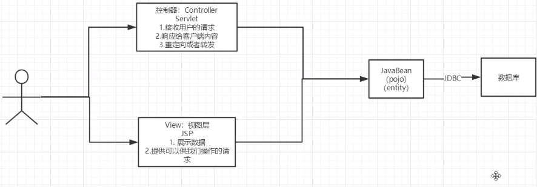
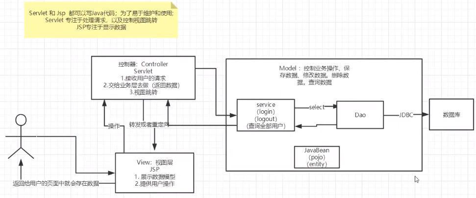
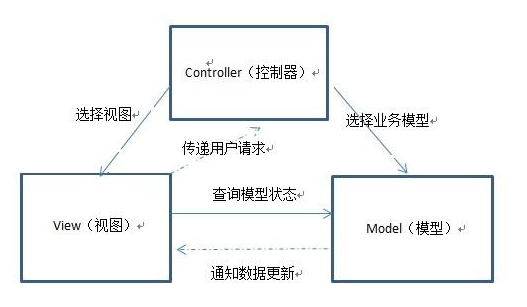
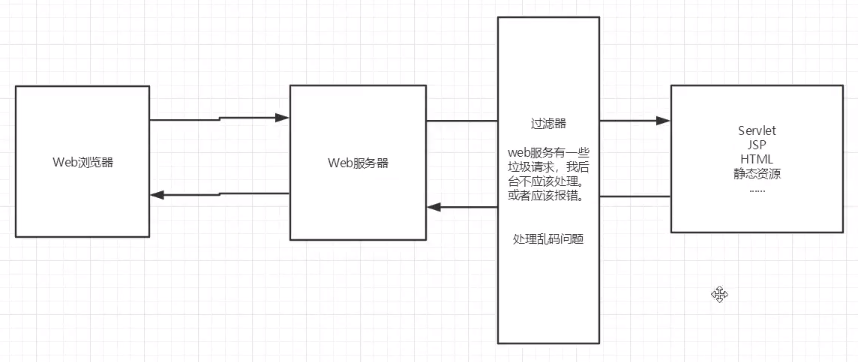

# MVC、JDBC、Filter

[TOC]

## MVC

MVC: 		`Model`--- 模型     	`View` --- 视图层            `Controller`---控制器

### 1.早些年的项目结构

用户直接访问控制层，控制层可以直接操作数据库。

Servlet --> CRUD -->数据库

弊端: 程序十分臃肿 , 不利于维护。

Servlet代码中：处理请求、视图跳转、响应、处理JDBC、处理业务代码、处理逻辑代码

### 2.MVC三层架构

简化抽象后：

`Model`

- 业务处理： 业务逻辑
- 数据持久层：CRUD（DAO）

`View`

- 展示数据
- 提供链接发起Servlet请求（a、form 、img...)

`Controller`

- 接收用户请求(req: 请求参数   Session信息....)
- 交给业务层处理对应代码
- 控制视图的跳转

`登录`-->`接收用户的登录请求`-->`处理用户的请求(获取用户登录的参数,username,password)`--> `交给业务层处理登录业务`--> `Dao层查询用户名和密码是否正确`  -->`数据库`

## Filter

Filter：过滤器，用来过滤网站的数据。

- 处理中文乱码
- 登录验证
- 非法输入或请求

