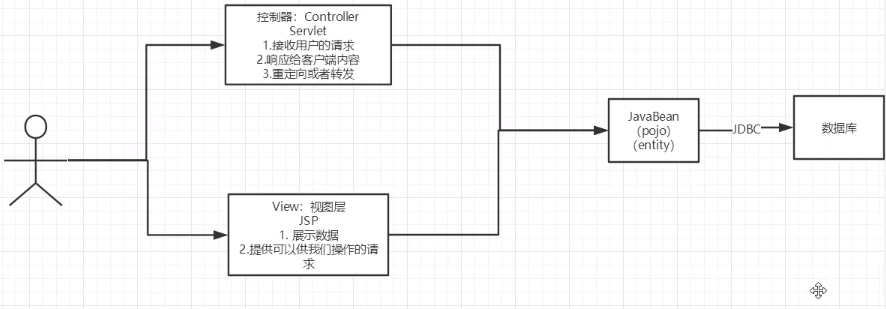
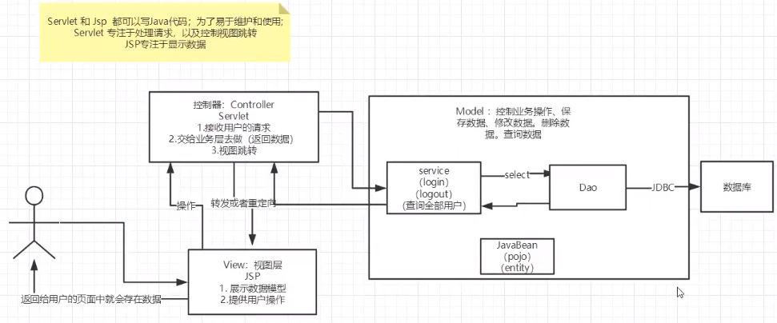
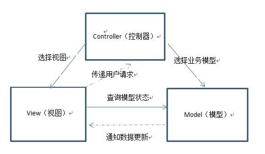
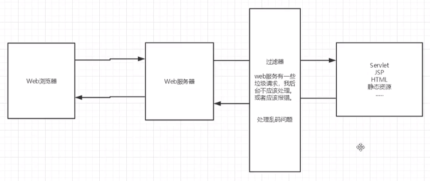
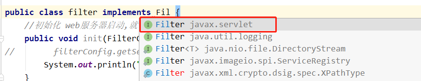
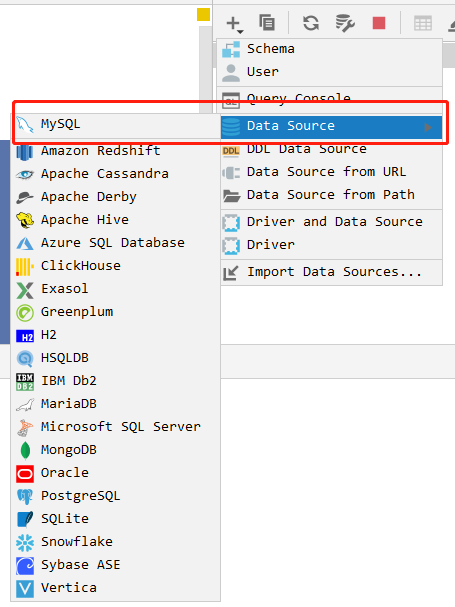
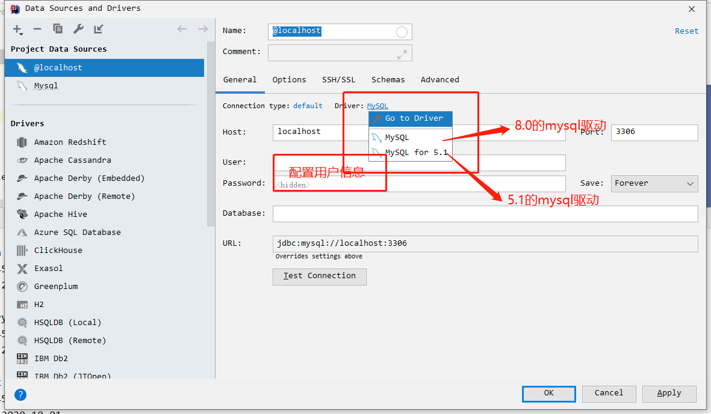
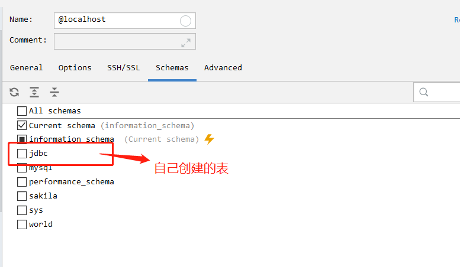
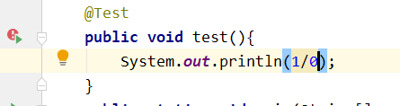
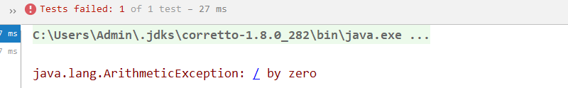

# MVC、JDBC、Filter

[TOC]

## MVC

MVC: 		`Model`--- 模型     	`View` --- 视图层            `Controller`---控制器

### 1.早些年的项目结构




用户直接访问控制层，控制层可以直接操作数据库。

Servlet --> CRUD -->数据库

弊端: 程序十分臃肿 , 不利于维护。

Servlet代码中：处理请求、视图跳转、响应、处理JDBC、处理业务代码、处理逻辑代码


### 2.MVC三层架构



简化抽象后：



`Model`

- 业务处理： 业务逻辑
- 数据持久层：CRUD（DAO）

`View`

- 展示数据
- 提供链接发起Servlet请求（a、form 、img...)

`Controller`

- 接收用户请求(req: 请求参数   Session信息....)
- 交给业务层处理对应代码
- 控制视图的跳转

`登录`-->`接收用户的登录请求`-->`处理用户的请求(获取用户登录的参数,username,password)`--> `交给业务层处理登录业务`--> `Dao层查询用户名和密码是否正确`  -->`数据库`


## 过滤器Filter

Filter：过滤器，用来过滤网站的数据。

- 处理中文乱码
- 登录验证
- 非法输入或请求




编写过滤器:

1. 导包

2. 编写过滤器

   1. 实现`Filter`接口时,主要导入`Servlet`的Filter接口，不要导错

      

   2. 实现Filter接口,重写方法

      ```java
      public class filter implements Filter {
          //初始化 web服务器启动,就已经初始化了,随时等待过滤对象出现!
          public void init(FilterConfig filterConfig) throws ServletException {
      //        filterConfig.getServletContext();获取一些上下文对象
              System.out.println("Encoding Init");
          }
          /*
          Chain
          1. 过滤器中所有的代码,在过滤特定请求时都会执行
          2.  必须要让过滤器继续执行
          filterChain.doFilter(servletRequest,servletResponse);
           */
      
          public void doFilter(ServletRequest servletRequest, ServletResponse servletResponse, FilterChain filterChain) throws IOException, ServletException {
              servletRequest.setCharacterEncoding("utf-8");
              servletResponse.setCharacterEncoding("utf-8");
              servletResponse.setContentType("text/html;charset=UTF-8");
      
              System.out.println("before execute");
              //保证请求接着往下走,如果不写,程序执行到此之后就被拦截停止
              filterChain.doFilter(servletRequest,servletResponse);
              System.out.println("after execute");
          }
          //销毁 web服务器关闭时才会销毁
          public void destroy() {
              System.out.println("Encoding destroy");
          }
      }
      ```

3. `web.xml`中配置Filter

   ```xml
       <filter>
           <filter-name>char</filter-name>
           <filter-class>com.zhang.filter</filter-class>
       </filter>
       <filter-mapping>
           <filter-name>char</filter-name>
   <!--        只要是过/servlet的任何请求,都会过这个过滤器-->
           <url-pattern>/servlet/*</url-pattern>
   <!--     <url-pattern>/*</url-pattern> 全局过滤  -->
       </filter-mapping>
   ```


## 监听器Listener

实现一个监听器的接口，有许多种。

1. 实现监听器接口

```java
//统计网站在线人数:统计session
public class Listener implements  HttpSessionListener {
    //创建Session监听
    //一旦创建一次Session,就会触发一次这个事件
    @Override
    public void sessionCreated(HttpSessionEvent se) {
        ServletContext servletContext = se.getSession().getServletContext();
        Integer onlineCount = (Integer) servletContext.getAttribute("onlineCount");
        if(onlineCount == null){
            onlineCount = new Integer("1");
        }else {
            int cout = onlineCount.intValue();
            onlineCount = new Integer(cout+1);
        }
        servletContext.setAttribute("onlineCount",onlineCount);
    }
    //销毁Session监听
    //一旦销毁一次Session,就会触发一次这个事件
    @Override
    public void sessionDestroyed(HttpSessionEvent se) {
        ServletContext servletContext = se.getSession().getServletContext();
        Integer onlineCount = (Integer) servletContext.getAttribute("onlineCount");
        if(onlineCount == null){
            onlineCount = new Integer("0");
        }else {
            int cout = onlineCount.intValue();
            onlineCount = new Integer(cout-1);
        }
        servletContext.setAttribute("onlineCount",onlineCount);

    }
}
```

2. web.xml中注册监听器

```xml
<listener>
    <listener-class>com.zhang.Listener</listener-class>
</listener>
```

3. 看情况是否使用!


## 过滤器、监听器的常见使用场景

监听器：GUI中，监控控件。

过滤器：实现权限拦截


## JDBC

### IDEA连接数据库:

1. 选择mysql

   

2. 选择驱动

   

3. 选择数据库表

   


### JDBC连接数据库

```java
public static void main(String[] args) throws ClassNotFoundException, SQLException {
    //配置信息
    String url = "jdbc:mysql://localhost:3306/jdbc?useUnicode=true&characterEncoding=utf-8";
    String username = "root";
    String password = "123456";
    //加载驱动
    Class.forName("com.mysql.jdbc.Driver");
    //链接数据库
    Connection connection = DriverManager.getConnection(url, username, password);
    //向数据库发送sql的对象Statement:CURD
    Statement statement = connection.createStatement();
    //写sql
    String sql="select * from   users;";
    //执行sql,返回一个ResultSet,结果集
    ResultSet resultSet = statement.executeQuery(sql);
    while(resultSet.next()){
        System.out.println("id = "+resultSet.getObject("id"));
        System.out.println("name = "+resultSet.getObject("name"));
        System.out.println("email = "+resultSet.getObject("email"));
        System.out.println("birthday = "+resultSet.getObject("birthday"));
    }
    //关闭链接,释放资源,先开后关
    resultSet.close();
    statement.close();
    connection.close();
    
}
```

预编译sql

```java
public static void main(String[] args) throws ClassNotFoundException, SQLException {
    //配置信息
    String url = "jdbc:mysql://localhost:3306/jdbc?useUnicode=true&characterEncoding=utf-8";
    String username = "root";
    String password = "123456";
    //加载驱动
    Class.forName("com.mysql.jdbc.Driver");
    //链接数据库
    Connection connection = DriverManager.getConnection(url, username, password);
    //向数据库发送sql的对象Statement、PreparedStatement:CURD
    //Statement statement = connection.createStatement();
    //写sql
    //查
    //String sql="select * from   users;";
    //增删改都使用executeUpdate即可
    String sql="insert into users (id, name, password, email, birthday) values (?,?,?,?,?);";
    PreparedStatement preparedStatement = connection.prepareStatement(sql);
    preparedStatement.setInt(1,5);//给第一个占位符?,赋值为 5
    preparedStatement.setString(2,"lili");//给第二个占位符?,赋值为 lili
    preparedStatement.setString(3,"123456");//给第三个占位符?,赋值为 123456
    preparedStatement.setString(4,"151@qq.com");//给第四个占位符?,赋值为 151@qq.com
    preparedStatement.setDate(5,new Date(new java.util.Date().getTime()));//给第五个占位符?,赋值为 1
    //执行sql,返回受影响的行数
    System.out.println(sql);
    int i = preparedStatement.executeUpdate();//受影响的行数
    if (i > 0) {
        System.out.println("受影响的行数为:"+i);
    }
    //关闭链接,释放资源,先开后关
    preparedStatement.close();
    connection.close();
}
```


## Junit

单元测试，为了可以直接测试方法

添加依赖

```xml
<dependency>
    <groupId>junit</groupId>
    <artifactId>junit</artifactId>
    <version>4.13.2</version>
</dependency>
```

方法左侧会出现执行按钮



也会正常报错



`@Test`的源码

```java
@Retention(RetentionPolicy.RUNTIME)
@Target({ElementType.METHOD})//作用域为方法
public @interface Test {
    Class<? extends Throwable> expected() default Test.None.class;

    long timeout() default 0L;

    public static class None extends Throwable {
        private static final long serialVersionUID = 1L;

        private None() {
        }
    }
}
```

