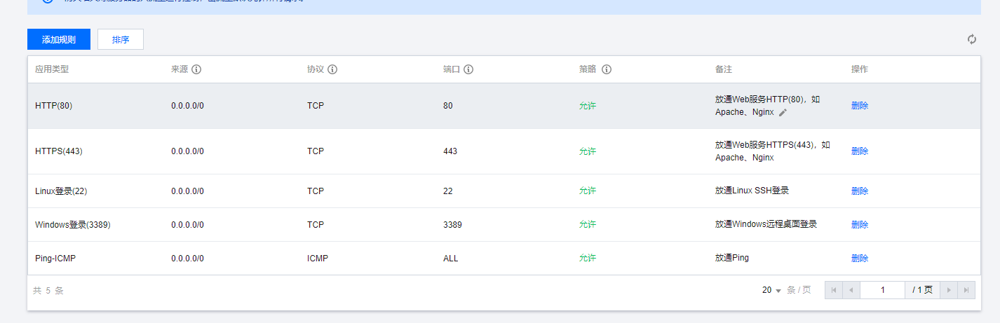
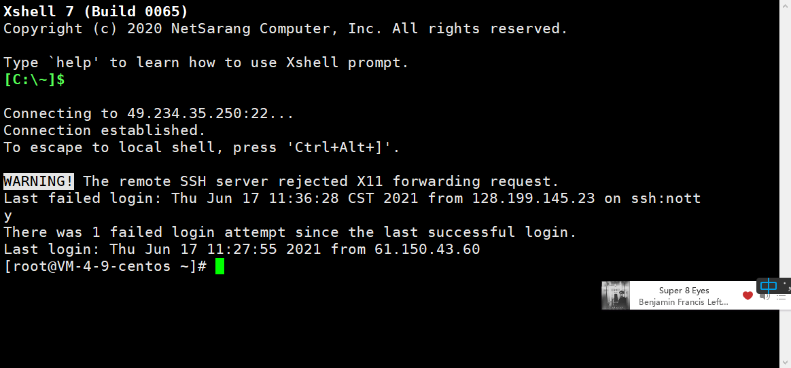

# Linux简介

​	*Linux，全称 GNU/Linux，是一种免费使用和自由传播的类 UNIX 操作系统，其内核由林纳斯·本纳第克特·托瓦兹于1991年10月5日首次发布，它主要受到 Minix 和 Unix 思想的启发，是一个基于 POSIX 的多用户、多任务、支持多线程和多CPU的操作系统。它能运行主要的 Unix 工具软件、应用程序和网络协议。它支持32位和64位硬件。Linux继承了 Unix 以网络为核心的设计思想，是一个性能稳定的多用户网络操作系统。*

​	*Linux不仅系统性能稳定，而且是开源软件。其核心防火墙组件性能高效、配置简单，保证了系统的安全。在很多企业网络中，为了追求速度和安全，Linux不仅仅是被网络运维人员当作服务器使用，甚至当作网络防火墙，这是Linux的一大亮点。*

​	*Linux的基本思想有两点：*

​	*第一，一切都是文件；*

​	*第二，每个文件都有确定的用途。*

​	*其中第一条详细来讲就是系统中的所有都归结为一个文件，包括命令、硬件和软件设备、操作系统、进程等等对于操作系统内核而言，都被视为拥有各自特性或类型的文件。至于说Linux是基于Unix的，很大程度上也是因为这两者的基本思想十分相近。*

> 服务器通常使用的两套组合是:LAMP(Linux + Apache + Mysql + PHP) 和 LNMP(Linux + Nginx + Mysql + PHP)组合。

​	

# Linux安装

常见的安装方式有三种，这里我们使用的购买的云服务器：

1. 虚拟机安装

2. 本地安装

3. 云服务器安装，这里使用的是腾讯云服务器

   

# 云服务器登录配置

1. 首先要配置防火墙

   

2. 可以修改登录密码。

3. 下载`Xshell`和`Xftp`来进行远程连接和文件传输。

4. 输入用户名和密码，登录成功。

   

# 基本命令
