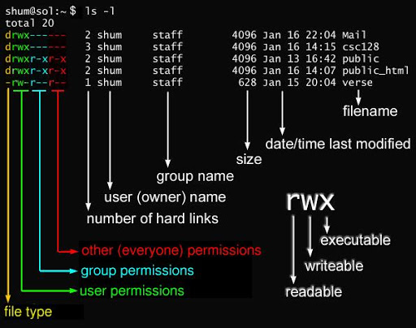

# Linux简介

​	*Linux，全称 GNU/Linux，是一种免费使用和自由传播的类 UNIX 操作系统，其内核由林纳斯·本纳第克特·托瓦兹于1991年10月5日首次发布，它主要受到 Minix 和 Unix 思想的启发，是一个基于 POSIX 的多用户、多任务、支持多线程和多CPU的操作系统。它能运行主要的 Unix 工具软件、应用程序和网络协议。它支持32位和64位硬件。Linux继承了 Unix 以网络为核心的设计思想，是一个性能稳定的多用户网络操作系统。*

​	*Linux不仅系统性能稳定，而且是开源软件。其核心防火墙组件性能高效、配置简单，保证了系统的安全。在很多企业网络中，为了追求速度和安全，Linux不仅仅是被网络运维人员当作服务器使用，甚至当作网络防火墙，这是Linux的一大亮点。*

​	*Linux的基本思想有两点：*

​	*第一，一切都是文件；*

​	*第二，每个文件都有确定的用途。*

​	*其中第一条详细来讲就是系统中的所有都归结为一个文件，包括命令、硬件和软件设备、操作系统、进程等等对于操作系统内核而言，都被视为拥有各自特性或类型的文件。至于说Linux是基于Unix的，很大程度上也是因为这两者的基本思想十分相近。*

> 服务器通常使用的两套组合是:LAMP(Linux + Apache + Mysql + PHP) 和 LNMP(Linux + Nginx + Mysql + PHP)组合。


# Linux安装

常见的安装方式有三种，这里我们使用的购买的云服务器：

1. 虚拟机安装

2. 本地安装

3. 云服务器安装，这里使用的是腾讯云服务器

   

# 云服务器登录配置

1. 首先要配置防火墙

   

2. 可以修改登录密码。

3. 下载`Xshell`和`Xftp`来进行远程连接和文件传输。


# Linux 系统启动过程

Linux启动时我们会看到许多启动信息。

Linux系统的启动过程并不是大家想象中的那么复杂，其过程可以分为5个阶段：

- 内核的引导。
- 运行 init。
- 系统初始化。
- 建立终端。
- 用户登录系统。

>init程序的类型：
>
>- **SysV:** init, CentOS 5之前, 配置文件： /etc/inittab。
>- **Upstart:** init,CentOS 6, 配置文件： /etc/inittab, /etc/init/*.conf。
>- **Systemd：** systemd, CentOS 7,配置文件： /usr/lib/systemd/system、 /etc/systemd/system。


## 1、内核引导

> BIOS -> /boot

当计算机打开电源后，首先是BIOS开机自检，按照BIOS中设置的启动设备（通常是硬盘）来启动。

操作系统接管硬件以后，首先读入 /boot 目录下的内核文件。


## 2、运行init

> /boot -> init程序 -> 读取/etc/inittab -> 运行级别

​	init 进程是系统所有进程的起点，你可以把它比拟成系统所有进程的老祖宗，没有这个进程，系统中任何进程都不会启动。init 程序首先是需要读取配置文件 /etc/inittab。

​	许多程序需要开机启动，在Linux就叫做"守护进程"（daemon）。init进程的一大任务，就是去运行这些开机启动的程序。但是，不同的场合需要启动不同的程序，比如用作服务器时，需要启动Apache，用作桌面就不需要。Linux允许为不同的场合，分配不同的开机启动程序，这就叫做"运行级别"（runlevel）。

​	也就是说，启动时根据"运行级别"，确定要运行哪些程序。Linux系统有7个运行级别(runlevel)：

| 运行级别  | 系统操作                                                    |
| --------- | ----------------------------------------------------------- |
| 运行级别0 | 系统停机状态，系统默认运行级别不能设为0，否则不能正常启动   |
| 运行级别1 | 单用户工作状态，root权限，用于系统维护，禁止远程登陆        |
| 运行级别2 | 多用户状态(没有NFS)                                         |
| 运行级别3 | 完全的多用户状态(有NFS)，登陆后进入控制台命令行模式         |
| 运行级别4 | 系统未使用，保留                                            |
| 运行级别5 | X11控制台，登陆后进入图形GUI模式                            |
| 运行级别6 | 系统正常关闭并重启，默认运行级别不能设为6，否则不能正常启动 |


## 3、系统初始化

> init -> rc.sysinit -> /etc/init.d

​	在init的配置文件中有这么一行： si::sysinit:/etc/rc.d/rc.sysinit　它调用执行了/etc/rc.d/rc.sysinit，而rc.sysinit是一个bash shell的脚本，它主要是完成一些系统初始化的工作，rc.sysinit是每一个运行级别都要首先运行的重要脚本。

​	它主要完成的工作有：激活交换分区，检查磁盘，加载硬件模块以及其它一些需要优先执行任务。

```bshell
l5:5:wait:/etc/rc.d/rc 5
```

​	这一行表示以5为参数运行/etc/rc.d/rc，/etc/rc.d/rc是一个Shell脚本，它接受5作为参数，去执行/etc/rc.d/rc5.d/目录下的所有的rc启动脚本，/etc/rc.d/rc5.d/目录中的这些启动脚本实际上都是一些连接文件，而不是真正的rc启动脚本，真正的rc启动脚本实际上都是放在/etc/rc.d/init.d/目录下。

​	而这些rc启动脚本有着类似的用法，它们一般能接受start、stop、restart、status等参数。/etc/rc.d/rc5.d/中的rc启动脚本通常是K或S开头的连接文件，对于以 S 开头的启动脚本，将以start参数来运行。而如果发现存在相应的脚本也存在K打头的连接，而且已经处于运行态了(以/var/lock/subsys/下的文件作为标志)，则将首先以stop为参数停止这些已经启动了的守护进程，然后再重新运行。

​	这样做是为了保证是当init改变运行级别时，所有相关的守护进程都将重启。

​	至于在每个运行级中将运行哪些守护进程，用户可以通过chkconfig或setup中的"System Services"来自行设定。


## 4、建立终端

> init -> rc.sysinit -> /etc/init.d -> 建立终端

​	rc执行完毕后，返回init。这时基本系统环境已经设置好了，各种守护进程也已经启动了。

​	init接下来会打开6个终端，以便用户登录系统。在inittab中的以下6行就是定义了6个终端：

```shell
1:2345:respawn:/sbin/mingetty tty1
2:2345:respawn:/sbin/mingetty tty2
3:2345:respawn:/sbin/mingetty tty3
4:2345:respawn:/sbin/mingetty tty4
5:2345:respawn:/sbin/mingetty tty5
6:2345:respawn:/sbin/mingetty tty6
```

​	从上面可以看出在2、3、4、5的运行级别中都将以respawn方式运行mingetty程序，mingetty程序能打开终端、设置模式。

​	同时它会显示一个文本登录界面，这个界面就是我们经常看到的登录界面，在这个登录界面中会提示用户输入用户名，而用户输入的用户将作为参数传给login程序来验证用户的身份。


## 5、用户登录系统

一般来说，用户的登录方式有三种：

- （1）命令行登录

- （2）ssh登录

- （3）图形界面登录

​	对于运行级别为5的图形方式用户来说，他们的登录是通过一个图形化的登录界面。登录成功后可以直接进入 KDE、Gnome 等窗口管理器而本文主要讲的还是文本方式登录的情况：当我们看到mingetty的登录界面时，我们就可以输入用户名和密码来登录系统了。

​	Linux 的账号验证程序是 login，login 会接收 mingetty 传来的用户名作为用户名参数。然后 login 会对用户名进行分析：如果用户名不是 root，且存在 /etc/nologin 文件，login 将输出 nologin 文件的内容，然后退出。

​	这通常用来系统维护时防止非root用户登录。只有/etc/securetty中登记了的终端才允许 root 用户登录，如果不存在这个文件，则 root 用户可以在任何终端上登录。

​	/etc/usertty文件用于对用户作出附加访问限制，如果不存在这个文件，则没有其他限制。


# 文件系统目录结构

​	Linux一切皆文件，根目录就是 `/` 。

```shell
[root@VM-4-9-centos /]# ls
bin   data  etc   lib    lost+found  mnt  proc  run   srv  tmp  var
boot  dev   home  lib64  media       opt  root  sbin  sys  usr
```

## 一级目录

| 一级目录    | 功能（作用）                                                 |
| ----------- | :----------------------------------------------------------- |
| /bin        | 存放系统命令，普通用户和 root 都可以执行。放在 /bin 下的命令在单用户模式下也可以执行 |
| /boot       | 系统启动目录，保存与系统启动相关的文件，如内核文件和启动引导程序（grub）文件等 |
| /dev        | 设备文件保存位置                                             |
| ==/etc==    | ==配置文件保存位置。系统内所有采用默认安装方式（rpm 安装）的服务配置文件全部保存在此目录中，如用户信息、服务的启动脚本、常用服务的配置文件等== |
| ==/home==   | ==普通用户的主目录（也称为家目录）。在创建用户时，每个用户要有一个默认登录和保存自己数据的位置，就是用户的主目录，所有普通用户的主目录是在 /home/ 下建立一个和用户名相同的目录。如用户 liming 的主目录就是 /home/liming== |
| /lib        | 系统调用的函数库保存位置                                     |
| /media      | 挂载目录。系统建议用来挂载媒体设备，如软盘和光盘             |
| /mnt        | 挂载目录。早期 Linux 中只有这一个挂载目录，并没有细分。系统建议这个目录用来挂载额外的设备，如 U 盘、移动硬盘和其他操作系统的分区 |
| /misc       | 挂载目录。系统建议用来挂载 NFS 服务的共享目录。虽然系统准备了三个默认挂载目录 /media/、/mnt/、/misc/，但是到底在哪个目录中挂载什么设备可以由管理员自己决定。例如，笔者在接触 Linux 的时候，默认挂载目录只有 /mnt/，所以养成了在 /mnt/ 下建立不同目录挂载不同设备的习惯，如 /mnt/cdrom/ 挂载光盘、/mnt/usb/ 挂载 U 盘，都是可以的 |
| ==/opt==    | ==第三方安装的软件保存位置。这个目录是放置和安装其他软件的位置，手工安装的源码包软件都可以安装到这个目录中。不过笔者还是习惯把软件放到 /usr/local/ 目录中，也就是说，/usr/local/ 目录也可以用来安装软件== |
| /root       | root 的主目录。普通用户主目录在 /home/ 下，root 主目录直接在“/”下 |
| /sbin       | 保存与系统环境设置相关的命令，只有 root 可以使用这些命令进行系统环境设置，但也有些命令可以允许普通用户查看 |
| /srv        | 服务数据目录。一些系统服务启动之后，可以在这个目录中保存所需要的数据 |
| ==/tmp==    | ==临时目录。系统存放临时文件的目录，在该目录下，所有用户都可以访问和写入。建议此目录中不能保存重要数据，最好每次开机都把该目录清空== |
| /lost+found | 当系统意外崩溃或意外关机时，产生的一些文件碎片会存放在这里。在系统启动的过程中，fsck 工具会检查这里，并修复已经损坏的文件系统。这个目录只在每个分区中出现，例如，/lost+found 就是根分区的备份恢复目录，/boot/lost+found 就是 /boot 分区的备份恢复目录 |
| /proc       | 虚拟文件系统。该目录中的数据并不保存在硬盘上，而是保存到内存中。主要保存系统的内核、进程、外部设备状态和网络状态等。如 /proc/cpuinfo 是保存 CPU 信息的，/proc/devices 是保存设备驱动的列表的，/proc/filesystems 是保存文件系统列表的，/proc/net 是保存网络协议信息的...... |
| /sys        | 虚拟文件系统。和 /proc 目录相似，该目录中的数据都保存在内存中，主要保存与内核相关的信息 |
| /usr        | 全称为 Unix Software Resource，此目录用于存储系统软件资源。FHS 建议所有开发者，应把软件产品的数据合理的放置在 /usr 目录下的各子目录中，而不是为他们的产品创建单独的目录。 |
| /var        | /var 目录用于存储动态数据，例如缓存、日志文件、软件运行过程中产生的文件等。通常，此目录下含一些子目录。 |


## 重要的子目录

**Linux /usr目录**

| 子目录       | 功能（作用）                                                 |
| ------------ | ------------------------------------------------------------ |
| /usr/bin/    | 存放系统命令，普通用户和超级用户都可以执行。这些命令和系统启动无关，在单用户模式下不能执行 |
| /usr/sbin/   | 存放根文件系统不必要的系统管理命令，如多数服务程序，只有 root 可以使用。 |
| /usr/lib/    | 应用程序调用的函数库保存位置                                 |
| /usr/XllR6/  | 图形界面系统保存位置                                         |
| /usr/local/  | 手工安装的软件保存位置。我们一般建议源码包软件安装在这个位置 |
| /usr/share/  | 应用程序的资源文件保存位置，如帮助文档、说明文档和字体目录   |
| /usr/src/    | 源码包保存位置。我们手工下载的源码包和内核源码包都可以保存到这里。不过笔者更习惯把手工下载的源码包保存到 /usr/local/src/ 目录中，把内核源码保存到 /usr/src/linux/ 目录中 |
| /usr/include | C/C++ 等编程语言头文件的放置目录                             |


**Linux /var 目录**

| /var子目录        | 功能（作用）                                                 |
| ----------------- | ------------------------------------------------------------ |
| /var/lib/         | 程序运行中需要调用或改变的数据保存位置。如 [MySQL](http://c.biancheng.net/mysql/) 的数据库保存在 /var/lib/mysql/ 目录中 |
| /var/log/         | 登陆文件放置的目录，其中所包含比较重要的文件如 /var/log/messages, /var/log/wtmp 等。 |
| /var/run/         | 一些服务和程序运行后，它们的 PID（进程 ID）保存位置          |
| /var/spool/       | 里面主要都是一些临时存放，随时会被用户所调用的数据，例如 /var/spool/mail/ 存放新收到的邮件，/var/spool/cron/ 存放系统定时任务。 |
| /var/www/         | RPM 包安装的 Apache 的网页主目录                             |
| /var/nis和/var/yp | NIS 服务机制所使用的目录，nis 主要记录所有网络中每一个 client 的连接信息；yp 是 linux 的 nis 服务的日志文件存放的目录 |
| /var/tmp          | 一些应用程序在安装或执行时，需要在重启后使用的某些文件，此目录能将该类文件暂时存放起来，完成后再行删除 |

## Linux链接概念

​	Linux 链接分两种，一种被称为硬链接（Hard Link），另一种被称为符号链接（Symbolic Link）。默认情况下，**ln** 命令产生硬链接。

**硬连接**

​	硬连接指通过索引节点来进行连接。在 Linux 的文件系统中，保存在磁盘分区中的文件不管是什么类型都给它分配一个编号，称为索引节点号(Inode Index)。在 Linux 中，多个文件名指向同一索引节点是存在的。

​	比如：A 是 B 的硬链接（A 和 B 都是文件名），则 A 的目录项中的 inode 节点号与 B 的目录项中的 inode 节点号相同，即一个 inode 节点对应两个不同的文件名，两个文件名指向同一个文件，A 和 B 对文件系统来说是完全平等的。删除其中任何一个都不会影响另外一个的访问。

​	硬连接的作用是允许一个文件拥有多个有效路径名，这样用户就可以建立硬连接到重要文件，以防止“误删”的功能。其原因如上所述，因为对应该目录的索引节点有一个以上的连接。只删除一个连接并不影响索引节点本身和其它的连接，只有当最后一个连接被删除后，文件的数据块及目录的连接才会被释放。也就是说，==文件真正删除的条件是与之相关的所有硬连接文件均被删除==。

**软连接**

​	另外一种连接称之为符号连接（Symbolic Link），也叫软连接。软链接文件有类似于 Windows 的快捷方式。它实际上是一个特殊的文件。在符号连接中，文件实际上是一个文本文件，其中包含的有另一文件的位置信息。

​	比如：A 是 B 的软链接（A 和 B 都是文件名），A 的目录项中的 inode 节点号与 B 的目录项中的 inode 节点号不相同，A 和 B 指向的是两个不同的 inode，继而指向两块不同的数据块。但是 A 的数据块中存放的只是 B 的路径名（可以根据这个找到 B 的目录项）。A 和 B 之间是“主从”关系，如果 B 被删除了，A 仍然存在（因为两个是不同的文件），但指向的是一个无效的链接。


==ln创建链接命令==

```bash
 ln [参数][源文件或目录][目标文件或目录]
```

选项与参数：

- -b 删除，覆盖以前建立的链接
- -d 允许超级用户制作目录的硬链接
- -f 强制执行
- -i 交互模式，文件存在则提示用户是否覆盖
- -n 把符号链接视为一般目录
- -s 软链接(符号链接)
- -v 显示详细的处理过程


```shell
[root@VM-4-9-centos home]# ls
kdum.sh  lighthouse  test1
[root@VM-4-9-centos home]# touch f1							#创建文件f1
[root@VM-4-9-centos home]# ls
f1  kdum.sh  lighthouse  test1
[root@VM-4-9-centos home]# ln f1 f2							#创建硬链接f2 指向f1指向的文件
[root@VM-4-9-centos home]# ls
f1  f2  kdum.sh  lighthouse  test1
[root@VM-4-9-centos home]# ls -al
total 32
drwxr-xr-x.  4 root       root        4096 Jun 18 16:50 .
dr-xr-xr-x. 19 root       root        4096 Jun 18 16:50 ..
-rw-r--r--   2 root       root           0 Jun 18 16:49 f1		#此时f1和f2都是文件,指向同一物理文件
-rw-r--r--   2 root       root           0 Jun 18 16:49 f2		#此时f1和f2都是文件,指向同一物理文件
-rwxr-xr-x   1 root       root       14704 Jun 17 20:55 kdum.sh
drwx------   5 lighthouse lighthouse  4096 May 18 10:10 lighthouse
drwxr-xr-x   2 root       root        4096 Jun 17 20:56 test1
[root@VM-4-9-centos home]# ln -s  f1 f3							#创建软链接f3 指向f1
[root@VM-4-9-centos home]# ls -al
total 32
drwxr-xr-x.  4 root       root        4096 Jun 18 16:50 .
dr-xr-xr-x. 19 root       root        4096 Jun 18 16:50 ..
-rw-r--r--   2 root       root           0 Jun 18 16:49 f1
-rw-r--r--   2 root       root           0 Jun 18 16:49 f2
lrwxrwxrwx   1 root       root           2 Jun 18 16:50 f3 -> f1	#软链接f3 指向f1
-rwxr-xr-x   1 root       root       14704 Jun 17 20:55 kdum.sh
drwx------   5 lighthouse lighthouse  4096 May 18 10:10 lighthouse
drwxr-xr-x   2 root       root        4096 Jun 17 20:56 test1
[root@VM-4-9-centos home]# echo "hello world" >> f1				#f1文件写入
[root@VM-4-9-centos home]# cat f1
hello world
[root@VM-4-9-centos home]# ls
f1  f2  f3  kdum.sh  lighthouse  test1
[root@VM-4-9-centos home]# cat f2								#f2文件也同时写入
hello world
[root@VM-4-9-centos home]# cat f3								#f3指向的f1内容
hello world
[root@VM-4-9-centos home]# ll
total 32
-rw-r--r-- 2 root       root          12 Jun 18 16:51 f1
-rw-r--r-- 2 root       root          12 Jun 18 16:51 f2
lrwxrwxrwx 1 root       root           2 Jun 18 16:50 f3 -> f1
-rwxr-xr-x 1 root       root       14704 Jun 17 20:55 kdum.sh
drwx------ 5 lighthouse lighthouse  4096 May 18 10:10 lighthouse
drwxr-xr-x 2 root       root        4096 Jun 17 20:56 test1
[root@VM-4-9-centos home]# rm  f1							#删除f1
rm: remove regular file ‘f1’? y
[root@VM-4-9-centos home]# ls
f2  f3  kdum.sh  lighthouse  test1
[root@VM-4-9-centos home]# cat f2							#f2正常访问
hello world
[root@VM-4-9-centos home]# cat f1							#f3由于f1已经删除而访问失败
cat: f1: No such file or directory
```


# 常用命令

## 开关机登录

​	Windows开机会启动很多服务 "service"，在Linux中叫做守护进程"daemon"。

​	在开关机前，最好进行内存-硬盘的数据同步，使用 `sync` 命令来进行数据同步。

```shell
sync # 将数据由内存同步到硬盘中
```

==shutdown关机==

```shell
halt				#立刻关机
poweroff			#立刻关机
shutdown -h now 	#立刻关机(root用户使用)
shutdown -h 10 		#10分钟后自动关机
```

==reboot重启==

```shell
reboot
shutdown -r now 	#立刻重启(root用户使用)
shutdown -r 10 		#过10分钟自动重启(root用户使用)
shutdown -r 20:35	#在时间为20:35时候重启(root用户使用)
```


## 目录管理

​	最常用的目录命令为:

```shell
cd .. 	#返回上一级目录
cd ./ 	#当前目录
ls 		#展示当前目录下的文件及文件夹
```


==ls列出目录==

```shell
ls -a #查看全部文件,包括隐藏文件
ls -l #查看文件详细信息
#可以组合使用
ls -al #查看全部文件,包括隐藏文件的详细信息
```


==cd切换目录==

```shell
cd /xxx/xxx # 以绝对路径进入到/xxx/xxx
cd ../xxx 	# 相对路径进入到/xxx
cd ~		#返回当前的用户目录
```


==pwd显示目录==

​	显示当前用户所在目录。

```bash
[root@VM-4-9-centos ~]# cd /
[root@VM-4-9-centos /]# pwd
/
[root@VM-4-9-centos ~]# cd ~
[root@VM-4-9-centos ~]# pwd
/root
[root@VM-4-9-centos ~]# cd /bin
[root@VM-4-9-centos bin]# pwd
/bin
[root@VM-4-9-centos bin]# cd /usr/local
[root@VM-4-9-centos local]# pwd
/usr/local
```


==mkdir创建目录==

```shell
 mkdir [-mp] 目录名称
```

选项与参数：

- -m ：配置文件的权限喔！直接配置，不需要看默认权限 (umask) 的脸色～
- -p ：帮助你直接将所需要的目录(包含上一级目录)递归创建起来！

```shell
mkdir test1 			#创建目录
mkdir -p test2/test3	 #递归创建目录
```


==rmdir删除空目录==

​	只能删除空目录。

```shell
 rmdir [-p] 目录名称 
```

选项与参数：

- -p ：连同上一级『空的』目录也一起删除


==cp复制文件或目录==

​	cp 即拷贝文件和目录。

```bash
cp [-adfilprsu] 来源档(source) 目标档(destination)
```

选项与参数：

- -a：相当於 -pdr 的意思，至於 pdr 请参考下列说明；(常用)
- -d：若来源档为连结档的属性(link file)，则复制连结档属性而非文件本身；
- -f：为强制(force)的意思，若目标文件已经存在且无法开启，则移除后再尝试一次；
- -i：若目标档(destination)已经存在时，在覆盖时会先询问动作的进行(常用)
- -l：进行硬式连结(hard link)的连结档创建，而非复制文件本身；
- -p：连同文件的属性一起复制过去，而非使用默认属性(备份常用)；
- -r：递归持续复制，用於目录的复制行为；(常用)
- -s：复制成为符号连结档 (symbolic link)，亦即『捷径』文件；
- -u：若 destination 比 source 旧才升级 destination ！

```shell
[root@VM-4-9-centos home]# ls 
kdump-lib.sh  lighthouse  test1
[root@VM-4-9-centos home]# cp kdump-lib.sh  test1/ 		#复制文件
[root@VM-4-9-centos home]# cd test1/
[root@VM-4-9-centos test1]# ls
kdump-lib.sh
[root@VM-4-9-centos home]# cp kdump-lib.sh test1/		#如果文件重复存在,会询问是否覆盖
cp: overwrite ‘test1/kdump-lib.sh’? y  
```


==rm 移除文件或目录==

```shell
 rm [-fir] 文件或目录
```

选项与参数：

- -f ：就是 force 的意思，忽略不存在的文件，不会出现警告信息；
- -i ：互动模式，在删除前会询问使用者是否动作
- -r ：递归删除啊！最常用在目录的删除了！这是非常危险的选项！！！

```shell
[root@VM-4-9-centos home]# ls
kdump-lib.sh  lighthouse  test1
[root@VM-4-9-centos home]# rm kdump-lib.sh  -i
rm: remove regular file ‘kdump-lib.sh’? y
[root@VM-4-9-centos home]# ls
lighthouse  test1
```

```bash
rm -rf /  #删除操作系统在内的所有文件!!!!!!!!!删库跑路
```


==mv(移动文件与目录,或修改名称)==

```shell
mv [-fiu] source destination
```

选项与参数：

- -f ：force 强制的意思，如果目标文件已经存在，不会询问而直接覆盖；
- -i ：若目标文件 (destination) 已经存在时，就会询问是否覆盖！
- -u ：若目标文件已经存在，且 source 比较新，才会升级 (update)

```shell
[root@VM-4-9-centos test1]# ls
kdump-lib.sh
[root@VM-4-9-centos test1]# mv kdump-lib.sh ../  #移动文件到上一级目录 
[root@VM-4-9-centos test1]# cd ..
[root@VM-4-9-centos home]# ls
kdump-lib.sh  lighthouse  test1
```

```bash
[root@VM-4-9-centos home]# mv kdump-lib.sh kdum.sh #重命名文件或文件夹
[root@VM-4-9-centos home]# ls
kdum.sh  lighthouse  test1
```


## 文件内容查看

Linux系统中使用以下命令来查看文件的内容：

- cat 由第一行开始显示文件内容
- tac 从最后一行开始显示，可以看出 tac 是 cat 的倒着写！
- nl  显示的时候，顺道输出行号！
- more 一页一页的显示文件内容 
- less 与 more 类似，但是比 more 更好的是，他可以往前翻页！
- head 只看头几行 (-n命令显示头部 n行)
- tail 只看尾巴几行

[注意]

​	`q` :退出 `空格`:代表下翻页  `回车`: 下一行 `f`显示行号  

​	向上查找 : `/`[目标字符串] 向下查找: `?`[目标字符串] 

​	查找时,`n`:下一个 `N`: 上一个

```shell
#命令测试
[root@VM-4-9-centos /]# cd /etc/sysconfig/network-scripts/
[root@VM-4-9-centos network-scripts]# cat ifcfg-eth0  					#从第一行开始显示
# Created by cloud-init on instance boot automatically, do not edit.
#
BOOTPROTO=dhcp
DEVICE=eth0
HWADDR=52:54:00:27:a8:37
ONBOOT=yes
PERSISTENT_DHCLIENT=yes
TYPE=Ethernet
USERCTL=no
[root@VM-4-9-centos network-scripts]# tac ifcfg-eth0 					#从末尾反向开始显示
USERCTL=no
TYPE=Ethernet
PERSISTENT_DHCLIENT=yes
ONBOOT=yes
HWADDR=52:54:00:27:a8:37
DEVICE=eth0
BOOTPROTO=dhcp
#
# Created by cloud-init on instance boot automatically, do not edit.
[root@VM-4-9-centos network-scripts]# nl ifcfg-eth0 					#加行号开始显示
     1	# Created by cloud-init on instance boot automatically, do not edit.
     2	#
     3	BOOTPROTO=dhcp
     4	DEVICE=eth0
     5	HWADDR=52:54:00:27:a8:37
     6	ONBOOT=yes
     7	PERSISTENT_DHCLIENT=yes
     8	TYPE=Ethernet
     9	USERCTL=no
[root@VM-4-9-centos network-scripts]# head -n 5 ifcfg-eth0 
# Created by cloud-init on instance boot automatically, do not edit.
#
BOOTPROTO=dhcp
DEVICE=eth0
HWADDR=52:54:00:27:a8:37
```


# 文件权限和属性

​	Linux 系统是一种典型的多用户系统，不同的用户处于不同的地位，拥有不同的权限。为了保护系统的安全性，Linux 系统对不同的用户访问同一文件（包括目录文件）的权限做了不同的规定。在 Linux 中我们通常使用以下两个命令来修改文件或目录的所属用户与权限：

- chown (change ownerp) ： 修改所属用户与组。
- chmod (change mode) ： 修改用户的权限。

​	我们以`/`目录下的目录为例，查看他们的权限和属性。

```shell
[root@VM-4-9-centos /]# ls -al
total 80
dr-xr-xr-x.  19 root root  4096 Jun 18 11:08 .
dr-xr-xr-x.  19 root root  4096 Jun 18 11:08 ..
lrwxrwxrwx.   1 root root     7 Mar  7  2019 bin -> usr/bin
dr-xr-xr-x.   5 root root  4096 May 17 10:32 boot
drwxr-xr-x    2 root root  4096 Nov  5  2019 data
drwxr-xr-x   20 root root  3040 Jun 17 11:27 dev
drwxr-xr-x.  96 root root 12288 Jun 17 11:27 etc
drwxr-xr-x.   4 root root  4096 Jun 17 20:57 home
lrwxrwxrwx.   1 root root     7 Mar  7  2019 lib -> usr/lib
lrwxrwxrwx.   1 root root     9 Mar  7  2019 lib64 -> usr/lib64
drwx------.   2 root root 16384 Mar  7  2019 lost+found
drwxr-xr-x.   2 root root  4096 Apr 11  2018 media
drwxr-xr-x.   2 root root  4096 Apr 11  2018 mnt
drwxr-xr-x.   5 root root  4096 Jan  8 18:18 opt
dr-xr-xr-x  102 root root     0 Jun 17 11:26 proc
dr-xr-x---.   6 root root  4096 May 17 10:31 root
drwxr-xr-x   24 root root   880 Jun 17 11:28 run
lrwxrwxrwx.   1 root root     8 Mar  7  2019 sbin -> usr/sbin
drwxr-xr-x.   2 root root  4096 Apr 11  2018 srv
dr-xr-xr-x   13 root root     0 Jun 17 17:11 sys
drwxrwxrwt.   8 root root  4096 Jun 18 10:54 tmp
drwxr-xr-x.  14 root root  4096 Jan  8 18:19 usr
drwxr-xr-x.  20 root root  4096 Jan  8 18:19 var
```

```shell
[文件类型和权限][硬链接个数][创建者名][所属组名][大小][上一次修改时间][文件名]
```



## 文件属性

```shell
lrwxrwxrwx.   1 root root     7 Mar  7  2019 bin -> usr/bin
dr-xr-xr-x.   5 root root  4096 May 17 10:32 boot
```

在 Linux 中第一个字符代表这个文件是目录、文件或链接文件等等。

- ==当为 **d** 则是目录==
- ==当为 **-** 则是文件；==
- ==若是 **l** 则表示为链接文档(link file)；==
- 若是 **b** 则表示为装置文件里面的可供储存的接口设备(可随机存取装置)；
- 若是 **c** 则表示为装置文件里面的串行端口设备，例如键盘、鼠标(一次性读取装置)。

​	

## 文件权限

	lrwxrwxrwx.   1 root root     7 Mar  7  2019 bin -> usr/bin
	dr-xr-xr-x.   5 root root  4096 May 17 10:32 boot

​	接下来的字符中，以三个为一组，且均为 **rwx** 的三个参数的组合。其中， **r** 代表可读(read)、 **w** 代表可写(write)、 **x** 代表可执行(execute)。 要注意的是，这三个权限的位置不会改变，如果没有权限，就会出现减号 **-** 而已。每个文件的属性由左边第一部分的 10 个字符来确定（如下图）。


​	在Linux系统中，用户是按组分类的，一个用户属于一个或多个组。文件所有者以外的用户又可以分为文件所有者的同组用户和其他用户。因此，Linux系统按文件所有者、文件所有者同组用户和其他用户来规定了不同的文件访问权限。


## 文件权限修改

​	Linux文件属性有两种设置方法，一种是数字，一种是符号。


==chmod更改文件9个属性==

```bash
 chmod [-R] xyz 文件或目录
```

选项与参数：

- xyz : 就是数字类型的权限属性，为 rwx 属性数值的相加。
- -R : 进行递归(recursive)的持续变更，亦即连同次目录下的所有文件都会变更

​	Linux 文件的基本权限就有九个，分别是 **owner/group/others(拥有者/组/其他)** 三种身份各有自己的 **read/write/execute** 权限。

先复习一下刚刚上面提到的数据：文件的权限字符为： **-rwxrwxrwx** ， 这九个权限是三个三个一组的！其中，我们可以使用数字来代表各个权限，各权限的分数对照如下：

```shell
 r:4   w:2   x:1
```

每种身份(owner/group/others)各自的三个权限(r/w/x)分数是需要累加的，例如当权限为： **-rwxrwx---** 分数则是：

- owner = rwx = 4+2+1 = 7
- group = rwx = 4+2+1 = 7
- others= --- = 0+0+0 = 0

所以等我们设定权限的变更时，该文件的权限数字就是 **770**。

```shell
-rwxr-xr-x   1 root       root       14704 Jun 17 20:55 kdum.sh
[root@VM-4-9-centos home]# chmod 777 kdum.sh
-rwxrwxrwx   1 root       root       14704 Jun 17 20:55 kdum.sh
[root@VM-4-9-centos home]# chmod 755 kdum.sh 
-rwxr-xr-x   1 root       root       14704 Jun 17 20:55 kdum.sh
```


chgrp：更改文件属组

```
chgrp [-R] 属组名 文件名
```

参数选项

- -R：递归更改文件属组，就是在更改某个目录文件的属组时，如果加上-R的参数，那么该目录下的所有文件的属组都会更改。


chown：更改文件属主，也可以同时更改文件属组

语法：

```
chown [–R] 属主名 文件名
chown [-R] 属主名：属组名 文件名
```


# Vim编辑器

​	*所有的 Unix Like 系统都会内建 vi 文书编辑器，其他的文书编辑器则不一定会存在。但是目前我们使用比较多的是 vim 编辑器。vim 具有程序编辑的能力，可以主动的以字体颜色辨别语法的正确性，方便程序设计。*

## vi/vim 的使用

​	基本上 vi/vim 共分为三种模式，分别是**命令模式（Command mode）**，**输入模式（Insert mode）**和**底线命令模式（Last line mode）**。 这三种模式的作用分别是：


## 命令模式

用户刚刚启动 vi/vim，便进入了命令模式。

此状态下敲击键盘动作会被Vim识别为命令，而非输入字符。比如我们此时按下i，并不会输入一个字符，i被当作了一个命令。

以下是常用的几个命令：

- **i** 切换到输入模式，以输入字符。
- **x** 删除当前光标所在处的字符。
- **:** 切换到底线命令模式，以在最底一行输入命令。

若想要编辑文本：启动Vim，进入了命令模式，按下i，切换到输入模式。

命令模式只有一些最基本的命令，因此仍要依靠底线命令模式输入更多命令。

## 输入模式

在命令模式下按下i就进入了输入模式。

在输入模式中，可以使用以下按键：

- **字符按键以及Shift组合**，输入字符
- **ENTER**，回车键，换行
- **BACK SPACE**，退格键，删除光标前一个字符
- **DEL**，删除键，删除光标后一个字符
- **方向键**，在文本中移动光标
- **HOME**/**END**，移动光标到行首/行尾
- **Page Up**/**Page Down**，上/下翻页
- **Insert**，切换光标为输入/替换模式，光标将变成竖线/下划线
- **ESC**，退出输入模式，切换到命令模式

## 底线命令模式

在命令模式下按下:（英文冒号）就进入了底线命令模式。底线命令模式可以输入单个或多个字符的命令，可用的命令非常多。在底线命令模式中，基本的命令有（已经省略了冒号）：

- q 退出程序
- w 保存文件

按ESC键可随时退出底线命令模式。

```shell
:wq
```

## 常用操作

| 功能键           | 作用                                                         |
| ---------------- | ------------------------------------------------------------ |
| [Ctrl] + [f]     | 屏幕『向下』移动一页，相当于 [Page Down]按键 (常用)          |
| [Ctrl] + [b]     | 屏幕『向上』移动一页，相当于 [Page Up] 按键 (常用)           |
| 0 或功能键[Home] | 这是数字『 0 』：移动到这一行的最前面字符处 (常用)           |
| $ 或功能键[End]  | 移动到这一行的最后面字符处(常用)                             |
| gg               | 移动到这个档案的第一行，相当于 1G 啊！ (常用)                |
| n<Enter>         | n 为数字。光标向下移动 n 行(常用)                            |
| /word            | 向光标之下寻找一个名称为 word 的字符串。例如要在档案内搜寻 vbird 这个字符串，就输入 /vbird 即可！ (常用) |
| ?word            | 向光标之上寻找一个字符串名称为 word 的字符串。               |
| n                | 这个 n 是英文按键。代表重复前一个搜寻的动作。举例来说， 如果刚刚我们执行 /vbird 去向下搜寻 vbird 这个字符串，则按下 n 后，会向下继续搜寻下一个名称为 vbird 的字符串。如果是执行 ?vbird 的话，那么按下 n 则会向上继续搜寻名称为 vbird 的字符串！ |
| N                | 这个 N 是英文按键。与 n 刚好相反，为『反向』进行前一个搜寻动作。 例如 /vbird 后，按下 N 则表示『向上』搜寻 vbird 。 |
| x, X             | 在一行字当中，x 为向后删除一个字符 (相当于 [del] 按键)， X 为向前删除一个字符(相当于 [backspace] 亦即是退格键) (常用) |
| dd               | 删除游标所在的那一整行(常用)                                 |
| ndd              | n 为数字。删除光标所在的向下 n 行，例如 20dd 则是删除 20 行 (常用) |
| yy               | 复制游标所在的那一行(常用)                                   |
| u                | 复原前一个动作。(常用)                                       |
| [Ctrl]+r         | 重做上一个动作。(常用)                                       |
| .                | 不要怀疑！这就是小数点！意思是重复前一个动作的意思。 如果你想要重复删除、重复贴上等等动作，按下小数点『.』就好了！ (常用) |
| :wq              | 储存后离开，若为 :wq! 则为强制储存后离开 (常用)              |


# 用户和用户组管理

​	Linux系统是一个多用户多任务的分时操作系统，任何一个要使用系统资源的用户，都必须首先向系统管理员申请一个账号，然后以这个账号的身份进入系统。

​	用户的账号一方面可以帮助系统管理员对使用系统的用户进行跟踪，并控制他们对系统资源的访问；另一方面也可以帮助用户组织文件，并为用户提供安全性保护。

​	每个用户账号都拥有一个唯一的用户名和各自的口令。

​	用户在登录时键入正确的用户名和口令后，就能够进入系统和自己的主目录。

实现用户账号的管理，要完成的工作主要有如下几个方面：

- 用户账号的添加、删除与修改。
- 用户口令的管理。
- 用户组的管理。

## 用户账号的管理


==useradd添加新的用户==

使用root用户添加，其他用户初始没有权限。

```bash
useradd [选项] [用户名]
```

参数说明：

- 选项:

  - -c comment 指定一段注释性描述。
  - -d 目录 指定用户主目录，如果此目录不存在，则同时使用`-m`选项，可以创建主目录。
  - -g 用户组 指定用户所属的用户组。
  - -G 用户组，用户组 指定用户所属的附加组。
  - -s Shell文件 指定用户的登录Shell。
  - -u 用户号 指定用户的用户号，如果同时有-o选项，则可以重复使用其他用户的标识号。

- 用户名:

  指定新账号的登录名。

\[本质]:这个命令在 `/etc/passwd` 中添加了一个用户的信息，同时更新其他系统文件如`/etc/shadow`, `/etc/group`等。

```shell
[root@VM-4-9-centos /]# adduser -m zhangfan 
[root@VM-4-9-centos /]# cd home/
[root@VM-4-9-centos home]# ls
lighthouse  test1  zhangfan  
```


==userdel删除帐号==

```bash
userdel [选项] [用户名]
```

常用的选项是 **-r**，它的作用是把用户的主目录一起删除。

```shell
[root@VM-4-9-centos etc]# userdel -r zhangfan
[root@VM-4-9-centos etc]# cd /home
[root@VM-4-9-centos home]# ls
lighthouse  test1 
```


==usermod修改帐号==

```
usermod [选项] [用户名]
```

常用的选项包括`-c, -d, -m, -g, -G, -s, -u以及-o等`，这些选项的意义与`useradd`命令中的选项一样，可以为用户指定新的资源值。

另外，有些系统可以使用选项：-l 新用户名

这个选项指定一个新的账号，即将原来的用户名改为新的用户名。

```shell
[root@VM-4-9-centos home]# usermod -d /home/zhang zhangfan
usermod: user 'zhangfan' does not exist
[root@VM-4-9-centos home]# useradd -m  zhangfan
[root@VM-4-9-centos home]# usermod -d /home/zhang zhangfan
[root@VM-4-9-centos home]# ls
kdum.sh  lighthouse  test1  zhangfan  zhang.txt
[root@VM-4-9-centos home]# cat /etc/passwd
root:x:0:0:root:/root:/bin/bash
...
zhangfan:x:1001:1001::/home/zhang:/bin/bash
```


==su切换用户==

```shell
[root@F4N ~]# su zhangfan
[zhangfan@F4N root]$ 
```


==passwd密码管理==

```shell
passwd 选项 用户名
```

可使用的选项：

- -l 锁定口令，即禁用账号。
- -u 口令解锁。
- -d 使账号无口令。
- -f 强迫用户下次登录时修改口令。

如果默认用户名，则修改当前用户的口令。


如果是超级用户，可以用下列形式指定任何用户的口令：

```
# passwd [username] 
New password:******* 
Re-enter new password:*******
```

假设当前用户是普通，则下面的命令修改该用户自己的口令：

```
$ passwd 
Old password:****** 
New password:******* 
Re-enter new password:*******
```


锁定用户

```shell
[root@F4N home]# passwd -l zhangfan  	#冻结账户
Locking password for user zhangfan.
passwd: Success
```

```shell
[root@F4N home]# passwd -d zhangfan 	#删除密码而达到锁定目的
Removing password for user zhangfan.
passwd: Success
```


## 用户组

​	每个用户都有一个用户组，系统可以对一个用户组中的所有用户进行集中管理。不同Linux 系统对用户组的规定有所不同，如Linux下的用户属于与它同名的用户组，这个用户组在创建用户时同时创建。用户组的管理涉及用户组的添加、删除和修改。

​	组的增加、删除和修改实际上就是对`/etc/group`文件的更新。


==groupadd创建用户组==

```shell
groupadd 选项 用户组
```

可以使用的选项有：

- -g GID 指定新用户组的组标识号（GID）。
- -o 一般与-g选项同时使用，表示新用户组的GID可以与系统已有用户组的GID相同。

```shell
[root@F4N home]# groupadd zhangfan
[root@F4N home]# cat /etc/group
root:x:0:
...
zhangfan:x:1001: #新组的组标识号是在当前已有的最大组标识号的基础上加1。
[root@F4N home]# groupadd -g 250 zhangfan2
[root@F4N home]# cat /etc/group
root:x:0:
...
zhangfan:x:1001:
zhangfan2:x:250:
```


==groupmod修改用户组==

```
groupmod 选项 用户组
```

常用的选项有：

- -g GID 为用户组指定新的组标识号。
- -o 与-g选项同时使用，用户组的新GID可以与系统已有用户组的GID相同。
- -n新用户组 将用户组的名字改为新名字

```shell
# groupmod –g 10000 -n group3 group2
此命令将组group2的标识号改为10000，组名修改为group3。
```


==groupdel删除组==

```
groupdel 用户组
```


## 用户账号有关的系统文件

完成用户管理的工作有许多种方法，但是每一种方法实际上都是对有关的系统文件进行修改。

与用户和用户组相关的信息都存放在一些系统文件中，这些文件包括/etc/passwd, /etc/shadow, /etc/group等。

下面分别介绍这些文件的内容。

### 1、/etc/passwd文件是用户管理工作涉及的最重要的一个文件。

Linux系统中的每个用户都在/etc/passwd文件中有一个对应的记录行，它记录了这个用户的一些基本属性。

这个文件对所有用户都是可读的。它的内容类似下面的例子：

```
＃ cat /etc/passwd

root:x:0:0:Superuser:/:
daemon:x:1:1:System daemons:/etc:
bin:x:2:2:Owner of system commands:/bin:
sys:x:3:3:Owner of system files:/usr/sys:
adm:x:4:4:System accounting:/usr/adm:
uucp:x:5:5:UUCP administrator:/usr/lib/uucp:
auth:x:7:21:Authentication administrator:/tcb/files/auth:
cron:x:9:16:Cron daemon:/usr/spool/cron:
listen:x:37:4:Network daemon:/usr/net/nls:
lp:x:71:18:Printer administrator:/usr/spool/lp:
sam:x:200:50:Sam san:/home/sam:/bin/sh
```

从上面的例子我们可以看到，/etc/passwd中一行记录对应着一个用户，每行记录又被冒号(:)分隔为7个字段，其格式和具体含义如下：

```shell
用户名:口令:用户标识号:组标识号:注释性描述:主目录:登录Shell
```

1）"用户名"是代表用户账号的字符串。

通常长度不超过8个字符，并且由大小写字母和/或数字组成。登录名中不能有冒号(:)，因为冒号在这里是分隔符。

为了兼容起见，登录名中最好不要包含点字符(.)，并且不使用连字符(-)和加号(+)打头。

2）“口令”一些系统中，存放着加密后的用户口令字。

虽然这个字段存放的只是用户口令的加密串，不是明文，但是由于/etc/passwd文件对所有用户都可读，所以这仍是一个安全隐患。因此，现在许多Linux 系统（如SVR4）都使用了shadow技术，把真正的加密后的用户口令字存放到/etc/shadow文件中，而在/etc/passwd文件的口令字段中只存放一个特殊的字符，例如“x”或者“*”。

3）“用户标识号”是一个整数，系统内部用它来标识用户。

一般情况下它与用户名是一一对应的。如果几个用户名对应的用户标识号是一样的，系统内部将把它们视为同一个用户，但是它们可以有不同的口令、不同的主目录以及不同的登录Shell等。

通常用户标识号的取值范围是0～65 535。0是超级用户root的标识号，1～99由系统保留，作为管理账号，普通用户的标识号从100开始。在Linux系统中，这个界限是500。

4）“组标识号”字段记录的是用户所属的用户组。

它对应着/etc/group文件中的一条记录。

5)“注释性描述”字段记录着用户的一些个人情况。

例如用户的真实姓名、电话、地址等，这个字段并没有什么实际的用途。在不同的Linux 系统中，这个字段的格式并没有统一。在许多Linux系统中，这个字段存放的是一段任意的注释性描述文字，用做finger命令的输出。

6)“主目录”，也就是用户的起始工作目录。

它是用户在登录到系统之后所处的目录。在大多数系统中，各用户的主目录都被组织在同一个特定的目录下，而用户主目录的名称就是该用户的登录名。各用户对自己的主目录有读、写、执行（搜索）权限，其他用户对此目录的访问权限则根据具体情况设置。

7)用户登录后，要启动一个进程，负责将用户的操作传给内核，这个进程是用户登录到系统后运行的命令解释器或某个特定的程序，即Shell。

Shell是用户与Linux系统之间的接口。Linux的Shell有许多种，每种都有不同的特点。常用的有sh(Bourne Shell), csh(C Shell), ksh(Korn Shell), tcsh(TENEX/TOPS-20 type C Shell), bash(Bourne Again Shell)等。

系统管理员可以根据系统情况和用户习惯为用户指定某个Shell。如果不指定Shell，那么系统使用sh为默认的登录Shell，即这个字段的值为/bin/sh。

用户的登录Shell也可以指定为某个特定的程序（此程序不是一个命令解释器）。

利用这一特点，我们可以限制用户只能运行指定的应用程序，在该应用程序运行结束后，用户就自动退出了系统。有些Linux 系统要求只有那些在系统中登记了的程序才能出现在这个字段中。

8)系统中有一类用户称为伪用户（pseudo users）。

这些用户在/etc/passwd文件中也占有一条记录，但是不能登录，因为它们的登录Shell为空。它们的存在主要是方便系统管理，满足相应的系统进程对文件属主的要求。

常见的伪用户如下所示：

```
伪 用 户 含 义 
bin 拥有可执行的用户命令文件 
sys 拥有系统文件 
adm 拥有帐户文件 
uucp UUCP使用 
lp lp或lpd子系统使用 
nobody NFS使用
```

------


### 2、拥有帐户文件

**1、除了上面列出的伪用户外，还有许多标准的伪用户，例如：audit, cron, mail, usenet等，它们也都各自为相关的进程和文件所需要。**

由于/etc/passwd文件是所有用户都可读的，如果用户的密码太简单或规律比较明显的话，一台普通的计算机就能够很容易地将它破解，因此对安全性要求较高的Linux系统都把加密后的口令字分离出来，单独存放在一个文件中，这个文件是/etc/shadow文件。 有超级用户才拥有该文件读权限，这就保证了用户密码的安全性。

**2、/etc/shadow中的记录行与/etc/passwd中的一一对应，它由pwconv命令根据/etc/passwd中的数据自动产生**

它的文件格式与/etc/passwd类似，由若干个字段组成，字段之间用":"隔开。这些字段是：

```
登录名:加密口令:最后一次修改时间:最小时间间隔:最大时间间隔:警告时间:不活动时间:失效时间:标志
```

1. "登录名"是与/etc/passwd文件中的登录名相一致的用户账号
2. "口令"字段存放的是加密后的用户口令字，长度为13个字符。如果为空，则对应用户没有口令，登录时不需要口令；如果含有不属于集合 { ./0-9A-Za-z }中的字符，则对应的用户不能登录。
3. "最后一次修改时间"表示的是从某个时刻起，到用户最后一次修改口令时的天数。时间起点对不同的系统可能不一样。例如在SCO Linux 中，这个时间起点是1970年1月1日。
4. "最小时间间隔"指的是两次修改口令之间所需的最小天数。
5. "最大时间间隔"指的是口令保持有效的最大天数。
6. "警告时间"字段表示的是从系统开始警告用户到用户密码正式失效之间的天数。
7. "不活动时间"表示的是用户没有登录活动但账号仍能保持有效的最大天数。
8. "失效时间"字段给出的是一个绝对的天数，如果使用了这个字段，那么就给出相应账号的生存期。期满后，该账号就不再是一个合法的账号，也就不能再用来登录了。

下面是/etc/shadow的一个例子：

```
＃ cat /etc/shadow

root:Dnakfw28zf38w:8764:0:168:7:::
daemon:*::0:0::::
bin:*::0:0::::
sys:*::0:0::::
adm:*::0:0::::
uucp:*::0:0::::
nuucp:*::0:0::::
auth:*::0:0::::
cron:*::0:0::::
listen:*::0:0::::
lp:*::0:0::::
sam:EkdiSECLWPdSa:9740:0:0::::
```

### 3、用户组的所有信息都存放在/etc/group文件中。

将用户分组是Linux 系统中对用户进行管理及控制访问权限的一种手段。

每个用户都属于某个用户组；一个组中可以有多个用户，一个用户也可以属于不同的组。

当一个用户同时是多个组中的成员时，在/etc/passwd文件中记录的是用户所属的主组，也就是登录时所属的默认组，而其他组称为附加组。

用户要访问属于附加组的文件时，必须首先使用newgrp命令使自己成为所要访问的组中的成员。

用户组的所有信息都存放在/etc/group文件中。此文件的格式也类似于/etc/passwd文件，由冒号(:)隔开若干个字段，这些字段有：

```
组名:口令:组标识号:组内用户列表
```

1. "组名"是用户组的名称，由字母或数字构成。与/etc/passwd中的登录名一样，组名不应重复。
2. "口令"字段存放的是用户组加密后的口令字。一般Linux 系统的用户组都没有口令，即这个字段一般为空，或者是*。
3. "组标识号"与用户标识号类似，也是一个整数，被系统内部用来标识组。
4. "组内用户列表"是属于这个组的所有用户的列表/b]，不同用户之间用逗号(,)分隔。这个用户组可能是用户的主组，也可能是附加组。

/etc/group文件的一个例子如下：

```
root::0:root
bin::2:root,bin
sys::3:root,uucp
adm::4:root,adm
daemon::5:root,daemon
lp::7:root,lp
users::20:root,sam
```


# 磁盘管理

Linux磁盘管理好坏直接关系到整个系统的性能问题。

Linux磁盘管理常用三个命令为df、du和fdisk。

- df：列出文件系统的整体磁盘使用量
- du：检查磁盘空间使用量
- fdisk：用于磁盘分区


## df 检查文件系统的磁盘空间占用情况

df命令参数功能：检查文件系统的磁盘空间占用情况。可以利用该命令来获取硬盘被占用了多少空间，目前还剩下多少空间等信息。

语法：

```
df [-ahikHTm] [目录或文件名]
```

选项与参数：

- -a ：列出所有的文件系统，包括系统特有的 /proc 等文件系统；
- -k ：以 KBytes 的容量显示各文件系统；
- -m ：以 MBytes 的容量显示各文件系统；
- -h ：以人们较易阅读的 GBytes, MBytes, KBytes 等格式自行显示；
- -H ：以 M=1000K 取代 M=1024K 的进位方式；
- -T ：显示文件系统类型, 连同该 partition 的 filesystem 名称 (例如 ext3) 也列出；
- -i ：不用硬盘容量，而以 inode 的数量来显示

```shell
[root@F4N home]# df -h
Filesystem      Size  Used Avail Use% Mounted on
devtmpfs        908M     0  908M   0% /dev
tmpfs           919M   24K  919M   1% /dev/shm
tmpfs           919M  556K  919M   1% /run
tmpfs           919M     0  919M   0% /sys/fs/cgroup
/dev/vda1        59G  3.8G   53G   7% /
tmpfs           184M     0  184M   0% /run/user/0
```


## du 对文件和目录磁盘使用的空间的查看

Linux du命令也是查看使用空间的，但是与df命令不同的是Linux du命令是对文件和目录磁盘使用的空间的查看，还是和df命令有一些区别的，这里介绍Linux du命令。

语法：

```
du [-ahskm] 文件或目录名称
```

选项与参数：

- -a ：列出所有的文件与目录容量，因为默认仅统计目录底下的文件量而已。
- -h ：以人们较易读的容量格式 (G/M) 显示；
- -s ：列出总量而已，而不列出每个各别的目录占用容量；
- -S ：不包括子目录下的总计，与 -s 有点差别。
- -k ：以 KBytes 列出容量显示；
- -m ：以 MBytes 列出容量显示；


```shell
[root@F4N home]# du -sm /*    #查看占用最多的文件夹
0	/bin
123	/boot
1	/data
0	/dev
37	/etc
...
1	/srv
0	/sys
1	/tmp
2791	/usr
761	/var
```

## fdisk 磁盘分区表

fdisk 是 Linux 的磁盘分区表操作工具。

语法：

```
fdisk [-l] 装置名称
```

选项与参数：

- -l ：输出后面接的装置所有的分区内容。若仅有 fdisk -l 时， 则系统将会把整个系统内能够搜寻到的装置的分区均列出来。

```shell
[root@F4N mnt]# fdisk -l

Disk /dev/vda: 64.4 GB, 64424509440 bytes, 125829120 sectors
Units = sectors of 1 * 512 = 512 bytes
Sector size (logical/physical): 512 bytes / 512 bytes
I/O size (minimum/optimal): 512 bytes / 512 bytes
Disk label type: dos
Disk identifier: 0x0009ac89

   Device Boot      Start         End      Blocks   Id  System
/dev/vda1   *        2048   125829086    62913519+  83  Linux
```


## 磁盘挂载与卸除

Linux 的磁盘挂载使用 `mount` 命令，卸载使用 `umount` 命令。

磁盘挂载语法：

```
mount [-t 文件系统] [-L Label名] [-o 额外选项] [-n]  装置文件名  挂载点
```

用默认的方式，将刚刚创建的 /dev/hdc6 挂载到 /mnt/hdc6 上面！

```
[root@www ~]# mkdir /mnt/hdc6
[root@www ~]# mount /dev/hdc6 /mnt/hdc6
[root@www ~]# df
Filesystem           1K-blocks      Used Available Use% Mounted on
.....中间省略.....
/dev/hdc6              1976312     42072   1833836   3% /mnt/hdc6
```

磁盘卸载命令 `umount` 语法：

```
umount [-fn] 装置文件名或挂载点
```

选项与参数：

- -f ：强制卸除！可用在类似网络文件系统 (NFS) 无法读取到的情况下；
- -n ：不升级 /etc/mtab 情况下卸除。

卸载/dev/hdc6

```
[root@www ~]# umount /dev/hdc6     
```


# 进程管理

==ps查看进程信息==

Linux ps （英文全拼：process status）命令用于显示当前进程的状态，类似于 windows 的任务管理器。

```shell
ps [options] [--help]
```

参数：

- -A 列出所有的进程

- -a 列出当前运行的进程

- -w 显示加宽可以显示较多的资讯

- -au 显示较详细的资讯

- -aux 显示所有包含其他使用者的行程

- au(x) 输出格式 :

  ```
  USER PID %CPU %MEM VSZ RSS TTY STAT START TIME COMMAND
  ```

  - USER: 行程拥有者
  - PID: pid
  - %CPU: 占用的 CPU 使用率
  - %MEM: 占用的记忆体使用率
  - VSZ: 占用的虚拟记忆体大小
  - RSS: 占用的记忆体大小
  - TTY: 终端的次要装置号码 (minor device number of tty)
  - STAT: 该行程的状态:
    - D: 无法中断的休眠状态 (通常 IO 的进程)
    - R: 正在执行中
    - S: 静止状态
    - T: 暂停执行
    - Z: 不存在但暂时无法消除
    - W: 没有足够的记忆体分页可分配
    - <: 高优先序的行程
    - N: 低优先序的行程
    - L: 有记忆体分页分配并锁在记忆体内 (实时系统或捱A I/O)
  - START: 行程开始时间
  - TIME: 执行的时间
  - COMMAND:所执行的指令

```shell
[root@F4N /]# ps -au
USER       PID %CPU %MEM    VSZ   RSS TTY      STAT START   TIME COMMAND
root      1334  0.0  0.0 110208   868 ttyS0    Ss+  Jun17   0:00 /sbin/agetty --keep-baud 115200,38400,9600 ttyS0
root      1335  0.0  0.0 110208   856 tty1     Ss+  Jun17   0:00 /sbin/agetty --noclear tty1 linux
root     19471  0.0  0.1 116420  3044 pts/0    Ss   15:11   0:00 -bash
root     30682  0.0  0.0 155452  1868 pts/0    R+   16:19   0:00 ps -au
```

```shell
[root@F4N /]# ps -aux|grep mysql
root     31007  0.0  0.0 112812   972 pts/0    R+   16:21   0:00 grep --color=auto mysql
# | 在linux中成为管道符 A|B
#grep进行过滤,筛选符合条件的字符串
```


==pstree进程树状图==

Linux pstree命令将所有行程以树状图显示，树状图将会以 pid (如果有指定) 或是以 init 这个基本行程为根 (root)，如果有指定使用者 id，则树状图会只显示该使用者所拥有的行程。

```
pstree [-a] [-c] [-h|-Hpid] [-l] [-n] [-p] [-u] [-G|-U] [pid|user]
```

常用:

- -p 显示父id
- -u 显示用户组

```shell
[root@F4N /]# pstree -pu
systemd(1)─┬─YDLive(1698)─┬─{YDLive}(1699)
           │              ├─{YDLive}(1700)
...
           ├─rshim(1045)───{rshim}(1065)
           ├─rsyslogd(1262)─┬─{rsyslogd}(1280)
           │                └─{rsyslogd}(1313)
           ├─sgagent(1819)───{sgagent}(1820)
           ├─sshd(1556)─┬─sshd(19464)───bash(19471)───pstree(32457)
           │            └─sshd(19489)───sftp-server(19506)
           ├─systemd-journal(365)
           ├─systemd-logind(563)
           ├─systemd-udevd(397)
           ├─tat_agent(1275)─┬─{tat_agent}(1281)
           │                 ├─{tat_agent}(1320)
           │                 ├─{tat_agent}(1321)
           │                 └─{tat_agent}(1325)
           └─tuned(1040)─┬─{tuned}(1367)
                         ├─{tuned}(1368)
                         ├─{tuned}(1386)
                         └─{tuned}(1392)
```


==kill结束进程==

```shell
kill [-s <信息名称或编号>][程序]　或　kill [-l <信息编号>]
```

**参数说明**：

- -l <信息编号> 　若不加<信息编号>选项，则 -l 参数会列出全部的信息名称。
- -s <信息名称或编号> 　指定要送出的信息。
- [程序] 　[程序]可以是程序的PID或是PGID，也可以是工作编号。

使用 kill -l 命令列出所有可用信号。

最常用的信号是：

- 1 (HUP)：重新加载进程。
- 9 (KILL)：杀死一个进程。
- 15 (TERM)：正常停止一个进程。

杀死进程

```
# kill 12345
```

彻底杀死进程

```
# kill -9 123456
```


# 硬件信息查看

==lscpu命令==

lscpu命令能够查看 CPU 和处理单元的信息。该命令没有任何其他选项或者别的功能。

```shell
lscpu
```


==lspci查看PCI总线==

lspci是另一个命令行工具，可以用来列出所有的 PCI 总线，还有与 PCI 总线相连的设备的详细信息，比如 VGA 适配器、显卡、网络适配器、usb 端口、SATA 控制器等。

```shell
lspci -v | grep "VGA" -A 12 #可以过滤出特定设备的信息
```


# 防火墙设置


# 程序安装

一般安装软件有三种方式:

- `rpm`。

  ​	Linux rpm 命令用于管理套件。

  ​	rpm（英文全拼：redhat package manager） 原本是 Red Hat Linux 发行版专门用来管理 Linux 各项套件的程序，由于它遵循 GPL 规则且功能强大方便，因而广受欢迎。逐渐受到其他发行版的采用。RPM 套件管理方式的出现，让 Linux 易于安装，升级，间接提升了 Linux 的适用度。

- `解压缩`。

- `yum`在线安装。

## JDK安装

使用的解压缩安装，官方下载JDK，`jdk-8u161-linux-x64.tar.gz`，在/usr目录下java文件夹，将jdk.gz放入，然后进行解压缩

```shell
tar -zxvf jdk-8u161-linux-x64.tar.gz
```

```shell
[root@F4N etc]# cd /usr/java/
[root@F4N java]# ls
jdk1.8.0_161  jdk-8u161-linux-x64.tar.gz
```

然后在`/etc/profile`文件中添加环境变量:

```shell
 vim /etc/profile
```

在`profile`文件末尾中添加如下环境变量:

```bash
# Java Environment Path
export JAVA_HOME=/usr/java/jdk1.8.0_161
export PATH=$JAVA_HOME/bin:$PATH
export CLASSPATH=.:$JAVA_HOME/lib/dt.jar:$JAVA_HOME/lib/tools.jar
```

执行`source`命令让文件生效:

```shell
source /etc/profile
```

查看Java是否安装成功，出现版本号表示安装成功。

```shell
[root@F4N etc]# source /etc/profile
[root@F4N etc]# java -version
java version "1.8.0_161"
Java(TM) SE Runtime Environment (build 1.8.0_161-b12)
Java HotSpot(TM) 64-Bit Server VM (build 25.161-b12, mixed mode)
```


## Tomcat安装

1. 下载 tomcat9 的压缩包tar.gz。

   下载地址：https://downloads.apache.org/tomcat/tomcat-9/v9.0.48/bin/apache-tomcat-9.0.48.tar.gz

2. 将下载的压缩包上传到云服务器的/usr目录下，新建目录 tomcat ，将压缩包移入并解压。

   ```shell
    tar -zxvf apache-tomcat-9.0.48.tar.gz
   ```

3. 解压后，进入`/usr/tomcat/apache-tomcat-9.0.48/bin`目录，执行`startup.sh` 

   ```shell
   #启动 ./startup.sh 
   #终止 ./shutdown.sh 
   ```

   ```shell
   [root@F4N bin]# ./startup.sh 
   Using CATALINA_BASE:   /usr/tomcat/apache-tomcat-9.0.48
   Using CATALINA_HOME:   /usr/tomcat/apache-tomcat-9.0.48
   Using CATALINA_TMPDIR: /usr/tomcat/apache-tomcat-9.0.48/temp
   Using JRE_HOME:        /usr/java/jdk1.8.0_161
   Using CLASSPATH:       /usr/tomcat/apache-tomcat-9.0.48/bin/bootstrap.jar:/usr/tomcat/apache-tomcat-9.0.48/bin/tomcat-juli.jar
   Using CATALINA_OPTS:   
   Tomcat started.
   ```

4. 


