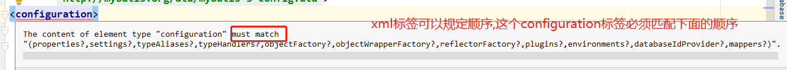
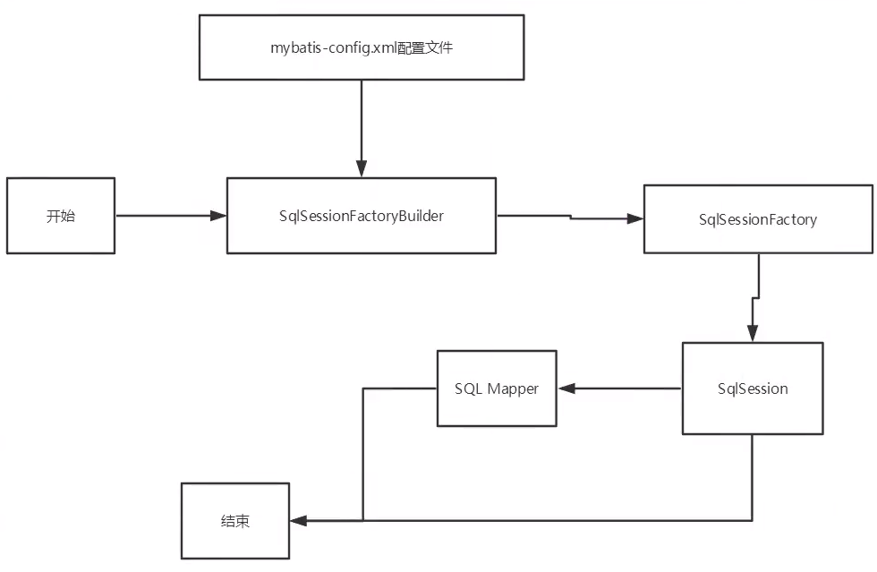
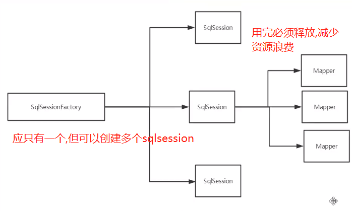
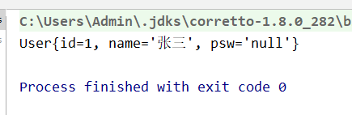
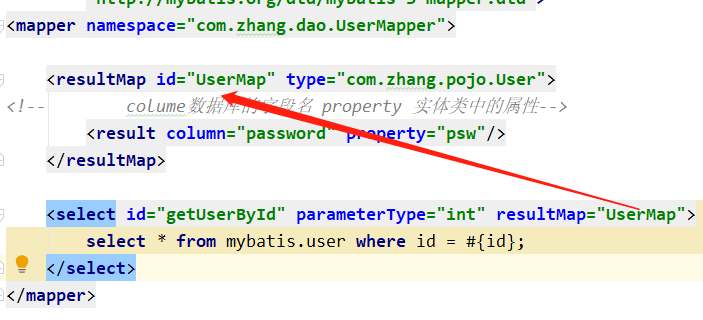
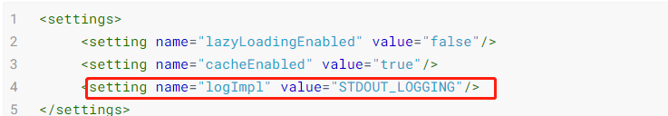
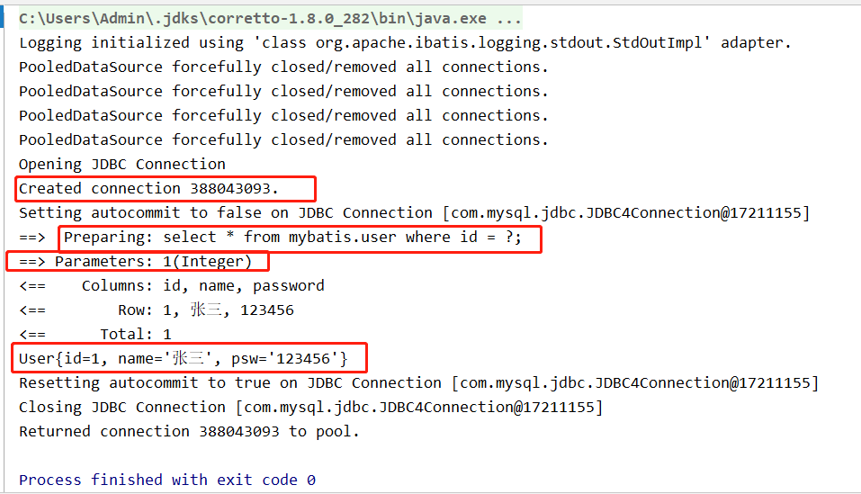
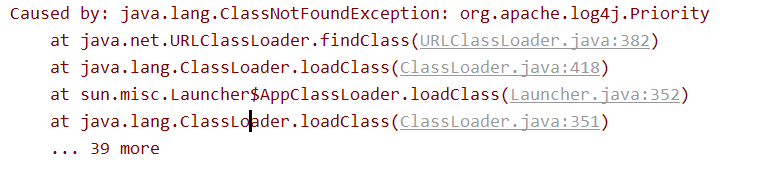
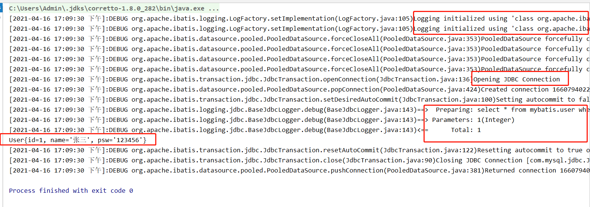
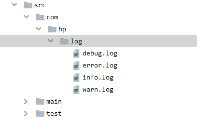

# MyBatis


[TOC]

# 1.	XML配置

- `configuration（配置）`
- `properties（属性）`
- `settings（设置）`
- `typeAliases（类型别名）`
- typeHandlers（类型处理器）
- objectFactory（对象工厂）
- plugins（插件）
- `environments（环境配置）`
  - `environment（环境变量）`
    - transactionManager（事务管理器）
    - dataSource（数据源）
- databaseIdProvider（数据库厂商标识）
- mappers（映射器）


## 1.环境配置（environments）

> MyBatis 可以配置成适应多种环境，这种机制有助于将 SQL 映射应用于多种数据库之中， 现实情况下有多种理由需要这么做。例如，开发、测试和生产环境需要有不同的配置；或者想在具有相同 Schema 的多个生产数据库中使用相同的 SQL 映射。


- **尽管可以配置多个环境，但每个 `SqlSessionFactory` 实例只能选择一种环境。**

- 所以，如果你想连接两个数据库，就需要创建两个 `SqlSessionFactory` 实例，每个数据库对应一个。
```xml
<?xml version="1.0" encoding="UTF-8" ?>
<!DOCTYPE configuration
        PUBLIC "-//mybatis.org//DTD Config 3.0//EN"
        "http://mybatis.org/dtd/mybatis-3-config.dtd">
<configuration>
    <environments default="development">
        <environment id="development">
            <transactionManager type="JDBC"/>
            <dataSource type="POOLED">
                <property name="driver" value="com.mysql.jdbc.Driver"/>
                <property name="url" value="jdbc:mysql://localhost:3306/mybatis?useSSL=false&amp;useUnicode=true&amp;characterEncoding=UTF-8"/>
                <property name="username" value="root"/>
                <property name="password" value="123456"/>
            </dataSource>
        </environment>
        <environment id="publish">
            <transactionManager type="JDBC"/>
            <dataSource type="POOLED">
                <property name="driver" value="com.mysql.jdbc.Driver"/>
                <property name="url" value="jdbc:mysql://localhost:3306/mybatis?useSSL=false&amp;useUnicode=true&amp;characterEncoding=UTF-8"/>
                <property name="username" value="root"/>
                <property name="password" value="123456"/>
            </dataSource>
        </environment>
    </environments>
    <mappers>
        <mapper resource="com/zhang/mapper/UserMapper.xml"/>
    </mappers>
</configuration>
```

- 注意一些关键点:
  - 默认使用的环境 ID（比如：default="`development`"）。
  - 每个 environment 元素定义的环境 ID（比如：id="`development`"）。
  - 事务管理器的配置（比如：type="`JDBC`"）。
  - 数据源的配置（比如：type="`POOLED`"）。

### 1. TransactionManager事务管理器

在 MyBatis 中有两种类型的事务管理器（也就是 type="[`JDBC`|`MANAGED`]"）：

- `JDBC` – 这个配置直接使用了 JDBC 的提交和回滚设施，它依赖从数据源获得的连接来管理事务作用域。
- `MANAGED` – 这个配置几乎没做什么。它从不提交或回滚一个连接，而是让容器来管理事务的整个生命周期（比如 JEE 应用服务器的上下文）。 默认情况下它会关闭连接。然而一些容器并不希望连接被关闭，因此需要将 closeConnection 属性设置为 false 来阻止默认的关闭行为。

### 2.DataSource数据源

dataSource 元素使用标准的 `JDBC` 数据源接口来配置 JDBC 连接对象的资源。

大多数 MyBatis 应用程序会按示例中的例子来配置数据源。虽然数据源配置是可选的，但如果要启用延迟加载特性，就必须配置数据源。

有三种内建的数据源类型（也就是 type="[`UNPOOLED`|`POOLED`|`JNDI`]"）：

- `POOLED`– 这种数据源的实现利用“池”的概念将 JDBC 连接对象组织起来，避免了创建新的连接实例时所必需的初始化和认证时间。 这种处理方式很流行，能使并发 Web 应用快速响应请求。

- `UNPOOLED`– 这个数据源的实现会 每次请求时打开和关闭连接。虽然有点慢，但对那些数据库连接可用性要求不高的简单应用程序来说，是一个很好的选择。 性能表现则依赖于使用的数据库，对某些数据库来说，使用连接池并不重要，这个配置就很适合这种情形。

- `JNDI` – 这个数据源实现是为了能在如 EJB 或应用服务器这类容器中使用，容器可以集中或在外部配置数据源，然后放置一个 JNDI 上下文的数据源引用。


## 2.	属性配置(properties)

属性可以在外部进行配置，并可以进行动态替换。你既可以在典型的 Java 属性文件中配置这些属性，也可以在 properties 元素的子元素中设置。

设置好的属性可以在整个配置文件中用来替换需要动态配置的属性值。[db.properties]

1. 编写一个配置文件`src\main\resources\db.properties`

   ```properties
   driver=com.mysql.jdbc.Driver
   url=jdbc:mysql://localhost:3306/mybatis?useSSL=false&useUnicode=true&characterEncoding=UTF-8
   username=root
   password=123456
   ```

2. 在核心配置文件中引入

   

   ```xml
   <configuration>
   <!--    引入外部配置文件-->
       <properties resource="db.properties"></properties>
       <environments default="development">
           <environment id="development">
               <transactionManager type="JDBC"/>
               <dataSource type="POOLED">
                   <property name="driver" value="${driver}"/>
                   <property name="url" value="${url}"/>
                   <property name="username" value="${username}"/>
                   <property name="password" value="${password}"/>
               </dataSource>
           </environment>
   <configuration>
   ```

   可以在`properties`里面添加一些配置，但如果属性出现同名，会优先使用`resource= "db.properties"`中的配置。

   ```xml
   <properties resource="db.properties">
       <property name="name" value="root"/>
       <property name="password" value="111111"/>
   </properties>
   ```


## 3.	类型别名（typeAliases）

类型别名可为 Java 类型设置一个缩写名字。 它仅用于 XML 配置，意在降低冗余的全限定类名书写。

`mybatis-config.xml`

```XML
<typeAliases>
    <typeAlias type="com.zhang.pojo.User" alias="User" />
</typeAliases>
```

`src\main\java\com\zhang\mapper\UserMapper.xml`中就可以将`com.zhang.pojo.User`替换为`User`

```xml
<select id="getUserList" resultType="User">
    select * from mybatis.user;
</select>
```

也可以只指定一个包名

```xml
<typeAliases>
    <typeAlias type="com.zhang.pojo.User" />
</typeAliases>
```

默认为`user`。若有注解，则别名为其注解值。

```java
@Alias("author")
public class Author {
    ...
}
```


## 4. 	设置（settings）

设置方法如下:

```xml
<settings>
     <setting name="lazyLoadingEnabled" value="false"/>
     <setting name="cacheEnabled" value="true"/>
     <setting name="logImpl" value="STDOUT_LOGGING"/>
</settings>
```


## 5.	映射器（mappers）

- 我们需要告诉 MyBatis 到哪里去找到SQL语句。 
- 你可以使用相对于类路径的资源引用，或完全限定资源定位符（包括 `file:///` 形式的 URL），或类名和包名等。

方式一（推荐）:

```xml
<!-- 使用相对于类路径的资源引用 -->
<mappers>
  <mapper resource="org/mybatis/builder/AuthorMapper.xml"/>
  <mapper resource="org/mybatis/builder/BlogMapper.xml"/>
  <mapper resource="org/mybatis/builder/PostMapper.xml"/>
</mappers>
```

方式二:

```xml
<!-- 使用映射器接口实现类的完全限定类名 -->
<mappers>
  <mapper class="org.mybatis.builder.AuthorMapper"/>
  <mapper class="org.mybatis.builder.BlogMapper"/>
  <mapper class="org.mybatis.builder.PostMapper"/>
</mappers>
```

- 接口和他的Mapper配置文件必须同名。
- 接口和他的Mapper配置文件必须在同一个包下。

方式三:

```xml
<!-- 将包内的映射器接口实现全部注册为映射器 -->
<mappers>
  <package name="org.mybatis.builder"/>
</mappers>
```

- 接口和他的Mapper配置文件必须同名。
- 接口和他的Mapper配置文件必须在同一个包下。

## 6.	其他设置

- typeHandlers（类型处理器）
- objectFactory（对象工厂）
- plugins（插件）
  - mybatis-generator-core
  - mybatis-plus
  - 通用mapper


# 2.	作用域（Scope）和生命周期

> 作用域和生命周期类别是至关重要的，因为错误的使用会导致非常严重的`并发问题`。



并发情况下：




## 1.	SqlSessionFactoryBuilder

- 一旦创建了 `SqlSessionFactory`，就不再需要它了。
-  `SqlSessionFactoryBuilder` 实例的最佳作用域是方法作用域（也就是局部方法变量）。 
- 你可以重用 `SqlSessionFactoryBuilder` 来创建多个 `SqlSessionFactory` 实例。
- 但最好还是不要一直保留着它，以保证所有的 XML 解析资源可以被释放给更重要的事情。


## 2.	SqlSessionFactory

- 可以想象为数据库连接池。
- `SqlSessionFactory` 一旦被创建就应该在应用的运行期间一直存在，没有任何理由丢弃它或重新创建另一个实例。 
- 因此 `SqlSessionFactory` 的最佳作用域是应用作用域。
- 最简单的就是使用`单例模式`或者静态单例模式。

## 3.	SqlSession

- 理解为连接连接池的请求。
- 每个线程都应该有它自己的 SqlSession 实例。
- SqlSession 的实例`不是线程安全`的，因此是`不能被共享`的，所以它的最佳的作用域是请求或方法作用域。 
- 用完就马上关闭它，关闭操作很重要，为了确保每次都能执行关闭操作，你应该把这个关闭操作放到 finally 块中。


# 3.	属性名和数据库字段名不一致问题

如果数据库字段名（password）和代码属性名（psw）不一致，会导致查找结果出错。



原因：`mapper.xml`中代码如下

```java
<select id="getUserById" parameterType="int" resultType="com.zhang.pojo.User">
     select * from mybatis.user where id = #{id};
</select>
```

默认将

```sql
select * from mybatis.user where id = #{id};
```

翻译为:

```sql
select id,name,psw from mybatis.user where id = 1;
--而数据库中字段名为password,导致查出为null
```

笨方法:

```xml
<select id="getUserById" parameterType="int" resultType="com.zhang.pojo.User">
     select id,name,psw as password from mybatis.user where id = #{id};
</select>
```


## 1.	ResultMap 结果集映射

- `resultMap` 元素是 MyBatis 中最重要最强大的元素。
- 一份 `resultMap` 能够代替实现同等功能的数千行代码。ResultMap 的设计思想是，对简单的语句做到零配置，对于复杂一点的语句，只需要描述语句之间的关系就行了。

在`UserMapper.xml`使用标签`resultMap` 将名称不一致的映射起来。

```xml
<mapper namespace="com.zhang.dao.UserMapper">

    <resultMap id="UserMap" type="com.zhang.pojo.User">
<!--        colume数据库的字段名 property 实体类中的属性-->
        <result column="password" property="psw"/>
    </resultMap>

    <select id="getUserById" parameterType="int" resultMap="UserMap">
        select * from mybatis.user where id = #{id};
    </select>
</mapper>
```



 


# 4.	日志工厂

如果一段Sql出现问题，我们想要显示的去查看这个Sql，就需将Sql最终转化形式进行打印。

之前可以使用cout、console.log、debug...

设置输出日志，一个字母，一个空格都不能错。



设置日志之后，运行输出就会变成：



日志类型：

| 设置名  | 描述                                                  | 有效值                                                       | 默认值 |
| ------- | ----------------------------------------------------- | ------------------------------------------------------------ | ------ |
| logImpl | 指定 MyBatis 所用日志的具体实现，未指定时将自动查找。 | SLF4J \| LOG4J \| LOG4J2 \| JDK_LOGGING \| COMMONS_LOGGING \| STDOUT_LOGGING \| NO_LOGGING | 未设置 |

- SLF4J 
- LOG4J 【掌握】
- LOG4J2 
- JDK_LOGGING
- COMMONS_LOGGING 
- STDOUT_LOGGING【掌握】
- NO_LOGGING

---

## STDOUT_LOGGING标准日志输出:

```shell
Logging initialized using 'class org.apache.ibatis.logging.stdout.StdOutImpl' adapter.
PooledDataSource forcefully closed/removed all connections.
PooledDataSource forcefully closed/removed all connections.
PooledDataSource forcefully closed/removed all connections.
PooledDataSource forcefully closed/removed all connections.
Opening JDBC Connection
Created connection 388043093.
Setting autocommit to false on JDBC Connection [com.mysql.jdbc.JDBC4Connection@17211155]
==>  Preparing: select * from mybatis.user where id = ?; 
==> Parameters: 1(Integer)
<==    Columns: id, name, password
<==        Row: 1, 张三, 123456
<==      Total: 1
User{id=1, name='张三', psw='123456'}
Resetting autocommit to true on JDBC Connection [com.mysql.jdbc.JDBC4Connection@17211155]
Closing JDBC Connection [com.mysql.jdbc.JDBC4Connection@17211155]
Returned connection 388043093 to pool.
```

---

## LOG4J 日志实现:

- Log4j是Apache的一个开源项目，通过使用Log4j，我们可以控制日志信息输送的目的地是控制台]、文件、GUI组件。
- 我们也可以控制每一条日志的输出格式；通过定义每一条日志信息的级别，我们能够更加细致地控制日志的生成过程。
- 最令人感兴趣的就是，这些可以通过一个配置文件来灵活地进行配置，而不需要修改应用的代码。

如果直接引入会报错，需要导包

```xml
<settings>
    <setting name="logImpl" value="LOG4J"/>
</settings>
```



1. 先导入`LOG4J`的包。

   ```xml
   <dependency>
       <groupId>log4j</groupId>
       <artifactId>log4j</artifactId>
       <version>1.2.17</version>
   </dependency>
   ```

2. 配置`log4j.properties`

   ```properties
   # priority  :debug<info<warn<error
   #you cannot specify every priority with different file for log4j 
   log4j.rootLogger=debug,stdout,info,debug,warn,error 
   
   #console
   log4j.appender.stdout=org.apache.log4j.ConsoleAppender 
   log4j.appender.stdout.layout=org.apache.log4j.PatternLayout 
   log4j.appender.stdout.layout.ConversionPattern= [%d{yyyy-MM-dd HH:mm:ss a}]:%p %l%m%n
   #info log
   log4j.logger.info=info
   log4j.appender.info=org.apache.log4j.DailyRollingFileAppender 
   log4j.appender.info.DatePattern='_'yyyy-MM-dd'.log'
   log4j.appender.info.File=./src/com/hp/log/info.log
   log4j.appender.info.Append=true
   log4j.appender.info.Threshold=INFO
   log4j.appender.info.layout=org.apache.log4j.PatternLayout 
   log4j.appender.info.layout.ConversionPattern=%d{yyyy-MM-dd HH:mm:ss a} [Thread: %t][ Class:%c >> Method: %l ]%n%p:%m%n
   #debug log
   log4j.logger.debug=debug
   log4j.appender.debug=org.apache.log4j.DailyRollingFileAppender 
   log4j.appender.debug.DatePattern='_'yyyy-MM-dd'.log'
   log4j.appender.debug.File=./src/com/hp/log/debug.log
   log4j.appender.debug.Append=true
   log4j.appender.debug.Threshold=DEBUG
   log4j.appender.debug.layout=org.apache.log4j.PatternLayout 
   log4j.appender.debug.layout.ConversionPattern=%d{yyyy-MM-dd HH:mm:ss a} [Thread: %t][ Class:%c >> Method: %l ]%n%p:%m%n
   #warn log
   log4j.logger.warn=warn
   log4j.appender.warn=org.apache.log4j.DailyRollingFileAppender 
   log4j.appender.warn.DatePattern='_'yyyy-MM-dd'.log'
   log4j.appender.warn.File=./src/com/hp/log/warn.log
   log4j.appender.warn.Append=true
   log4j.appender.warn.Threshold=WARN
   log4j.appender.warn.layout=org.apache.log4j.PatternLayout 
   log4j.appender.warn.layout.ConversionPattern=%d{yyyy-MM-dd HH:mm:ss a} [Thread: %t][ Class:%c >> Method: %l ]%n%p:%m%n
   #error
   log4j.logger.error=error
   log4j.appender.error = org.apache.log4j.DailyRollingFileAppender
   log4j.appender.error.DatePattern='_'yyyy-MM-dd'.log'
   log4j.appender.error.File = ./src/com/hp/log/error.log 
   log4j.appender.error.Append = true
   log4j.appender.error.Threshold = ERROR 
   log4j.appender.error.layout = org.apache.log4j.PatternLayout
   log4j.appender.error.layout.ConversionPattern = %d{yyyy-MM-dd HH:mm:ss a} [Thread: %t][ Class:%c >> Method: %l ]%n%p:%m%n
   ```

3. 配置log4j为日志实现

   ```xml
   <settings>
       <setting name="logImpl" value="LOG4J"/>
   </settings>
   ```

4. 执行Test

   


## LOG4J 在Java代码中使用:

Test类中实现:

```java
public class UserDaoTest {
    static Logger logger =  Logger.getLogger(UserDaoTest.class);
    @Test
    public void TestLog4j(){
        logger.info("info 进入了 TestLog4j");
        logger.debug("debug 进入了 TestLog4j");
        logger.debug("error 进入了 TestLog4j");
    }
}
```

控制台输出:

```shell
C:\Users\Admin\.jdks\corretto-1.8.0_282\bin\java.exe... -ideVersion5 -junit4 com.zhang.dao.UserDaoTest,TestLog4j
[2021-04-16 17:20:06 下午]:INFO com.zhang.dao.UserDaoTest.TestLog4j(UserDaoTest.java:18)info 进入了 TestLog4j
[2021-04-16 17:20:06 下午]:DEBUG com.zhang.dao.UserDaoTest.TestLog4j(UserDaoTest.java:19)debug 进入了 TestLog4j
[2021-04-16 17:20:06 下午]:DEBUG com.zhang.dao.UserDaoTest.TestLog4j(UserDaoTest.java:20)error 进入了 TestLog4j

Process finished with exit code 0
```

会在配置的目录下生成log文件:



log日志的输出目录可以在`log4j.properties`中设置:

```properties
log4j.appender.info.File=./src/com/hp/log/info.log
log4j.appender.debug.File=./src/com/hp/log/debug.log
log4j.appender.warn.File=./src/com/hp/log/warn.log
log4j.appender.error.File = ./src/com/hp/log/error.log 
```

