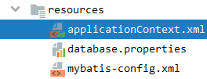
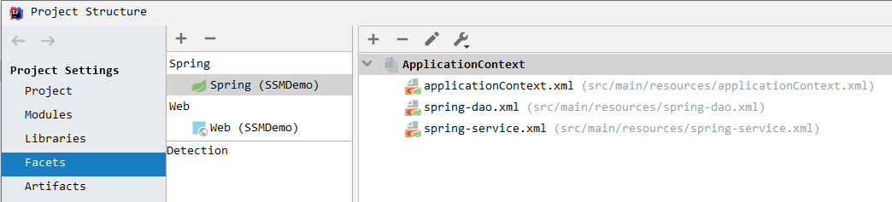
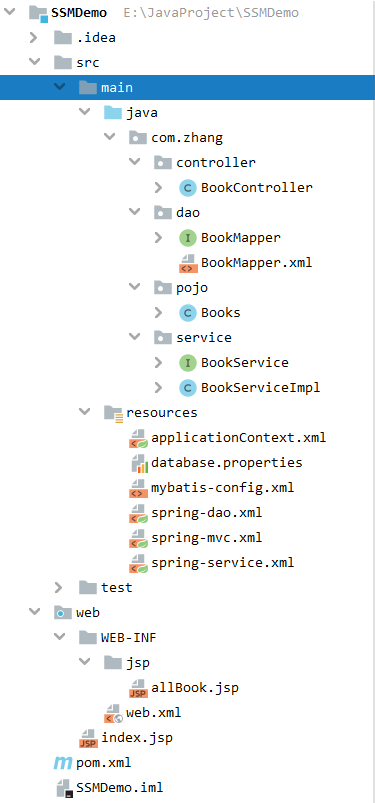
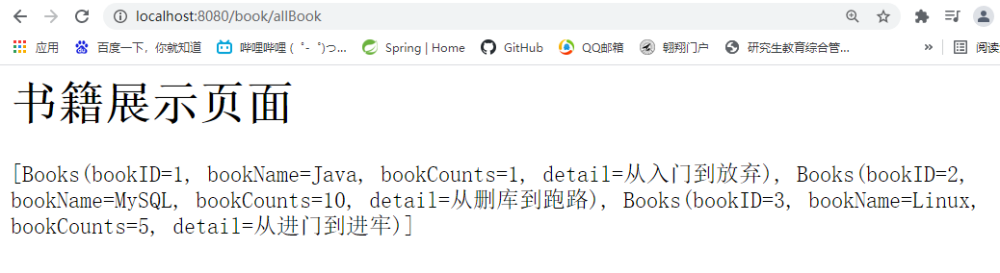
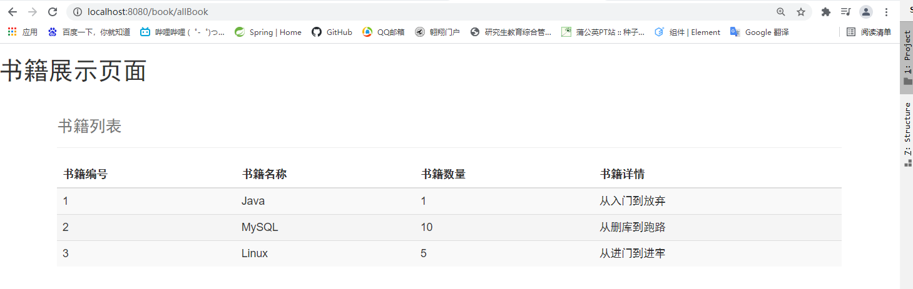
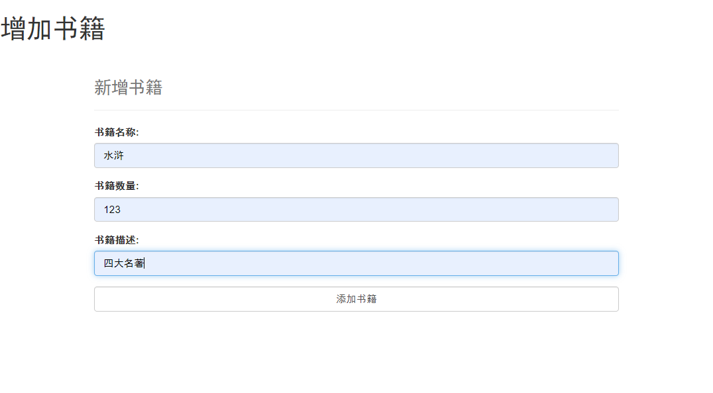
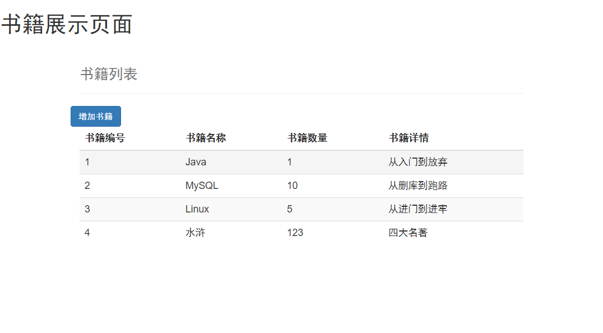
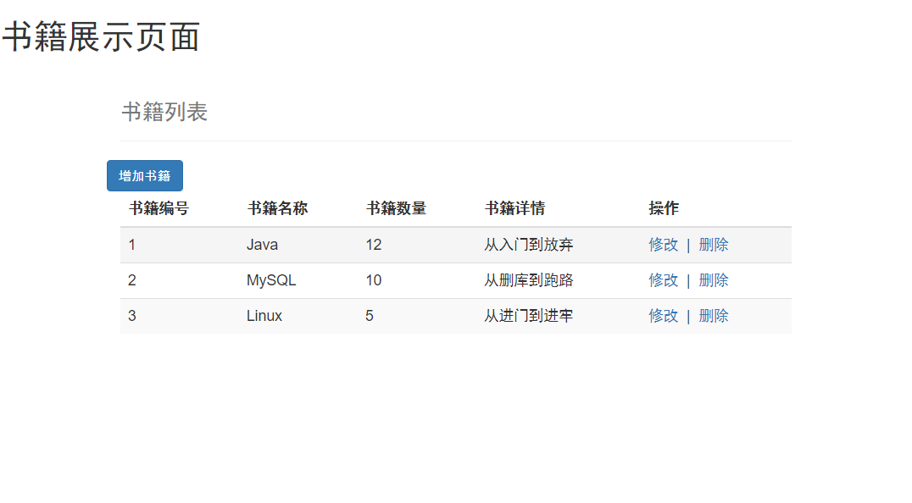
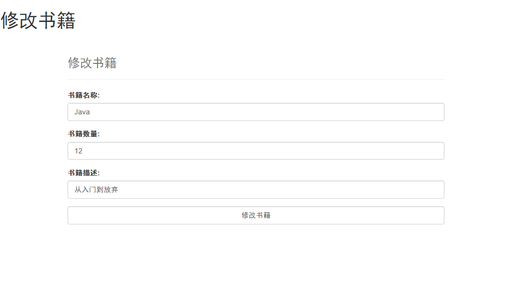

# SSM Integration

[TOC]

---

集成开发环境：`IDEA`

数据库：`Mysql 5.7.32`

服务器：`Tomcat 9.0.45`

项目管理工具：`Maven：3.8.1`

JDK：`JDK 1.8`

GitHub 项目代码：git@github.com:NPU-FanZhang/SSMIntegrationDemo.git

---


# 1、数据库建表

```mysql
CREATE DATABASE `ssmbuild`;

USE `ssmbuild`;

CREATE TABLE `books`(
`bookID` INT(10) NOT NULL AUTO_INCREMENT COMMENT '书id',
`bookName` VARCHAR(100) NOT NULL COMMENT '书名',
`bookCounts` INT(11) NOT NULL COMMENT '数量',
`detail` VARCHAR(200) NOT NULL COMMENT '描述',
KEY `bookID`(`bookID`)
)ENGINE=INNODB DEFAULT CHARSET=utf8;

INSERT INTO `books`(`bookID`,`bookName`,`bookCounts`,`detail`) VALUES
(1,'Java',1,'从入门到放弃'),
(2,'MySQL',10,'从删库到跑路'),
(3,'Linux',5,'从进门到进牢');
```

# 2、项目pom.xml配置

- 创建普通Maven项目

- pom.xml中配置依赖

  ```xml
  <!--添加依赖
      junit   数据库驱动   数据库连接池  servlet JSP
      mybatis mybatis-spring  spring lombok
  -->
  <dependencies>
      <dependency>
          <groupId>junit</groupId>
          <artifactId>junit</artifactId>
          <version>4.13</version>
      </dependency>
      <dependency>
          <groupId>mysql</groupId>
          <artifactId>mysql-connector-java</artifactId>
          <version>5.1.47</version>
      </dependency>
      <!--数据库连接池 : c3p0 -->
      <dependency>
          <groupId>com.mchange</groupId>
          <artifactId>c3p0</artifactId>
          <version>0.9.5.5</version>
      </dependency>
      <dependency>
          <groupId>javax.servlet</groupId>
          <artifactId>servlet-api</artifactId>
          <version>2.5</version>
      </dependency>
      <dependency>
          <groupId>javax.servlet.jsp</groupId>
          <artifactId>jsp-api</artifactId>
          <version>2.2</version>
      </dependency>
      <dependency>
          <groupId>javax.servlet</groupId>
          <artifactId>jstl</artifactId>
          <version>1.2</version>
      </dependency>
  
      <dependency>
          <groupId>org.mybatis</groupId>
          <artifactId>mybatis</artifactId>
          <version>3.5.2</version>
      </dependency>
      <dependency>
          <groupId>org.mybatis</groupId>
          <artifactId>mybatis-spring</artifactId>
          <version>2.0.2</version>
      </dependency>
  
      <dependency>
          <groupId>org.springframework</groupId>
          <artifactId>spring-webmvc</artifactId>
          <version>5.3.6</version>
      </dependency>
      <dependency>
          <groupId>org.springframework</groupId>
          <artifactId>spring-jdbc</artifactId>
          <version>5.3.6</version>
      </dependency>
  
      <dependency>
          <groupId>org.projectlombok</groupId>
          <artifactId>lombok</artifactId>
          <version>1.18.12</version>
      </dependency>
  </dependencies>
  ```

- pom.xml中配置静态资源导出

  ```xml
  <build>
      <resources>
          <resource>
              <directory>src/main/java</directory>
              <includes>
                  <include>**/*.properties</include>
                  <include>**/*.xml</include>
              </includes>
              <filtering>false</filtering>
          </resource>
          <resource>
              <directory>src/main/resources</directory>
              <includes>
                  <include>**/*.properties</include>
                  <include>**/*.xml</include>
              </includes>
              <filtering>false</filtering>
          </resource>
      </resources>
  </build>
  ```


# 3、resources中创建配置和资源文件



- 创建数据库连接配置文件database.properties

  ```properties
  jdbc.driver=com.mysql.jdbc.Driver
  #Mysql8.0+需要在url中增加时区配置 &serverTimezone=Asia/Shanghai
  jdbc.url=jdbc:mysql://localhost:3306/ssmbuild?useSSL=false&useUnicode=true&characterEncoding=utf8
  jdbc.username=root
  jdbc.password=123456
  ```

- 创建mybatis的配置文件mybatis-config.xml

  ```xml
  <?xml version="1.0" encoding="UTF-8" ?>
  <!DOCTYPE configuration
          PUBLIC "-//mybatis.org//DTD Config 3.0//EN"
          "http://mybatis.org/dtd/mybatis-3-config.dtd">
  <configuration>
      <settings>
          <setting name="logImpl" value="STDOUT_LOGGING"/>
      </settings>
      <!--配置数据源,交给Spring做-->
      <typeAliases>
          <package name="com.zhang.pojo"/>
      </typeAliases>
      <mappers>
          <!--dao里面的xml与接口名一致的话,可以使用class绑定
              如果不一致,使用resource绑定-->
          <mapper class="com.zhang.dao.BookMapper"></mapper>
      </mappers>
  </configuration>
  ```

- 创建spring的配置文件applicationContext.xml

  ```xml
  <?xml version="1.0" encoding="UTF-8" ?>
  <beans xmlns="http://www.springframework.org/schema/beans"
         xmlns:xsi="http://www.w3.org/2001/XMLSchema-instance"
         xsi:schemaLocation="http://www.springframework.org/schema/beans
          http://www.springframework.org/schema/beans/spring-beans.xsd">
  
      <import resource="classpath:spring-dao.xml"/>
      <import resource="classpath:spring-mvc.xml"/>
      <import resource="classpath:spring-service.xml"/>
  
  </beans>
  ```


# 4、创建实体类及接口，实现SQL


- 创建实体类`Books`

  ```java
  @Data
  @AllArgsConstructor
  @NoArgsConstructor
  public class Books {
      private int bookID;
      private String bookName;
      private int bookCounts;
      private String detail;
  
  }
  ```

- 编写dao层的`BookMapper`接口及`BookMapper.xml`实现

  ```java
  public interface BookMapper {
      //增加一本书
      int addBook(Books book);
      //删除一本书
      int deleteBookByID(@Param("bookId") int ID);
      //更新一本书
      int updateBook(Books book);
      //查询一本书
      Books queryBookByID(@Param("bookId") int ID);
      //查询全部的书
      //也可以使用注解写SQL,但有的复杂Sql不好写
      //@Select("select * from  ssmbuild.books")
      List<Books> queryAllBooks();
  }
  ```

  

  ```xml-dtd
  <?xml version="1.0" encoding="UTF-8" ?>
  <!DOCTYPE mapper
          PUBLIC "-//mybatis.org//DTD Config 3.0//EN"
          "http://mybatis.org/dtd/mybatis-3-mapper.dtd">
  <mapper namespace="com.zhang.dao.BookMapper">
  
      <insert id="addBook" parameterType="Books">
          insert into ssmbuild.books( bookName, bookCounts, detail)
          VALUES (#{bookName},#{bookCounts},#{detail});
      </insert>
  
      <delete id="deleteBookByID" parameterType="int">
          delete from ssmbuild.books where bookID=#{bookId};
      </delete>
  
      <update id="updateBook" parameterType="Books">
          update ssmbuild.books
          set bookName=#{bookName},
              bookCounts=#{bookCounts},
              detail=#{detail}
          where bookID=#{bookID};
      </update>
  
      <select id="queryBookByID" resultType="Books">
          select *
          from ssmbuild.books where bookID=#{bookId};
      </select>
  
      <select id="queryAllBooks" resultType="Books">
          select *
          from ssmbuild.books;
      </select>
  
  </mapper>
  ```

  写Sql时的自动补齐可以在IDEA中设置，`File | Settings | Languages & Frameworks | SQL Dialects`

- 在`mybatis-config.xml`中注册写好的`BookMapper.xml`

  ```xml
  <!--配置数据源,交给Spring做,-->
  <typeAliases>
      <package name="com.zhang.pojo"/>
  </typeAliases>
  <mappers>
      <!--dao里面的xml与接口名一致的话,可以使用class绑定
          如果不一致,使用resource绑定-->
      <mapper class="com.zhang.dao.BookMapper"></mapper>
  </mappers>
  ```


# 5、整合Spring

因为IDEA设置配置文件时,自动将配置文件关联了起来，不然需要手动将各个配置文件import到一个文件下。



- 创建`spring-dao.xml`，将`dao`层配置进来

  ```xml
  <?xml version="1.0" encoding="UTF-8" ?>
  <beans xmlns="http://www.springframework.org/schema/beans"
         xmlns:xsi="http://www.w3.org/2001/XMLSchema-instance"
         xmlns:context="http://www.springframework.org/schema/context"
         xsi:schemaLocation="http://www.springframework.org/schema/beans
          http://www.springframework.org/schema/beans/spring-beans.xsd
          http://www.springframework.org/schema/context
          https://www.springframework.org/schema/context/spring-context.xsd">
  
      <!--1.关联数据库配置文件-->
      <context:property-placeholder location="classpath:database.properties"/>
  
      <!--2.数据库连接池
          dbcp:半自动化操作,不能自动连接          c3p0:自动操作(自动化操作,可以自动设置到对象中)
          hikari:Spring2.0+自带              druid:很多公司在用
          我们用 c3p0
          -->
      <bean id="dataSource" class="com.mchange.v2.c3p0.ComboPooledDataSource">
          <property name="driverClass" value="${jdbc.driver}"/>
          <property name="jdbcUrl" value="${jdbc.url}"/>
          <property name="user" value="${jdbc.username}"/>
          <property name="password" value="${jdbc.password}"/>
          <!--c3p0的私有属性-->
          <property name="maxPoolSize" value="30"/>
          <property name="minPoolSize" value="10"/>
          <!--关闭后不自动commit-->
          <property name="autoCommitOnClose" value="false"/>
          <!--获取连接超时时间-->
          <property name="checkoutTimeout" value="10000"/>
          <!--获取连接失败重连次数-->
          <property name="acquireRetryAttempts" value="2"/>
      </bean>
  
      <!--3. sqlSessionFactory-->
      <bean id="sqlSessionFactory" class="org.mybatis.spring.SqlSessionFactoryBean">
          <property name="dataSource" ref="dataSource"/>
          <!--绑定Mybatis的配置文件-->
          <property name="configLocation" value="classpath:mybatis-config.xml"/>
      </bean>
  
      <!--配置Dao接口,扫描包,动态实现了Dao接口,可以注入到Spring容器中-->
      <bean class="org.mybatis.spring.mapper.MapperScannerConfigurer">
          <property name="sqlSessionFactoryBeanName" value="sqlSessionFactory"/><!--和上面的sqlSessionFactory同名-->
          <!--要扫描的包-->
          <property name="basePackage" value="com.zhang.dao"/>
      </bean>
  </beans>
  ```

- 创建`spring-service.xml`，将`service`层配置进来

  ```xml
  <beans xmlns="http://www.springframework.org/schema/beans"
         xmlns:xsi="http://www.w3.org/2001/XMLSchema-instance"
         xmlns:mvc="http://www.springframework.org/schema/mvc"
         xmlns:context="http://www.springframework.org/schema/context"
         xsi:schemaLocation="http://www.springframework.org/schema/beans
          https://www.springframework.org/schema/beans/spring-beans.xsd
          http://www.springframework.org/schema/mvc
          https://www.springframework.org/schema/mvc/spring-mvc.xsd
          http://www.springframework.org/schema/context
          https://www.springframework.org/schema/context/spring-context.xsd">
      <!--1.扫描service下的包-->
      <context:component-scan base-package="com.zhang.service"/>
  
      <!--2.将我们的所有业务类,注入到Spring,可以通过配置或者注解实现-->
      <bean id="BookServiceImpl" class="com.zhang.service.BookServiceImpl">
          <!--因为IDEA设置配置文件时,自动将配置文件关联了起来
              会有自动补全,不然需要手动将各个配置文件import到一个文件下-->
          <property name="bookMapper" ref="bookMapper"/>
      </bean>
  
      <!--3.声明式事务配置-->
      <bean id="transcationManager" class="org.springframework.jdbc.datasource.DataSourceTransactionManager">
          <property name="dataSource" ref="dataSource"/>
      </bean>
      <!--4.可选aop事务支持-->
  </beans>
  ```


# 6、整合SpringMVC

- 添加WEB框架支持

- 配置`src\main\resources\spring-mvc.xml`并添加入主配置文件。

  ```xml
  <?xml version="1.0" encoding="UTF-8"?>
  <beans xmlns="http://www.springframework.org/schema/beans"
         xmlns:xsi="http://www.w3.org/2001/XMLSchema-instance"
         xmlns:mvc="http://www.springframework.org/schema/mvc"
         xmlns:context="http://www.springframework.org/schema/context"
         xsi:schemaLocation="http://www.springframework.org/schema/beans
          https://www.springframework.org/schema/beans/spring-beans.xsd
          http://www.springframework.org/schema/mvc
          https://www.springframework.org/schema/mvc/spring-mvc.xsd
          http://www.springframework.org/schema/context
          https://www.springframework.org/schema/context/spring-context.xsd">
  
      <!--1.注解驱动-->
      <mvc:annotation-driven/>
      <!--2.静态资源过滤-->
      <mvc:default-servlet-handler/>
      <!--3.扫描包 controller-->
      <context:component-scan base-package="com.zhang.controller"/>
      <!--4.视图解析器-->
      <bean class="org.springframework.web.servlet.view.InternalResourceViewResolver">
          <property name="prefix" value="/WEB-INF/jsp/"/>
          <property name="suffix" value=".jsp"/>
      </bean>
  
  </beans>
  ```

- 配置`web\WEB-INF\web.xml`

  ```xml
  <?xml version="1.0" encoding="UTF-8"?>
  <web-app xmlns="http://xmlns.jcp.org/xml/ns/javaee"
           xmlns:xsi="http://www.w3.org/2001/XMLSchema-instance"
           xsi:schemaLocation="http://xmlns.jcp.org/xml/ns/javaee http://xmlns.jcp.org/xml/ns/javaee/web-app_4_0.xsd"
           version="4.0">
      <!--DispatcherServlet-->
      <servlet>
          <servlet-name>SpringMVC</servlet-name>
          <servlet-class>org.springframework.web.servlet.DispatcherServlet</servlet-class>
          <init-param>
              <param-name>contextConfigLocation</param-name>
              <param-value>classpath:applicationContext.xml</param-value>
          </init-param>
          <load-on-startup>1</load-on-startup>
      </servlet>
      <servlet-mapping>
          <servlet-name>SpringMVC</servlet-name>
          <url-pattern>/</url-pattern>
      </servlet-mapping>
      <!--乱码过滤-->
      <filter>
          <filter-name>encodingFilter</filter-name>
          <filter-class>org.springframework.web.filter.CharacterEncodingFilter</filter-class>
          <init-param>
              <param-name>encoding</param-name>
              <param-value>utf-8</param-value>
          </init-param>
      </filter>
      <filter-mapping>
          <filter-name>encodingFilter</filter-name>
          <url-pattern>/*</url-pattern>
      </filter-mapping>
      <!--Session-->
      <session-config>
          <session-timeout>15</session-timeout>
      </session-config>
  </web-app>
  ```


- 完整的项目结构

  


# 7、实现第一个业务-查询

- 创建`src\main\java\com\zhang\controller\BookController.java`，实现业务逻辑，调用`Service`层。

  ```java
  @Controller
  @RequestMapping("/book")
  public class BookController {
      //Controller层调Service层
      @Autowired
      @Qualifier("BookServiceImpl")
      private BookService bookService;
  
      //查询全部数据,并返回到一个书籍的展示页面
      @RequestMapping("/allbook")
      public String bookList(Model model){
          List<Books> books = bookService.queryAllBooks();
          model.addAttribute("list",books);
          return "allBook";
      }
  
  }
  ```

- 创建JSP页面，`index.jsp`及`web\WEB-INF\jsp\allBook.jsp`。

  `index.jsp`

  ```jsp
  <%@ page contentType="text/html;charset=UTF-8" language="java" %>
  <html>
    <head>
      <title>$Title$</title>
    </head>
    <body>
    <h3>
      <a href="${pageContext.request.contextPath}/book/allBook">进入书籍页面</a>
    </h3>
    </body>
  </html>
  ```

  `allBook.jsp`

  ```jsp
  <%@ page contentType="text/html;charset=UTF-8" language="java" %>
  <html>
  <head>
      <title>书籍展示页面</title>
  </head>
  <body>
  <h1>书籍展示页面</h1>
  ${list}
  </body>
  </html>
  ```

- 配置Tomcat，添加lib

- 运行



**初步成功!**

---

进行页面展示美化：`allBook.jsp`

```jsp
<%@ taglib prefix="c" uri="http://java.sun.com/jsp/jstl/core" %>
<%@ page contentType="text/html;charset=UTF-8" language="java" %>
<html>
<head>
    <title>书籍展示页面</title>
    <%--BootStrasp--%>
    <link href="https://cdn.staticfile.org/twitter-bootstrap/3.3.7/css/bootstrap.min.css" rel="stylesheet">
</head>
<body>
<h1>书籍展示页面</h1>

<div class="container">
    <div class="row clearfix">
        <div class="col-md-12 column">
            <div class="page-header">
                <h1>
                    <small>书籍列表</small>
                </h1>
            </div>
        </div>
    </div>
    <div class="row clearfix">
        <div class="col-md-12 column">
            <table class="table table-hover table-striped">
                <thead>
                    <tr>
                        <th>书籍编号</th>
                        <th>书籍名称</th>
                        <th>书籍数量</th>
                        <th>书籍详情</th>
                    </tr>
                </thead>
                <tbody>
                    <c:forEach var="book" items="${list}">
                        <tr>
                            <td>${book.bookID}</td>
                            <td>${book.bookName}</td>
                            <td>${book.bookCounts}</td>
                            <td>${book.detail}</td>
                        </tr>
                    </c:forEach>
                </tbody>
            </table>
        </div>
    </div>
</div>
</body>
</html>
```




# 8、实现增加业务

1. 先增加跳转页面，跳转到新增页面。

   ```jsp
   <div class="row">
       <div class="col-md-4 column">
           <a class="btn btn-primary" href="${pageContext.request.contextPath}/book/toAddPage">增加书籍</a>
       </div>
   </div>
   ```

2. `BookController.java`增加跳转控制

   ```java
   //跳转到增加书籍页面
   @RequestMapping("/toAddPage")
   public String toAddPage(){
       return "addBook";
   }
   ```

3. 新建增加图书JSP页面，`web\WEB-INF\jsp\addBook.jsp`。

   ```jsp
   <%@ page contentType="text/html;charset=UTF-8" language="java" %>
   <html>
   <head>
       <title>Title</title>
       <%--BootStrasp--%>
       <link href="https://cdn.staticfile.org/twitter-bootstrap/3.3.7/css/bootstrap.min.css" rel="stylesheet">
   </head>
   <body>
   <h1>增加书籍</h1>
   <div class="container">
       <div class="row clearfix">
           <div class="col-md-12 column">
               <div class="page-header">
                   <h1>
                       <small>新增书籍</small>
                   </h1>
               </div>
           </div>
       </div>
       <form action="${pageContext.request.contextPath}/book/addBook" method="get">
           <div class="form-group">
               <label >书籍名称:</label>
               <input type="text" name="bookName" class="form-control" required>
           </div>
           <div class="form-group">
               <label>书籍数量:</label>
               <input type="text" name="bookCounts" class="form-control" required>
           </div>
           <div class="form-group">
               <label>书籍描述:</label>
               <input type="text" name="detail" class="form-control" required >
           </div>
           <div class="form-group">
               <input type="submit" class="form-control" value="添加书籍">
           </div>
       </form>
   </div>
   </body>
   </html>
   ```

4. `BookController.java`增加添加控制

   ```java
   //添加书籍的请求
   @RequestMapping("/addBook")
   public  String addBook(Books books){
       System.out.println("addBook->"+books);
       //addBook->Books(bookID=0, bookName=水浒, bookCounts=123, detail=四大名著)
       bookService.addBook(books);
       return "redirect:/book/allBook";
   }
   ```





# 9、实现修改业务

1. 先增加跳转页面，跳转到修改页面。

   ```jsp
   <td>
       <a href="${pageContext.request.contextPath}/book/toUpdatePage?id=${book.bookID}">修改</a>
       &nbsp;|&nbsp;
       <a href="#">删除</a>
   </td>
   ```

2. `BookController.java`增加跳转控制

   ```java
   //跳转到修改书籍页面
   @RequestMapping("/toUpdatePage")
   public String toUpdatePage(int id,Model model){
       Books books = bookService.queryBookByID(id);
       model.addAttribute("Qbooks",books);
       return "updateBook";
   }
   ```
   
3. 新建修改图书JSP页面，`web\WEB-INF\jsp\updateBook.jsp`。

   修改页面需要增加修改书籍的ID。

   ```jsp
   <%@ page contentType="text/html;charset=UTF-8" language="java" %>
   <html>
   <head>
       <title>Title</title>
       <%--BootStrasp--%>
       <link href="https://cdn.staticfile.org/twitter-bootstrap/3.3.7/css/bootstrap.min.css" rel="stylesheet">
   </head>
   <body>
   <h1>修改书籍</h1>
   
   <div class="container">
       <div class="row clearfix">
           <div class="col-md-12 column">
               <div class="page-header">
                   <h1>
                       <small>修改书籍</small>
                   </h1>
               </div>
           </div>
       </div>
       <form action="${pageContext.request.contextPath}/book/updateBook" method="get">
           <%--前端传递隐藏域提交ID--%>
           <input type="hidden" name="bookID" value="${Qbooks.bookID}">
           <div class="form-group">
               <label >书籍名称:</label>
               <input type="text" name="bookName" value="${Qbooks.bookName}" class="form-control" required>
           </div>
           <div class="form-group">
               <label>书籍数量:</label>
               <input type="text" name="bookCounts" value="${Qbooks.bookCounts}" class="form-control" required>
           </div>
           <div class="form-group">
               <label>书籍描述:</label>
               <input type="text" name="detail" value="${Qbooks.detail}" class="form-control" required >
           </div>
           <div class="form-group">
               <input type="submit" class="form-control" value="修改书籍">
           </div>
       </form>
   </div>
   </body>
   </html>
   ```

4. `BookController.java`增加更新控制

   ```java
   //修改书籍的请求
   @RequestMapping("/updateBook")
   public  String updateBook(Books books){
       System.out.println("updateBook->"+books);
       //updateBook->Books(bookID=1, bookName=Java, bookCounts=12, detail=从入门到放弃)
       bookService.updateBook(books);
       return "redirect:/book/allBook";
   }
   ```





# 10、实现删除业务

1. 跳转到删除请求。

   ```jsp
   <td>
       <a href="${pageContext.request.contextPath}/book/toUpdatePage?id=${book.bookID}">修改</a>
       &nbsp;|&nbsp;
       <a href="${pageContext.request.contextPath}/book/delBook/${book.bookID}">删除</a>
   </td>
   ```

2. `BookController.java`增加删除控制

   ```java
   //删除书籍的请求
   @RequestMapping("/delBook/{bookId}")
   public  String delBook(@PathVariable("bookId") int id){
       System.out.println("delBook->"+id);
       //delBook->4
       bookService.deleteBookByID(id);
       return "redirect:/book/allBook";
   }
   ```

   

# 11、实现查询功能

实现一个完全新增的功能，应该从下往上开发，`Dao`->`Service`->`Controller`。

1. `Dao`接口增加`src\main\java\com\zhang\dao\BookMapper.java`。

   ```java
   List<Books> queryBookByName(String bookName);
   ```

2. `Dao`实现XML`src\main\java\com\zhang\dao\BookMapper.xml`。

   ```xml
   <select id="queryBookByName" resultType="Books">
       select *
       from ssmbuild.books where bookName like concat('%',#{bookName},'%');
   </select>
   ```

3. `Service`增加接口`src\main\java\com\zhang\service\BookService.java`。

   ```java
   List<Books>  queryBookByName(String bookName);
   ```

4. `Service`增加接口的实现`src\main\java\com\zhang\service\BookServiceImpl.java`。

   ```java
   public List<Books> queryBookByName(String bookName) {
       return bookMapper.queryBookByName(bookName);
   }
   ```

5. `BookController.java`增加查询控制。

   ```java
   //按名查询
   @RequestMapping("/queryBook")
   public String queryBookByName(String queryBookName,Model model){
       List<Books> books = bookService.queryBookByName(queryBookName);
       //List<Books> books = bookService.queryAllBooks();
       model.addAttribute("list",books);
       return "allBook";
       //return "redirect:/book/allBook";
   }
   ```

6. JSP页面展示。

   ```jsp
   <div class="row">
       <div class="col-md-4 column">
           <a class="btn btn-primary" href="${pageContext.request.contextPath}/book/toAddPage">增加书籍</a>
       </div>
       <div class="col-md-4 column" >
           <form action="${pageContext.request.contextPath}/book/queryBook" method="get" style="display:flex">
               <input type="text" name="queryBookName" class="form-control" placeholder="输入查询书籍的名称">
               <input type="submit" value="查询" class="btn btn-primary">
           </form>
       </div>
   </div>
   ```


#  报错处理

他妈的这些傻逼错误查了一早上！后面我再自己手敲配置文件头，直接吃屎。

##  class path resource [applicationContext.xml] cannot be opened because it does not exist

1. web.xml路径配置不正确。

2. build project工程后没有将资源文件resources下的配置文件拷贝到out目录下面的classes目录下。

   解决方法参考:https://blog.csdn.net/sinat_38301574/article/details/80465693

## java.lang.IllegalArgumentException: protocol = https host = null

xml中的头部网址配错。

## Type org.apache.ibatis.session.SqlSessionFactory not present

mybatis依赖导入有问题，注意版本。

```xml
<dependency>
    <groupId>org.mybatis</groupId>
    <artifactId>mybatis</artifactId>
    <version>3.5.2</version>
</dependency>
<dependency>
    <groupId>org.mybatis</groupId>
    <artifactId>mybatis-spring</artifactId>
    <version>2.0.2</version>
</dependency>
```

## Path does not chain with any of the trust anchors

src\main\resources\database.properties中`useSSL=true`设为false

```properties
jdbc.url=jdbc:mysql://localhost:3306/ssmbuild?useSSL=false&useUnicode=true&characterEncoding=utf8
```

