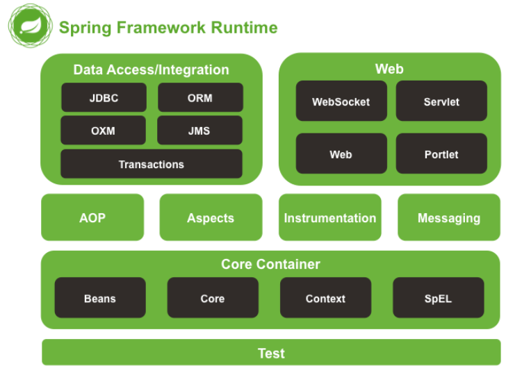
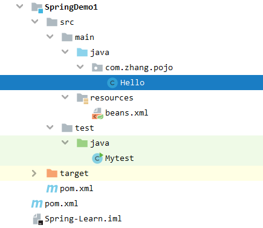

# Spring


[TOC]

# 1、Spring简介

> Spring是一个轻量级的`控制反转(IoC)`和`面向切面(AOP)`的容器框架。

- Spring框架是由于软件开发的复杂性而创建的。
- Spring的用途不仅仅限于服务器端的开发。从简单性、可测试性和松耦合性角度而言，绝大部分Java应用都可以从Spring中受益。
- **Rod Johnson**是Spring框架的创始人，同时也是SpringSource的联合创始人。Spring是面向切面编程`（AOP）`和控制反转`（IoC)`的容器框架。
- SSM: `SpringMVC` + `Spring` + `Mybatis`
- SSH: Struct2 + Spring + Hibernate


官方网站:https://spring.io

GitHub地址:https://github.com/spring-projects/spring-framework


- `Spring Boot`

  *Spring Boot makes it easy to create stand-alone, production-grade Spring based Applications that you can "just run".*

  - 一个快速开发的脚手架。
  - 基于SpringBoot可以快速开发单个微服务。
  - 约定大于配置。

- `Spring Cloud`

  *Spring Cloud provides tools for developers to quickly build some of the common patterns in distributed systems (e.g. configuration management, service discovery).*

  - Spring Cloud是基于SpringBoot实现的。

  - 以快速构建分布式系统中的某些常见模式，例如：配置管理、服务发现、智能路由、微代理、控制总线、一次性令牌、全局锁、分布式会话、群集状态等。

    

## 1、Spring的优点

- Spring是一个开源的免费的框架（容器）。
- Spring是一个轻量级、非入侵式的框架！
- `控制反转(IoC)`和`面向切面(AOP)`！
- 支持事务处理，对其他框架整合的支持。
- 面向接口编程，而不是针对类编程。Spring将使用接口的复杂度降低到零。
- 代码应该易于测试。Spring框架会帮助你，使代码的测试更加简单。
- 在Java中，已检查异常（Checked exception）被过度使用。框架不应该迫使你捕获不能恢复的异常。


## 2、Spring的框架组成




- Spring Core（核心容器）：核心容器提供 Spring 框架的基本功能。核心容器的主要组件是 BeanFactory，它是工厂模式的实现。BeanFactory 使用控制反转 （IOC） 模式将应用程序的配置和依赖性规范与实际的应用程序代码分开。
- Spring Context（上下文）：Spring 上下文是一个配置文件，向 Spring 框架提供上下文信息。Spring 上下文包括企业服务，例如：JNDI、EJB、电子邮件、国际化、校验和调度功能。
- Spring AOP：通过配置管理特性，Spring AOP 模块直接将面向方面的编程功能集成到了 Spring 框架中。所以，可以很容易地使 Spring 框架管理的任何对象支持 AOP。Spring AOP 模块为基于 Spring 的应用程序中的对象提供了事务管理服务。通过使用 Spring AOP，不用依赖 EJB 组件，就可以将声明性事务管理集成到应用程序中。
- Spring DAO：JDBC DAO 抽象层提供了有意义的异常层次结构，可用该结构来管理异常处理和不同数据库供应商抛出的错误消息。异常层次结构简化了错误处理，并且极大地降低了需要编写的异常代码数量（例如打开和关闭连接）。Spring DAO 的面向 JDBC 的异常遵从通用的 DAO 异常层次结构。
- Spring ORM：Spring 框架插入了若干个 ORM 框架，从而提供了 ORM 的对象关系工具，其中包括 JDO、Hibernate 和 iBatis SQL Map。所有这些都遵从 Spring 的通用事务和 DAO 异常层次结构。
- Spring Web 模块：Web 上下文模块建立在应用程序上下文模块之上，为基于 Web 的应用程序提供了上下文。所以，Spring 框架支持与 Jakarta Struts 的集成。Web 模块还简化了处理多部分请求以及将请求参数绑定到域对象的工作。
- Spring MVC 框架：MVC 框架是一个全功能的构建 Web 应用程序的 MVC 实现。通过策略接口，MVC 框架变成为高度可配置的，MVC 容纳了大量视图技术，其中包括 JSP、Velocity、Tiles、iText 和 POI。


# 2、环境搭建

1. 导入依赖Jar包。

   ```xml
   <!-- https://mvnrepository.com/artifact/org.springframework/spring-webmvc -->
   <dependency>
       <groupId>org.springframework</groupId>
       <artifactId>spring-webmvc</artifactId>
       <version>5.3.6</version>
   </dependency>
   
   <dependency>
       <groupId>org.springframework</groupId>
       <artifactId>spring-jdbc</artifactId>
       <version>5.3.6</version>
   </dependency>
   <dependency>
       <groupId>org.aspectj</groupId>
       <artifactId>aspectjweaver</artifactId>
       <version>1.9.6</version>
   </dependency>
   ```

   

2. 创建一个空的Maven项目。

   

3. 创建一个实体类。

   ```java
   public class Hello {
       private String str;
       public Hello() {
       }
       public Hello(String str) {
           this.str = str;
       }
       @Override
       public String toString() {
           return "Hello{" +
                   "str='" + str + '\'' +
                   '}';
       }
       public String getStr() {
           return str;
       }
       public void setStr(String str) {
           this.str = str;
       }
   }
   ```

4. 通过XML来关联实体类，让Spring对对象进行创建、管理以及装配。

   ```xml
   <?xml version="1.0" encoding="UTF-8"?>
   <beans xmlns="http://www.springframework.org/schema/beans"
          xmlns:xsi="http://www.w3.org/2001/XMLSchema-instance"
          xsi:schemaLocation="http://www.springframework.org/schema/beans
           https://www.springframework.org/schema/beans/spring-beans.xsd">
       <!--使用Spring来创建对象,在Spring中,这些都称为Bean-->
       <bean id="hello" class="com.zhang.pojo.Hello">
           <!--如果是基本数据类型,用value赋值
   			如果是引用数据类型,用ref赋值-->
           <property name="str" value="Spring"/>
       </bean>
   </beans>
   ```

5. Test类中，进行获取Bean。

   ```java
   import com.zhang.pojo.Hello;
   import org.springframework.context.ApplicationContext;
   import org.springframework.context.support.ClassPathXmlApplicationContext;
   
   public class Mytest {
       public static void main(String[] args) {
           //获取Spring的上下文对象
           ApplicationContext context = new ClassPathXmlApplicationContext("beans.xml");
           //我们的对象现在都在Spring中进行管理,我们要使用,直接去里面取出来就可以!
           Hello hello = (Hello) context.getBean("hello");
           System.out.println(hello.toString());
       }
   }
   ```

6. 结果

   ```shell
   Hello{str='Spring'}
   ```


获取Application的上下文对象:

```java
ApplicationContext context = new ClassPathXmlApplicationContext("beans.xml");
```


# 3、`IoC`控制反转

## 1、什么是IoC?

**控制反转**（Inversion of Control，缩写为**IoC**），是面向对象编程中的一种设计原则，可以用来减低计算机代码之间的耦合度。

```java
传统的设计方式为:
	定义接口interface	-->		依据基本需要声明接口
    实现接口implement	-->		实现接口
    服务调用Service		-->		服务要主动的调用具体的Implement,主动调用实现的接口	
    业务实现			-->		调用具体的Service,如果需求改变,需要修改Service
```

而使用IoC后:

```java
IoC控制反转为:
	定义接口interface	-->		依据基本需要声明接口
    实现接口implement	-->		实现接口
    ---------------前两步并不变----------------------    
    服务调用Service		-->		在服务调用层,声明一个容器,让调用者(业务层)传入需要具体的接口类型
        
    业务实现			-->		调用Service,在调用时,传入需要的接口实现,如果需求改变,只需要改变传入的							   参数
```


​		抽象出来就是: 获取对象的方式反转了，不需要程序员直接定义对象类型。

​		Class A中用到了Class B的对象b，一般情况下，需要在A的代码中显式的new一个B的对象。采用依赖注入技术之后，A的代码只需要定义一个私有的B对象，不需要直接new来获得这个对象，而是通过相关的容器控制程序来将B对象在外部new出来并注入到A类里的引用中。而具体获取的方法、对象被获取时的状态由配置文件（如XML）来指定。

## 2、IoC创建对象

1. `IoC`默认使用的是无参构造创建对象，如果不显示的在`XML`中调用有参构造，就会报错。

   ```xml
       <bean id="User1" class="com.zhang.pojo.User">
           <property name="name" value="User1"/>
       </bean>
   ```

   如果不定义无参构造，报错`java.lang.NoSuchMethodException: com.zhang.pojo.User.<init>()`

2. `IoC`显示的调用有参构造，参数名赋值方式和上面无参构造的区别。

   1. 参数名赋值。

      ```xml
      <!--调用有参构造,方式一,参数名赋值-->
      <bean id="User1" class="com.zhang.pojo.User">
          <constructor-arg name="name" value="ZFan"></constructor-arg>
      </bean>
      ```

   2. 下标赋值。

      ```xml
      <!--调用有参构造,方式二,下标赋值-->
      <bean id="User1" class="com.zhang.pojo.User">
          <constructor-arg index="0" value="ZFan"></constructor-arg>
      </bean>
      ```

   3. 类型赋值，不建议使用

      ```xml
      <!--调用有参构造,方式三,类型赋值,出现同数据类型会按照顺序赋值,不建议使用-->
      <bean id="User1" class="com.zhang.pojo.User">
          <constructor-arg type="java.lang.String" value="ZFan"></constructor-arg>
      </bean>
      ```

3. 只要BeanXML中注册了Bean，在配置文件加载的时候，容器（`ApplicationContext context` ）中已经将对象初始化了，不管有没有调用。


# 4、Spring配置

## 1、	别名

`beans.xml`中对bean起别名

```xml
<bean id="User1" class="com.zhang.pojo.User">
    <constructor-arg name="name" value="ZFan"></constructor-arg>
</bean>
<alias name="User1" alias="user"></alias>
```

两个名字都可以进行调用

```java
//User user1 = (User) context.getBean("User1");
User user1 = (User) context.getBean("user");
```

## 2、 Bean的配置

```xml
<!--
id:     bean的唯一标识符,相当于对象名
class:  bean对象所对应的全限定名,包+类名
name:   也是别名,并且可以取多个别名,各种分隔符都可以用
-->
<bean id="User2" class="com.zhang.pojo.User" name="UserT,USER2;saa sss">
    <property name="name" value="F4N"></property>
</bean>
```

## 3、	import

一般用于团队开发使用，各个团队配置了多个`beans.xml`，可以通过import将多个beans.xml导入合并为一个。

比如有多个`spring`配置文件，`beans1.xml`、`beans2.xml`....和`applicationContext.xml`，我们可以在`applicationContext.xml`中将其他的beans.xml导入。

```xml
<import resource="beans1.xml"></import>
<import resource="beans2.xml"></import>
...
```


# 5、依赖注入（DI）

## 1、	构造器注入

就是前面使用的有参和无参形式的构造方法。

```xml
<constructor-arg name="name" value="ZFan"></constructor-arg>
<bean id="hello" class="com.zhang.pojo.Hello">
   <!--如果是基本数据类型,用value赋值
	如果是引用数据类型,用ref赋值-->
  	<property name="str" value="Spring"/>
    <constructor-arg name="name" value="ZFan"></constructor-arg>
</bean>
```

## 2、	`Set方式注入` 【重点】

依赖注入：Set注入

- 依赖：Bean对象的创建，依赖于容器。
- 注入：Bean对象的所有属性，都依赖容器来注入。

各种属性使用Set注入的用法，例子：

`Student-POJO`

```java
public class Student {
    private String name;
    private Address address;
    private String[] books;
    private List<String> hobbies;
    private Map<String,String> card;
    private Set<String> games;
    private String wife;
    private Properties info;
    ///后面还有各种set方法
}
```

`applicationContext.xml`

```xml
<bean id="address" class="com.zhang.pojo.Address">
    <property name="address" value="xian xianyang"></property>
 </bean>
<!--各个数据类型的set注入方式-->
<bean id="student" class="com.zhang.pojo.Student">
    <!--基本类型-->
    <property name="name" value="F4N"></property>
    <!--对象类型-->
    <property name="address" ref="address"></property>
    <!--数组类型-->
    <property name="books">
        <array>
            <value>红楼梦</value>
            <value>西游记</value>
            <value>水浒传</value>
        </array>
    </property>
    <!--list类型-->
    <property name="hobbies">
        <list>
            <value>music</value>
            <value>moises</value>
            <value>run</value>
        </list>
    </property>
    <!--Map类型-->
    <property name="card">
        <map>
            <entry key="身份证" value="611232112512020001"></entry>
            <entry key="银行卡" value="465521846556"></entry>
        </map>
    </property>
    <!--Set类型-->
    <property name="games" >
        <set>
            <value>LOL</value>
            <value>COC</value>
        </set>
    </property>
    <!--NULL值注入-->
    <property name="wife">
        <null></null>
    </property>
    <!--properties类型-->
    <property name="info" >
        <props>
            <prop key="url">jdbc:mysql3213</prop>
            <prop key="username">root</prop>
            <prop key="password">123456</prop>
        </props>
    </property>
</bean>
```

## 3、	扩展注入

*XML Shortcut with the `p-namespace`和XML Shortcut with the `c-namespace`*

### 1.	P命名空间`p-namespace`

*p-namespace注入对应的set注入。*

在`applicationContext.xml`头部加入`xmlns:p="http://www.springframework.org/schema/p"`p命名空间的依赖。

```xml
<?xml version="1.0" encoding="UTF-8"?>
<beans xmlns="http://www.springframework.org/schema/beans"
       xmlns:xsi="http://www.w3.org/2001/XMLSchema-instance"
       xmlns:p="http://www.springframework.org/schema/p"
       xsi:schemaLocation="http://www.springframework.org/schema/beans
        https://www.springframework.org/schema/beans/spring-beans.xsd">
        
        <bean id="user" class="com.zhang.pojo.User" p:name="Zhang" p:age="18"></bean>
</beans>
```


### 2.	C命名空间`c-namespace`

*c-namespace注入对应的构造器注入。*

在`applicationContext.xml`头部加入`xmlns:c="http://www.springframework.org/schema/c"`c命名空间的依赖。

```xml
<?xml version="1.0" encoding="UTF-8"?>
<beans xmlns="http://www.springframework.org/schema/beans"
       xmlns:xsi="http://www.w3.org/2001/XMLSchema-instance"
       xmlns:c="http://www.springframework.org/schema/c"
       xsi:schemaLocation="http://www.springframework.org/schema/beans
        https://www.springframework.org/schema/beans/spring-beans.xsd">
        
        <bean id="user2" class="com.zhang.pojo.User" c:name="ZZZ" c:age="17"></bean>
</beans>
```


# 6、	Bean的作用域（Bean Scopes）

Bean的作用域主要包含以下几种作用域：

| Scope                                                        | Description                                                  |
| :----------------------------------------------------------- | :----------------------------------------------------------- |
| [singleton](https://docs.spring.io/spring-framework/docs/current/reference/html/core.html#beans-factory-scopes-singleton) | (Default) Scopes a single bean definition to a single object instance for each Spring IoC container. |
| [prototype](https://docs.spring.io/spring-framework/docs/current/reference/html/core.html#beans-factory-scopes-prototype) | Scopes a single bean definition to any number of object instances. |
| [request](https://docs.spring.io/spring-framework/docs/current/reference/html/core.html#beans-factory-scopes-request) | Scopes a single bean definition to the lifecycle of a single HTTP request. That is, each HTTP request has its own instance of a bean created off the back of a single bean definition. Only valid in the context of a web-aware Spring `ApplicationContext`. |
| [session](https://docs.spring.io/spring-framework/docs/current/reference/html/core.html#beans-factory-scopes-session) | Scopes a single bean definition to the lifecycle of an HTTP `Session`. Only valid in the context of a web-aware Spring `ApplicationContext`. |
| [application](https://docs.spring.io/spring-framework/docs/current/reference/html/core.html#beans-factory-scopes-application) | Scopes a single bean definition to the lifecycle of a `ServletContext`. Only valid in the context of a web-aware Spring `ApplicationContext`. |
| [websocket](https://docs.spring.io/spring-framework/docs/current/reference/html/web.html#websocket-stomp-websocket-scope) | Scopes a single bean definition to the lifecycle of a `WebSocket`. Only valid in the context of a web-aware Spring `ApplicationContext`. |

1. singleton单例模式（Spring默认机制）

   ```xml
   <bean id="user" class="com.zhang.pojo.User" p:name="Zhang" p:age="18" scope="singleton"></bean>
   ```

   每次getBean只会使用同一个对象。

   ```java
   @Test
   public void TestUser(){
       ApplicationContext Context = new ClassPathXmlApplicationContext("applicationContext.xml");
       User user = Context.getBean("user", User.class);
       User user2 = Context.getBean("user", User.class);
       System.out.println(user2);
       System.out.println(user);
       System.out.println(user == user2);
   }
   ```

   ```shell
   User{name='Zhang', age=18}
   User{name='Zhang', age=18}
   true
   ```

2. prototype原型模式

   每次getBean都会产生一个新的对象。
   
   ```xml
<bean id="user" class="com.zhang.pojo.User" p:name="Zhang" p:age="18" scope="prototype"></bean>
   ```
   
   ```java
   @Test
   public void TestUser(){
       ApplicationContext Context = new ClassPathXmlApplicationContext("applicationContext.xml");
       User user = Context.getBean("user", User.class);
       User user2 = Context.getBean("user", User.class);
       System.out.println(user2);
       System.out.println(user);
       System.out.println(user == user2);
}
   ```
   
   ```shell
   User{name='Zhang', age=18}
   User{name='Zhang', age=18}
   false
   ```
   
3. request、session、application等都是在WEB中进行使用的。


