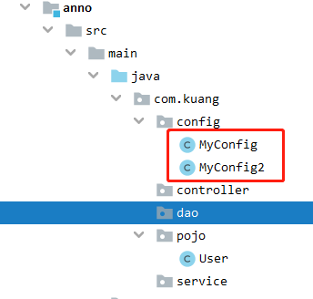
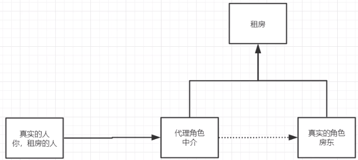

# Spring


[TOC]

# 常用注解说明

- `@Autowired(required = false)`是通过byType的方式进行自动装配
- 如果显示的定义了autowired属性required为false,说明这个对象可以为null,否则不允许为空。
  - 如果出现命名不清或冲突的情况，使用 `@Qualifier(value = "beanId")`注解来进行标注id
- `@Resource(name = "name")`是自动装配时byName和byType的结合体。
- `@Nullable` 说明这个属性可以为空。
- `@Component`
- `@Configuration`代表一个配置类,和我们之前看到的beans.xml作用一致。
- `@Import(MyConfig2.class)`引入了另外一个配置类。
- `@Bean`注册一个bean，就相当于之前xml中的一个Bean标签。
- `@ComponentScan("com.zhang.pojo")`扫描一个类。


# 1、Bean的自动装配Autowired

- 自动装配是Spring满足Bean依赖的一种方式！
- Spring会在上下文中会自动寻找，并自动给Bean装配属性！


Spring中有三种装配方式：

1. XML中显示的进行配置。
2. 在JAVA中显示的配置。
3. 隐式的自动装配Bean【重点】！


## 1、byName和byType自动装配

```xml
<bean id="cat" class="com.zhang.pojo.Cat"></bean>
<bean id="dog" class="com.zhang.pojo.Dog"></bean>

<!--
ByName:会自动在容器上下文中查找，和自己对象set方法后面的值对应的beanid！
        beanid必须和属性的set方法中参数同名
byType:会自动在容器上下文中查找，和自己对象属性类型相同的bean
        如果有重属性的bean会报错
-->
<bean id="people" class="com.zhang.pojo.People" autowire="byType">
    <property name="name" value="ZFAn"></property>
</bean>
```


## 2、注解实现自动装配

JDK1.5开始支持注解，Spring2.5开始支持注解。

- 使用注解需要导入约束支持：

  ```xml
  <?xml version="1.0" encoding="UTF-8"?>
  <beans xmlns="http://www.springframework.org/schema/beans"
      xmlns:xsi="http://www.w3.org/2001/XMLSchema-instance"
      xmlns:context="http://www.springframework.org/schema/context"
      xsi:schemaLocation="http://www.springframework.org/schema/beans
          https://www.springframework.org/schema/beans/spring-beans.xsd
          http://www.springframework.org/schema/context
          https://www.springframework.org/schema/context/spring-context.xsd">
  
      <context:annotation-config/>
  
  </beans>
  ```


@Autowired使用方法:

```java
public class People {
    //如果显示的定义了autowired属性required为false,说明这个对象可以为null,否则不允许为空
    @Autowired(required = false)
    private Cat cat;
    @Autowired
    @Qualifier(value = "dog222")
    private Dog dog;
    private String name;
    //@Nullable说明这个属性可以为空
    public People(@Nullable Cat cat) {
        this.cat = cat;
    }
}
```

在XML中只需要

```xml
<bean id="cat" class="com.zhang.pojo.Cat"></bean>
<bean id="dog" class="com.zhang.pojo.Dog"></bean>
<bean id="dog222" class="com.zhang.pojo.Dog"></bean>

<bean id="people" class="com.zhang.pojo.People" ></bean>
```

输入bean id和属性名不同时，可以使用Qualifier注解来进行声明。例如上面的例子@Qualifier(value = "dog222")

- `@Resource(name = "name")`注解，是上面的byName和byType的结合体。
- `@Autowired`是通过byType的方式。


# 2、使用注解开发

在Spring4之后，使用注解开发需要aop包的支持。

使用注解开发，需要导入context约束，增加注解的支持。

```xml
<?xml version="1.0" encoding="UTF-8"?>
<beans xmlns="http://www.springframework.org/schema/beans"
       xmlns:xsi="http://www.w3.org/2001/XMLSchema-instance"
       xmlns:context="http://www.springframework.org/schema/context"
       xsi:schemaLocation="http://www.springframework.org/schema/beans
        https://www.springframework.org/schema/beans/spring-beans.xsd
        http://www.springframework.org/schema/context
        https://www.springframework.org/schema/context/spring-context.xsd">
    <context:annotation-config/>
    <context:component-scan base-package="com.kuang.pojo"></context:component-scan>
</beans>
```

## 1、bean

```java
@Component
/*Component等价于<bean id = "user" class="com.kuang.pojo.User> */
```


## 2、属性如何注入

```java
/*Component等价于<bean id = "user" class="com.kuang.pojo.User> */
@Component
public class User {
    /*	Value 等价于 <property name="name" value="FANS"></property> 
    	也可作用于set方法上
    */
    @Value("FANS")
    public String name ;
}
```

## 3、衍生的注解

`@Component`的几个衍生注解，在Web开发中，会按照MVC三层架构分层！

- dao				[`@Repository`]
- service         [`@Service`]
- controller    [`@Controller`]

作用在类上，这几个注解就说明起到了在XML中声明Bean的作用。

## 4、自动装配

- `@Autowired(required = false)`是通过byType的方式进行自动装配
  - 如果显示的定义了autowired属性required为false,说明这个对象可以为null,否则不允许为空。
  - 如果出现命名不清或冲突的情况，使用 `@Qualifier(value = "beanId")`注解来进行标注id

- `@Resource(name = "name")`是自动装配时byName和byType的结合体。

- `@Nullable` 说明这个属性可以为空。

## 5、作用域

声明类的作用域，`singleton`，`prototype`，`request`....

```
@Scope("singleton")
public class User {
    public String name ;
}
```

## 6、小结

XML与注解的区别:

- XML更加全能，适用于任何场合，维护简单方便。
- 注解不是自己的类无法使用，维护相对复杂，但适合于简单设置。

XML与注解的最佳实践：

- XML用来管理bean；

- 注解只负责完成属性的注入；

- 在我们使用过程中，需要注意，让注解生效，需要开启注解的支持。

  ```xml
  <?xml version="1.0" encoding="UTF-8"?>
  <beans xmlns="http://www.springframework.org/schema/beans"
         xmlns:xsi="http://www.w3.org/2001/XMLSchema-instance"
         xmlns:context="http://www.springframework.org/schema/context"
         xsi:schemaLocation="http://www.springframework.org/schema/beans
          https://www.springframework.org/schema/beans/spring-beans.xsd
          http://www.springframework.org/schema/context
          https://www.springframework.org/schema/context/spring-context.xsd">
      <context:annotation-config/>
      <context:component-scan base-package="com.kuang.pojo"></context:component-scan>
  </beans>
  ```


# 3、使用Java配置Spring

`JavaConfig`可以摒弃`XML`来进行Bean的装载和配置。

例如，我们创建一个配置类：



然后使用注解声明这个类为Spring的配置类：

```java
/*
@Configuration这个也会被Spring接管,因为@Configuration本身也是一个组件
@Configuration代表一个配置类,和我们之前看到的beans.xml作用一致
*/
@Configuration
//扫描一个类
@ComponentScan("com.kuang.pojo")
//引入了另外一个配置类
@Import(MyConfig2.class)
public class MyConfig {
    //注册一个bean,就相当于之前xml中的一个Bean标签
    //这个方法的名字,就是bean标签中的id属性
    //这个方法的返回值,就是bean标签中的class属性
    @Bean
    public User newUser(){
        return new User();//返回要注入到bean的对象!
    }
}
```

接下来就可以进行测试了，通过`AnnotationConfigApplicationContext`去获得上下文对象：

```java
@Test
public void test(){
    //如果完全使用了配置类的方法去做,我们只能通过AnnotationConfigApplicationContext去获得上下文对象。
    ApplicationContext context = new AnnotationConfigApplicationContext(MyConfig.class);
    User getUser = context.getBean("newUser", User.class);//newUser就是类的方法名
    System.out.println(getUser.name);
}
```


# 4、代理模式



代理模式的好处：

- 职责清晰，真实的角色就是实现实际的业务逻辑，不用关心其他非本职责的事务，通过后期的代理完成一件完成事务，附带的结果就是编程简洁清晰。
- 代理对象可以在客户端和目标对象之间起到中介的作用，这样起到了中介的作用和保护了目标对象的作用。
- 高扩展性 

缺点：

- 一个真实的角色会产生一个代理角色；代码量会增加，开发效率会变低。


代理模式的分类：

- 静态代理
- 动态代理

## 1、	静态代理

角色分析：

- 抽象角色：一般会使用接口或者抽象类来解决。比如一起租房这件事。
- 真实角色：被代理的角色。比如房东。
- 代理角色：代理真实角色，代理真实角色会，会做一些附属操作。比如中介，帮忙写合同。
- 客户：访问代理角色的人，比如客户。


代码实现:

1. 接口。

   ```java
   public interface Rent {
       public void rent();
   }
   ```

2. 真实角色。

   ```java
   public class Landlord implements Rent{
       public void rent() {
           System.out.println("我要出租房");
       }
   }
   ```

3. 代理角色。

   ```java
   public class Proxy {
       private Landlord landlord;
       public Proxy() {
       }
       public Proxy(Landlord landlord) {
           this.landlord = landlord;
       }
       public void rent(){
           landlord.rent();
           seeHouse();
           hetong();
           fee();
       }
       public void seeHouse(){
           System.out.println("中介带看房");
       }
       public void hetong(){
           System.out.println("签合同");
       }
       public void fee(){
           System.out.println("收中介费");
       }
   }
   ```

4. 客户端访问代理角色。

   ```java
   public class Client {
       public static void main(String[] args) {
           Landlord landlord = new Landlord();//房东
           Proxy proxy = new Proxy(landlord);//中介
           proxy.rent();
       }
   }
   ```

在实际编程中的代理:

1. 接口类

   ```java
   public interface UserService {
       public void add();
       public void delete();
       public void update();
       public void query();
   }
   ```

2. 接口实现类

   ```java
   public class UserServiceImpl implements UserService {
       public void add() {System.out.println("增加了一个用户");}
       public void delete() {System.out.println("删除了一个用户");}
       public void update() {System.out.println("修改了一个用户");}
       public void query() {System.out.println("查询了一个用户");}
   }
   ```

3. 如果此时想要在实现的基础上，增加输出日志的功能，但是又不希望改变之前的代码，哪么就可以使用Proxy类来实现切面一样的效果。

   ```java
   public class UserServiceProxy implements UserService{
       private UserServiceImpl userService;
       
       public UserServiceProxy(UserServiceImpl userService) {
           this.userService = userService;
       }
       public void printLog(String msg){
           System.out.println("[DEBUG]使用了"+msg+"方法");
       }
       public void add() {
           printLog("Add");
           userService.add();
       }
       public void delete() {
           printLog("delete");
           userService.delete();
       }
       public void update() {
           printLog("update");
           userService.update();
       }
       public void query() {
           printLog("query");
           userService.query();
       }
   }
   ```

4. 在调用时，只需要调用代理类

   ```java
   public class Client {
       public static void main(String[] args) {
           UserServiceImpl userService = new UserServiceImpl();
           //如果不使用代理类,哪么就直接调用add方法。
           //userService.add();
           UserServiceProxy serviceProxy = new UserServiceProxy(userService);
           serviceProxy.add();
       }
   }
   ```

5. 我们可以发现，修改的代码量还是很大，哪么就出现了动态代理，底层使用反射实现。

## 2、	动态代理

- 动态代理和静态代理的角色一致。
- **动态代理的代理类是动态生成的**，不是我们手动写好的！
- 动态代理分为两大类：基于接口的动态代理，基于类的动态代理：
  - 基于接口的 -- JDK动态代理【我们使用JDK实现】
  - 基于类 -- cglib
  - Java字节码实现 -- JAVAssit


### **基于接口的 -- JDK动态代理**

需要了解两个类：`Proxy`代理和`InvocationHandler`调用处理程序接口。

---

#### `InvocationHandler`

InvocationHandler处于`java.lang.reflect`包下。

public interface InvocationHandler

- `InvocationHandler` 是代理实例的*调用处理程序* 实现的接口。

- 每个代理实例都具有一个关联的调用处理程序。对代理实例调用方法时，将对方法调用进行编码并将其指派到它的调用处理程序的 `invoke` 方法。

| 返回      | **方法摘要**                                                 |
| --------- | ------------------------------------------------------------ |
| ` Object` | `invoke` （Object proxy, Method method, Object[] args)   在代理实例上处理方法调用并返回结果。 |

```java
//proxy - 在其上调用方法的代理实例
//method - 对应于在代理实例上调用的接口方法的 Method 实例。
//args - 包含传入代理实例上方法调用的参数值的对象数组，如果接口方法不使用参数，则为 null。
//return - 从代理实例的方法调用返回的值。
Object invoke(Object proxy, Method method, Object[] args)throws Throwable
```

---

#### `Proxy`


