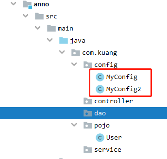
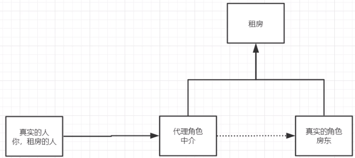
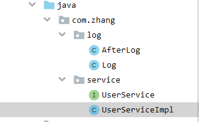
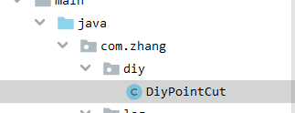
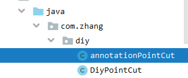
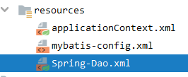
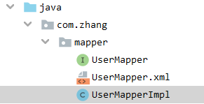

# Spring


[TOC]

# 常用注解说明

- `@Autowired(required = false)`是通过byType的方式进行自动装配
- 如果显示的定义了autowired属性required为false,说明这个对象可以为null,否则不允许为空。
  - 如果出现命名不清或冲突的情况，使用 `@Qualifier(value = "beanId")`注解来进行标注id
- `@Resource(name = "name")`是自动装配时byName和byType的结合体。
- `@Nullable` 说明这个属性可以为空。
- `@Component`
- `@Configuration`代表一个配置类,和我们之前看到的beans.xml作用一致。
- `@Import(MyConfig2.class)`引入了另外一个配置类。
- `@Bean`注册一个bean，就相当于之前xml中的一个Bean标签。
- `@ComponentScan("com.zhang.pojo")`扫描一个类。


# 1、Bean的自动装配`Autowired`

- 自动装配是Spring满足Bean依赖的一种方式！
- Spring会在上下文中会自动寻找，并自动给Bean装配属性！


Spring中有三种装配方式：

1. XML中显示的进行配置。
2. 在JAVA中显示的配置。
3. 隐式的自动装配Bean【重点】！


## 1、byName和byType自动装配

```xml
<bean id="cat" class="com.zhang.pojo.Cat"></bean>
<bean id="dog" class="com.zhang.pojo.Dog"></bean>

<!--
ByName:会自动在容器上下文中查找，和自己对象set方法后面的值对应的beanid！
        beanid必须和属性的set方法中参数同名
byType:会自动在容器上下文中查找，和自己对象属性类型相同的bean
        如果有重属性的bean会报错
-->
<bean id="people" class="com.zhang.pojo.People" autowire="byType">
    <property name="name" value="ZFAn"></property>
</bean>
```


## 2、注解实现自动装配

JDK1.5开始支持注解，Spring2.5开始支持注解。

- 使用注解需要导入约束支持：

  ```xml
  <?xml version="1.0" encoding="UTF-8"?>
  <beans xmlns="http://www.springframework.org/schema/beans"
      xmlns:xsi="http://www.w3.org/2001/XMLSchema-instance"
      xmlns:context="http://www.springframework.org/schema/context"
      xsi:schemaLocation="http://www.springframework.org/schema/beans
          https://www.springframework.org/schema/beans/spring-beans.xsd
          http://www.springframework.org/schema/context
          https://www.springframework.org/schema/context/spring-context.xsd">
  
      <context:annotation-config/>
  
  </beans>
  ```


@Autowired使用方法:

```java
public class People {
    //如果显示的定义了autowired属性required为false,说明这个对象可以为null,否则不允许为空
    @Autowired(required = false)
    private Cat cat;
    @Autowired
    @Qualifier(value = "dog222")
    private Dog dog;
    private String name;
    //@Nullable说明这个属性可以为空
    public People(@Nullable Cat cat) {
        this.cat = cat;
    }
}
```

在XML中只需要

```xml
<bean id="cat" class="com.zhang.pojo.Cat"></bean>
<bean id="dog" class="com.zhang.pojo.Dog"></bean>
<bean id="dog222" class="com.zhang.pojo.Dog"></bean>

<bean id="people" class="com.zhang.pojo.People" ></bean>
```

输入bean id和属性名不同时，可以使用Qualifier注解来进行声明。例如上面的例子@Qualifier(value = "dog222")

- `@Resource(name = "name")`注解，是上面的byName和byType的结合体。
- `@Autowired`是通过byType的方式。


# 2、使用注解开发

在Spring4之后，使用注解开发需要aop包的支持。

使用注解开发，需要导入context约束，增加注解的支持。

```xml
<?xml version="1.0" encoding="UTF-8"?>
<beans xmlns="http://www.springframework.org/schema/beans"
       xmlns:xsi="http://www.w3.org/2001/XMLSchema-instance"
       xmlns:context="http://www.springframework.org/schema/context"
       xsi:schemaLocation="http://www.springframework.org/schema/beans
        https://www.springframework.org/schema/beans/spring-beans.xsd
        http://www.springframework.org/schema/context
        https://www.springframework.org/schema/context/spring-context.xsd">
    <context:annotation-config/>
    <context:component-scan base-package="com.kuang.pojo"></context:component-scan>
</beans>
```

## 1、bean

```java
@Component
/*Component等价于<bean id = "user" class="com.kuang.pojo.User> */
```


## 2、属性如何注入

```java
/*Component等价于<bean id = "user" class="com.kuang.pojo.User> */
@Component
public class User {
    /*	Value 等价于 <property name="name" value="FANS"></property> 
    	也可作用于set方法上
    */
    @Value("FANS")
    public String name ;
}
```

## 3、衍生的注解

`@Component`的几个衍生注解，在Web开发中，会按照MVC三层架构分层！

- dao				[`@Repository`]
- service         [`@Service`]
- controller    [`@Controller`]

作用在类上，这几个注解就说明起到了在XML中声明Bean的作用。

## 4、自动装配

- `@Autowired(required = false)`是通过byType的方式进行自动装配
  - 如果显示的定义了autowired属性required为false,说明这个对象可以为null,否则不允许为空。
  - 如果出现命名不清或冲突的情况，使用 `@Qualifier(value = "beanId")`注解来进行标注id

- `@Resource(name = "name")`是自动装配时byName和byType的结合体。

- `@Nullable` 说明这个属性可以为空。

## 5、作用域

声明类的作用域，`singleton`，`prototype`，`request`....

```
@Scope("singleton")
public class User {
    public String name ;
}
```

## 6、小结

XML与注解的区别:

- XML更加全能，适用于任何场合，维护简单方便。
- 注解不是自己的类无法使用，维护相对复杂，但适合于简单设置。

XML与注解的最佳实践：

- XML用来管理bean；

- 注解只负责完成属性的注入；

- 在我们使用过程中，需要注意，让注解生效，需要开启注解的支持。

  ```xml
  <?xml version="1.0" encoding="UTF-8"?>
  <beans xmlns="http://www.springframework.org/schema/beans"
         xmlns:xsi="http://www.w3.org/2001/XMLSchema-instance"
         xmlns:context="http://www.springframework.org/schema/context"
         xsi:schemaLocation="http://www.springframework.org/schema/beans
          https://www.springframework.org/schema/beans/spring-beans.xsd
          http://www.springframework.org/schema/context
          https://www.springframework.org/schema/context/spring-context.xsd">
      <context:annotation-config/>
      <context:component-scan base-package="com.kuang.pojo"></context:component-scan>
  </beans>
  ```


# 3、使用Java配置Spring

`JavaConfig`可以摒弃`XML`来进行Bean的装载和配置。

例如，我们创建一个配置类：



然后使用注解声明这个类为Spring的配置类：

```java
/*
@Configuration这个也会被Spring接管,因为@Configuration本身也是一个组件
@Configuration代表一个配置类,和我们之前看到的beans.xml作用一致
*/
@Configuration
//扫描一个类
@ComponentScan("com.kuang.pojo")
//引入了另外一个配置类
@Import(MyConfig2.class)
public class MyConfig {
    //注册一个bean,就相当于之前xml中的一个Bean标签
    //这个方法的名字,就是bean标签中的id属性
    //这个方法的返回值,就是bean标签中的class属性
    @Bean
    public User newUser(){
        return new User();//返回要注入到bean的对象!
    }
}
```

接下来就可以进行测试了，通过`AnnotationConfigApplicationContext`去获得上下文对象：

```java
@Test
public void test(){
    //如果完全使用了配置类的方法去做,我们只能通过AnnotationConfigApplicationContext去获得上下文对象。
    ApplicationContext context = new AnnotationConfigApplicationContext(MyConfig.class);
    User getUser = context.getBean("newUser", User.class);//newUser就是类的方法名
    System.out.println(getUser.name);
}
```


# 4、代理模式



代理模式的好处：

- 职责清晰，真实的角色就是实现实际的业务逻辑，不用关心其他非本职责的事务，通过后期的代理完成一件完成事务，附带的结果就是编程简洁清晰。
- 代理对象可以在客户端和目标对象之间起到中介的作用，这样起到了中介的作用和保护了目标对象的作用。
- 高扩展性 

缺点：

- 一个真实的角色会产生一个代理角色；代码量会增加，开发效率会变低。


代理模式的分类：

- 静态代理
- 动态代理

## 1、	静态代理

角色分析：

- 抽象角色：一般会使用接口或者抽象类来解决。比如一起租房这件事。
- 真实角色：被代理的角色。比如房东。
- 代理角色：代理真实角色，代理真实角色会，会做一些附属操作。比如中介，帮忙写合同。
- 客户：访问代理角色的人，比如客户。


代码实现:

1. 接口。

   ```java
   public interface Rent {
       public void rent();
   }
   ```

2. 真实角色。

   ```java
   public class Landlord implements Rent{
       public void rent() {
           System.out.println("我要出租房");
       }
   }
   ```

3. 代理角色。

   ```java
   public class Proxy {
       private Landlord landlord;
       public Proxy() {
       }
       public Proxy(Landlord landlord) {
           this.landlord = landlord;
       }
       public void rent(){
           landlord.rent();
           seeHouse();
           hetong();
           fee();
       }
       public void seeHouse(){
           System.out.println("中介带看房");
       }
       public void hetong(){
           System.out.println("签合同");
       }
       public void fee(){
           System.out.println("收中介费");
       }
   }
   ```

4. 客户端访问代理角色。

   ```java
   public class Client {
       public static void main(String[] args) {
           Landlord landlord = new Landlord();//房东
           Proxy proxy = new Proxy(landlord);//中介
           proxy.rent();
       }
   }
   ```

在实际编程中的代理:

1. 接口类

   ```java
   public interface UserService {
       public void add();
       public void delete();
       public void update();
       public void query();
   }
   ```

2. 接口实现类

   ```java
   public class UserServiceImpl implements UserService {
       public void add() {System.out.println("增加了一个用户");}
       public void delete() {System.out.println("删除了一个用户");}
       public void update() {System.out.println("修改了一个用户");}
       public void query() {System.out.println("查询了一个用户");}
   }
   ```

3. 如果此时想要在实现的基础上，增加输出日志的功能，但是又不希望改变之前的代码，哪么就可以使用Proxy类来实现切面一样的效果。

   ```java
   public class UserServiceProxy implements UserService{
       private UserServiceImpl userService;
       
       public UserServiceProxy(UserServiceImpl userService) {
           this.userService = userService;
       }
       public void printLog(String msg){
           System.out.println("[DEBUG]使用了"+msg+"方法");
       }
       public void add() {
           printLog("Add");
           userService.add();
       }
       public void delete() {
           printLog("delete");
           userService.delete();
       }
       public void update() {
           printLog("update");
           userService.update();
       }
       public void query() {
           printLog("query");
           userService.query();
       }
   }
   ```

4. 在调用时，只需要调用代理类

   ```java
   public class Client {
       public static void main(String[] args) {
           UserServiceImpl userService = new UserServiceImpl();
           //如果不使用代理类,哪么就直接调用add方法。
           //userService.add();
           UserServiceProxy serviceProxy = new UserServiceProxy(userService);
           serviceProxy.add();
       }
   }
   ```

5. 我们可以发现，修改的代码量还是很大，哪么就出现了动态代理，底层使用反射实现。

## 2、	动态代理

- 动态代理和静态代理的角色一致。
- **动态代理的代理类是动态生成的**，不是我们手动写好的！
- 动态代理分为两大类：基于接口的动态代理，基于类的动态代理：
  - 基于接口的 -- JDK动态代理【我们使用JDK实现】
  - 基于类 -- cglib
  - Java字节码实现 -- JAVAssit


### **基于接口的 -- JDK动态代理**

需要了解两个类：`Proxy`代理和`InvocationHandler`调用处理程序接口。

---

`InvocationHandler`

InvocationHandler处于`java.lang.reflect`包下。

public interface InvocationHandler

- `InvocationHandler` 是代理实例的*调用处理程序* 实现的接口。

- 每个代理实例都具有一个关联的调用处理程序。对代理实例调用方法时，将对方法调用进行编码并将其指派到它的调用处理程序的 `invoke` 方法。

| 返回      | **方法摘要**                                                 |
| --------- | ------------------------------------------------------------ |
| ` Object` | `invoke` （Object proxy, Method method, Object[] args)   在代理实例上处理方法调用并返回结果。 |

```java
//proxy - 在其上调用方法的代理实例
//method - 对应于在代理实例上调用的接口方法的 Method 实例。
//args - 包含传入代理实例上方法调用的参数值的对象数组，如果接口方法不使用参数，则为 null。
//return - 从代理实例的方法调用返回的值。
Object invoke(Object proxy, Method method, Object[] args)throws Throwable
```

---

`Proxy`

`Proxy` 提供用于创建动态代理类和实例的静态方法，它还是由这些方法创建的所有动态代理类的超类。

创建某一接口 `Foo` 的代理：

```java
InvocationHandler handler = new MyInvocationHandler(...);
Class proxyClass = Proxy.getProxyClass(Foo.class.getClassLoader(), new Class[] { Foo.class });
Foo f = (Foo) proxyClass.getConstructor(new Class[] { InvocationHandler.class }).newInstance(new Object[] { handler });
```

或使用以下更简单的方法：

```java
Foo f = (Foo) Proxy.newProxyInstance(Foo.class.getClassLoader(),new Class[] { Foo.class },
                                     handler);
```

---

下面举一个动态代理实现的例子，真实角色依旧为上面的静态代理的`UserService`和`UserServiceImpl`

创建一个动态代理类:

```java
public class ProxyInvocationHandler implements InvocationHandler {
    private Object target;
    public void setObject(Object target) {
        this.target = target;
    }
    //生成得到代理类
    public Object getProxy(){
        return Proxy.newProxyInstance(this.getClass().getClassLoader(),target.getClass().getInterfaces(),this);
    }
    //处理代理实例,并返回结果.
    public Object invoke(Object proxy, Method method, Object[] args) throws Throwable {
        Log(method.getName());
        Object result = method.invoke(target,args);
        return result;
    }
    //新增需求,加日志
    public void Log(String msg){
        System.out.println("调用了"+msg+"方法");
    }
}
```

`Client`调用动态代理类生成代理:

```java
public class Client {
    public static void main(String[] args) {
        //真实角色
        UserServiceImpl userService = new UserServiceImpl();
        //代理角色,不存在
        ProxyInvocationHandler handler = new ProxyInvocationHandler();
        //设置要代理的对象
        handler.setObject(userService);
        //动态生成代理类
        UserService proxy = (UserService)handler.getProxy();
        proxy.add();
        //调用了add方法
		//增加了一个用户

    }
}
```


# 5、AOP

- `AOP`为`Aspect Oriented Programming`的缩写，意为：面向切面编程，通过预编译方式和运行期间动态代理实现程序功能的统一维护的一种技术。

- `AOP`是`OOP`的延续，是软件开发中的一个热点，也是Spring框架中的一个重要内容，是函数式编程的一种衍生范型。
- 利用`AOP`可以对业务逻辑的各个部分进行隔离，从而使得业务逻辑各部分之间的耦合度降低，提高程序的可重用性，同时提高了开发的效率。

使用SpringAOP需要导入包：

```xml
<dependency>
    <groupId>org.aspectj</groupId>
    <artifactId>aspectjweaver</artifactId>
    <version>1.9.6</version>
</dependency>
```


Spring实现AOP的两种方式:

## 方式一：使用`Spring`的`API`接口来实现`AOP`

1. 被代理类依旧为`UserService`和`UserServiceImpl`

2. 重写前置日志和后置日志的接口类:

   1. 新建日志类

      

   2. 重写前置日志

      ```java
      public class Log implements MethodBeforeAdvice {
          //method: 要执行的目标对象的方法
          //args: 参数
          //target: 目标对象
          public void before(Method method, Object[] objects, Object target) throws Throwable {
              System.out.println(target.getClass().getName()+"的"+method.getName()+"方法执行了.");
          }
      }
      ```

   3. 重写后置日志

      ```java
      public class AfterLog implements AfterReturningAdvice {
          //returnValue: 返回值
          //method: 要执行的目标对象的方法
          //args: 参数
          //target: 目标对象
          public void afterReturning(Object returnValue, Method method, Object[] args, Object target) throws Throwable {
              System.out.println("执行了"+method.getName()+"方法,返回结果为:"+returnValue);
          }
      }
      ```

3. 在applicationContext.xml中新建bean和配置AOP

   1. 首先要导入AOP约束	

      ```xml
      <?xml version="1.0" encoding="UTF-8"?>
      <beans xmlns="http://www.springframework.org/schema/beans"
             xmlns:xsi="http://www.w3.org/2001/XMLSchema-instance"
             xmlns:aop="http://www.springframework.org/schema/aop"
             xsi:schemaLocation="http://www.springframework.org/schema/beans
              https://www.springframework.org/schema/beans/spring-beans.xsd
              http://www.springframework.org/schema/aop
              https://www.springframework.org/schema/aop/spring-aop.xsd">
      ```

   2. 配置bean

      ```xml
      <bean id="userService" class="com.zhang.service.UserServiceImpl"></bean>
      <bean id="log" class="com.zhang.log.Log"/>
      <bean id="afterLog" class="com.zhang.log.AfterLog"></bean>
      ```

   3. 配置AOP

      ```xml
      <!--配置aop:需要导入aop的约束-->
      <aop:config>
          <!--切入点:pointcut    expression表达式execution()来定位要执行的位置-->
          <aop:pointcut id="pointcut" expression="execution(* com.zhang.service.UserServiceImpl.*(..))"/>
      
          <!--执行环绕增加-->
          <aop:advisor advice-ref="log" pointcut-ref="pointcut"/>
          <aop:advisor advice-ref="afterLog" pointcut-ref="pointcut"/>
      </aop:config>
      ```


execution(<修饰符模式>?<返回类型模式><方法名模式>(<参数模式>)<异常模式>?) 除了返回类型模式、方法名模式和参数模式外，其它项都是可选的。

```xml
整个表达式可以分为五个部分：

1、execution():		表达式主体。
2、第一个*号:		表示返回类型， *号表示所有的类型。
3、包名：				表示需要拦截的包名，后面的两个句点表示当前包和当前包的所有子包，com.sample.service.impl包、子孙包下所有类的方法。
4、第二个*号：		表示类名，*号表示所有的类。
5、*(..):			最后这个星号表示方法名，*号表示所有的方法，后面括弧里面表示方法的参数，两个句点表示任何参数
```


## 方式二：自定义类实现`AOP`

1. 被代理类依旧为`UserService`和`UserServiceImpl`

2. 自定义前置日志和后置日志

   

   ```java
   public class DiyPointCut {
       public void before(){
           System.out.println("---------方法执行前-------");
       }
       public void after(){
           System.out.println("---------方法执行后-------");
       }
   }
   ```

3. 在`applicationContext.xml`中新建bean和配置AOP

   ```xml
   <bean id="diy" class="com.zhang.diy.DiyPointCut"/>
   <bean id="userService" class="com.zhang.service.UserServiceImpl"></bean>
   <aop:config>
       <!--自定义切面-->
       <aop:aspect ref="diy">
           <!--切入点-->
           <aop:pointcut id="point" expression="execution(* com.zhang.service.UserServiceImpl.*(..))"/>
           <aop:before method="before" pointcut-ref="point"/>
           <aop:after method="after" pointcut-ref="point"/>
       </aop:aspect>
   </aop:config>
   ```

4. 测试执行

   ```java
   public class Mytest {
       public static void main(String[] args) {
           ClassPathXmlApplicationContext context = new ClassPathXmlApplicationContext("applicationContext.xml");
           //动态代理代理的是接口!
           UserService userService = context.getBean("userService", UserService.class);
           userService.query();
       }
   }
   ```

   ```shell
   ---------方法执行前-------
   查询了一个用户
   ---------方法执行后-------
   ```


## 方式三：注解实现AOP

1. 被代理类依旧为`UserService`和`UserServiceImpl`。

2. 使用注解自定义前置日志和后置日志。

   

   ```java
   @Aspect//标注这个类是一个切面
   public class annotationPointCut {
       @Before("execution(* com.zhang.service.UserServiceImpl.* (..))")
       public void before(){
           System.out.println("---------方法执行前-------");
       }
       @After("execution(* com.zhang.service.UserServiceImpl.* (..))")
       public void after(){
           System.out.println("---------方法执行后-------");
       }
       //在环绕增强中,我们可以给定一个参数,代表我们获取处理切入的点
       @Around("execution(* com.zhang.service.UserServiceImpl.* (..))")
       public void around(ProceedingJoinPoint JP) throws Throwable {
           System.out.println("环绕前");
           Signature signature = JP.getSignature();//获取签名
           System.out.println("signature is "+signature);
           Object proceed = JP.proceed();
           System.out.println("环绕后");
           System.out.println(proceed);
           /*
           环绕前
           signature is void com.zhang.service.UserService.query()
           ---------方法执行前-------
           查询了一个用户
           ---------方法执行后-------
           环绕后
           null
            */
       }
   }
   ```

3. 在`applicationContext.xml`中新建bean和配置AOP

   ```xml
   <!--方式三,使用注解定义切面-->
   <bean id="userService" class="com.zhang.service.UserServiceImpl"/>
   <bean id="annotationPoint" class="com.zhang.diy.annotationPointCut"/>
   <!--开启注解支持!-->
   <aop:aspectj-autoproxy/>
   ```

4. 测试执行

   ```shell
   环绕前
   signature is void com.zhang.service.UserService.query()
   ---------方法执行前-------
   查询了一个用户
   ---------方法执行后-------
   环绕后
   null
   ```


# 6、整合Mybatis

## 1.	环境搭建

- junit
- mybatis
- mysql数据库
- spring相关
- Aop织入
- mybatis-spring

```xml
<dependencies>
    <dependency>
        <groupId>org.springframework</groupId>
        <artifactId>spring-webmvc</artifactId>
        <version>5.3.6</version>
    </dependency>
    <dependency>
        <groupId>org.springframework</groupId>
        <artifactId>spring-jdbc</artifactId>
        <version>5.3.6</version>
    </dependency>
    <dependency>
        <groupId>junit</groupId>
        <artifactId>junit</artifactId>
        <version>4.13</version>
    </dependency>
    <dependency>
        <groupId>mysql</groupId>
        <artifactId>mysql-connector-java</artifactId>
        <version>5.1.47</version>
    </dependency>
    <dependency>
        <groupId>org.mybatis</groupId>
        <artifactId>mybatis</artifactId>
        <version>3.5.2</version>
    </dependency>
    <dependency>
        <groupId>org.aspectj</groupId>
        <artifactId>aspectjweaver</artifactId>
        <version>1.9.6</version>
    </dependency>
    <dependency>
        <groupId>org.mybatis</groupId>
        <artifactId>mybatis-spring</artifactId>
        <version>2.0.2</version>
    </dependency>
</dependencies>
```


## 2. 	mybatis开发基本步骤

1. 编写实体类
2. 编写核心配置文件
3. 编写接口
4. 编写Mapper.xml
5. 测试


## 3.	Mybatis-Spring整合

MyBatis-Spring 会帮助你将 MyBatis 代码无缝地整合到 Spring 中。

它将允许 MyBatis 参与到 Spring 的事务管理之中，创建映射器 mapper 和 `SqlSession` 并注入到 bean 中，以及将 Mybatis 的异常转换为 Spring 的 `DataAccessException`。

 最终，可以做到应用代码不依赖于 MyBatis，Spring 或 MyBatis-Spring。

---

1. 编写数据源配置

   

   ```xml
   <!--DataSource:使用Spring的数据源替代Mybatis的配置  c3p0 dbcp druid
       我们这里使用Spring提供的JDBC-->
   <bean id="dataSource" class="org.springframework.jdbc.datasource.DriverManagerDataSource">
       <property name="driverClassName" value="com.mysql.jdbc.Driver"/>
       <property name="url"
                 value="jdbc:mysql://localhost:3306/mybatis?useSSL=false&amp;useUnicode=true&amp;characterEncoding=UTF-8"/>
       <property name="username" value="root"/>
       <property name="password" value="123456"/>
   </bean>
   ```

2. 配置SqlSessionFactory

   ```xml
   <!--sqlSessionFactory-->
   <bean id="sqlSessionFactory" class="org.mybatis.spring.SqlSessionFactoryBean">
       <property name="dataSource" ref="dataSource" />
       <!--绑定Mybatis配置文件-->
       <property name="configLocation" value="classpath:mybatis-config.xml"/>
       <property name="mapperLocations" value="classpath:com/zhang/mapper/UserMapper.xml"/>
   </bean>
   ```

3. 配置SqlSessionTemplate

   `SqlSessionTemplate` 是 MyBatis-Spring 的核心。作为 `SqlSession` 的一个实现，这意味着可以使用它无缝代替你代码中已经在使用的 `SqlSession`。 `SqlSessionTemplate` 是线程安全的，可以被多个 DAO 或映射器所共享使用。

   ```xml
   <!--SqlSessionTemplate:就是我们使用的SqlSession-->
   <bean id="sqlSession" class="org.mybatis.spring.SqlSessionTemplate">
       <!--只能使用构造器注入SqlsessionFactory,因为他没有set方法-->
       <constructor-arg index="0" ref="sqlSessionFactory"/>
   </bean>
   ```

4. 给结构加实现类【这就是从mybatis转换到Spring的过程】

   

   ```java
   public class UserMapperImpl implements UserMapper {
       //我们原来所有的操作,都使sqlSession来执行,现在都使用sqlSessionTemplate;
       private SqlSessionTemplate sqlSession;
       public void setSqlSession(SqlSessionTemplate sqlSession) {
           this.sqlSession = sqlSession;
       }
   
       public List<User> selectUser() {
           UserMapper mapper = sqlSession.getMapper(UserMapper.class);
           return mapper.selectUser();
       }
   }
   ```

5. 将实现的类都添加入Bean中，然后进行测试。

   ```xml
   <bean id="userMapper" class="com.zhang.mapper.UserMapperImpl">
       <property name="sqlSession" ref="sqlSession"/>
   </bean>
   ```

   ```java
   @Test
   public void testSelect(){
       ApplicationContext context = new ClassPathXmlApplicationContext("Spring-Dao.xml");
       UserMapper userMapper = context.getBean("userMapper", UserMapper.class);
       for (User user : userMapper.selectUser()) {
           System.out.println(user);
       }
   }
   ```


---

还有另外一种简易的方法，在上面的步骤3，可以省略获取SqlSession的过程，然后再步骤4，继承`SqlSessionDaoSupport`这个类中对sqlSession进行了获取，使用方式参考下面第三行代码。

```java
public class UserMapperImpl2 extends SqlSessionDaoSupport implements UserMapper {
    public List<User> selectUser() {
//        SqlSession sqlSession = getSqlSession();
//        UserMapper mapper = sqlSession.getMapper(UserMapper.class);
//        return mapper.selectUser();//和下面一行等价
        return getSqlSession().getMapper(UserMapper.class).selectUser();
    }
}
```

5. 添加Bean，然后测试

   ```xml
   <bean id="userMapper2" class="com.zhang.mapper.UserMapperImpl2">
       <!--给extends SqlSessionDaoSupport 传入参数sqlSessionFactory-->
       <property name="sqlSessionFactory" ref="sqlSessionFactory"/>
   </bean>
   ```


## 4.	事务

- 事务在项目开发中，十分重要，要么都成功，要么都失败；涉及到数据一致性问题！

- 事务的ACID原则：

  - 原子性--Atomicity

    *一个事务（transaction）中的所有操作，要么全部完成，要么全部不完成，不会结束在中间某个环节。*

  - 一致性--Consistency

    *在事务开始之前和事务结束以后，数据库的完整性没有被破坏。*

  - 隔离性--Isolation

    *数据库允许多个并发事务同时对其数据进行读写和修改的能力，隔离性可以防止多个事务并发执行时由于交叉执行而导致数据的不一致。*

  - 持久性--Durability

    *事务处理结束后，对数据的修改就是永久的，即便系统故障也不会丢失。*


### 1.	Spring中的事务管理

- 声明式事务：使用AOP，不需要将事务管理的代码嵌入到原来的代码中。

- 编程式事务：需要在代码中，进行事务的管理。

一个使用 MyBatis-Spring 的其中一个主要原因是它允许 MyBatis 参与到 Spring 的事务管理中。而不是给 MyBatis 创建一个新的专用事务管理器，MyBatis-Spring 借助了 Spring 中的 `DataSourceTransactionManager` 来实现事务管理。

一般我们就使用声明式事务。

 You have an error in your SQL syntax; check the manual that corresponds to your MySQL server version for the right syntax to use near 'deletes from mybatis.user where id = 10' at line 1

配置声明式事务，不需要修改代码，只需要进行配置。

```xml
<!--配置声明式事务-->
<bean id="transactionManager" class="org.springframework.jdbc.datasource.DataSourceTransactionManager">
    <property name="dataSource" ref="dataSource"/>
</bean>
<!--结合AOP实现事务的织入-->
<!--配置事务通知,有关类Spring已经自动生成-->
<tx:advice id="txAdvice" transaction-manager="transactionManager">
    <!--给那些方法配置事务-->
    <!--配置事务的传播特性 propagation="REQUIRED" 默认选择,是最常用的-->
    <tx:attributes>
        <tx:method name="add" propagation="REQUIRED"/>
        <tx:method name="delete" propagation="REQUIRED"/>
        <tx:method name="update" propagation="REQUIRED"/>
        <tx:method name="query" read-only="true"/>
        <tx:method name="*" propagation="REQUIRED"/>
    </tx:attributes>
</tx:advice>

<!--配置事务切入-->
<aop:config>
    <aop:pointcut id="txPointCut" expression="execution(* com.zhang.mapper.*.*(..))"/>
    <aop:advisor advice-ref="txAdvice" pointcut-ref="txPointCut"></aop:advisor>
</aop:config>
```


