# Spring MVC


[TOC]


# 1、前置知识

## 1、MVC简介

经典MVC模式中，M是指业务模型，V是指用户界面，C则是控制器。

- V-`View`	视图是指用户看到并与之交互的界面。
- M-`Model`模型是指模型表示业务规则，包括数据和行为。
- C-`Controller`控制器是指控制器接受用户的输入并调用模型和视图去完成用户的需求，控制器本身不输出任何东西和做任何处理，是一个调度员的作用。

使用MVC的目的是将M和V的实现代码分离，从而使同一个程序可以使用不同的表现形式。

MVC的主要作用是降低了视图与业务逻辑间的双向耦合。

MVC不是一种设计模式，而是一种架构模式，所以不同的MVC之间存在差异。

---

MVC框架需要做哪些事情?

- 将URL映射到Java类或者Java类的方法。
- 封装用户提交的数据。
- 处理请求-调用相关的业务处理-封装响应数据。
- 将响应的数据进行渲染.jsp/html.等表示层数据。


## 2、回顾Servlet

1. 环境搭建，父类导入依赖

   ```xml
   <dependencies>
       <dependency>
           <groupId>junit</groupId>
           <artifactId>junit</artifactId>
           <version>4.12</version>
       </dependency>
       <dependency>
           <groupId>org.springframework</groupId>
           <artifactId>spring-webmvc</artifactId>
           <version>5.3.6</version>
       </dependency>
       <dependency>
           <groupId>javax.servlet</groupId>
           <artifactId>servlet-api</artifactId>
           <version>2.5</version>
       </dependency>
       <dependency>
           <groupId>javax.servlet.jsp</groupId>
           <artifactId>jsp-api</artifactId>
           <version>2.2</version>
       </dependency>
       <dependency>
           <groupId>javax.servlet</groupId>
           <artifactId>jstl</artifactId>
           <version>1.2</version>
       </dependency>
   </dependencies>
   ```
   
2. 创建module，新建继承`HttpServlet`的类，实现`doGet`，`doPost`方法重写。

   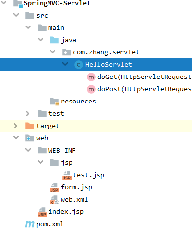

   ```java
   public class HelloServlet extends HttpServlet {
       @Override
       protected void doGet(HttpServletRequest req, HttpServletResponse resp) throws ServletException, IOException {
           //1. 获取前端参数
           String method = req.getParameter("method");
           if (method.equals("add")){
               req.getSession().setAttribute("msg","执行了add方法");
           }
           if (method.equals("delete")){
               req.getSession().setAttribute("msg","执行了delete方法");
           }
           //2.调用业务层
           //3.视图转发或重定向
           req.getRequestDispatcher("/WEB-INF/jsp/test.jsp").forward(req,resp);
       }
   
       @Override
       protected void doPost(HttpServletRequest req, HttpServletResponse resp) throws ServletException, IOException {
           doGet(req, resp);
       }
   }
   ```

3. Web.xml中配置servlet接口

   ```xml
   <?xml version="1.0" encoding="UTF-8"?>
   <web-app xmlns="http://xmlns.jcp.org/xml/ns/javaee"
            xmlns:xsi="http://www.w3.org/2001/XMLSchema-instance"
            xsi:schemaLocation="http://xmlns.jcp.org/xml/ns/javaee http://xmlns.jcp.org/xml/ns/javaee/web-app_4_0.xsd"
            version="4.0">
       <servlet>
           <servlet-name>hello</servlet-name>
           <servlet-class>com.zhang.servlet.HelloServlet</servlet-class>
       </servlet>
       <servlet-mapping>
           <servlet-name>hello</servlet-name>
           <url-pattern>/hello</url-pattern>
       </servlet-mapping>
       <!--配置Session超时时间-->
       <!--<session-config>
           <session-timeout>15</session-timeout>
       </session-config>-->
       <!--配置欢迎页-->
       <!--<welcome-file-list>
           <welcome-file>index.jsp</welcome-file>
       </welcome-file-list>-->
   </web-app>
   ```

4. 创建测试的jsp页面，配置Tomcat进行测试。

5. 访问http://localhost:8080/hello?method=add

   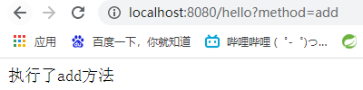


# 2、 SpringMVC简介

​			The Spring Web model-view-controller (MVC) framework is designed around a `DispatcherServlet` that dispatches requests to handlers, with configurable handler mappings, view resolution, locale, time zone and theme resolution as well as support for uploading files. The default handler is based on the `@Controller` and `@RequestMapping` annotations, offering a wide range of flexible handling methods. With the introduction of Spring 3.0, the `@Controller` mechanism also allows you to create RESTful Web sites and applications, through the `@PathVariable` annotation and other features.

- Spring MVC属于SpringFrameWork的后续产品，已经融合在Spring Web Flow里面。
- SpringMVC是基于Java实现MVC的轻量级Web框架。

- Spring 框架提供了构建 Web 应用程序的全功能 MVC 模块。

---

SpringMVC的特点：

- SpringMVC的核心是`DispatcherServlet` ，他的作用就是将请求分发到不同的处理器。
- 可以采用基于注解的`Controller`声明方式。
- `DispatcherServlet`本质也是`Servlet`


## 1、创建第一个SpringMVC程序

1. 整个项目的目录如下

   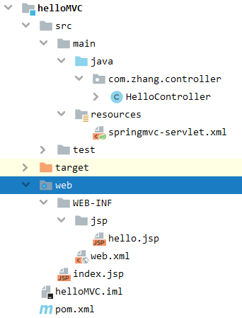

2. 配置`web\WEB-INF\web.xml`

   ```xml
   <?xml version="1.0" encoding="UTF-8"?>
   <web-app xmlns="http://xmlns.jcp.org/xml/ns/javaee"
            xmlns:xsi="http://www.w3.org/2001/XMLSchema-instance"
            xsi:schemaLocation="http://xmlns.jcp.org/xml/ns/javaee http://xmlns.jcp.org/xml/ns/javaee/web-app_4_0.xsd"
            version="4.0">
       <servlet>
           <servlet-name>springmvc</servlet-name>
           <servlet-class>org.springframework.web.servlet.DispatcherServlet</servlet-class>
           <init-param>
               <param-name>contextConfigLocation</param-name>
               <param-value>classpath:springmvc-servlet.xml</param-value>
           </init-param>
           <!--启动级别1-->
           <load-on-startup>1</load-on-startup>
       </servlet>
       <!--/ 匹配所有请求:不包括jsp-->
       <!--/* 匹配所有请求:包括jsp-->
       <servlet-mapping>
           <servlet-name>springmvc</servlet-name>
           <url-pattern>/</url-pattern>
       </servlet-mapping>
   </web-app>
   ```

3. 配置`src\main\resources\springmvc-servlet.xml`

   ```xml
   <?xml version="1.0" encoding="UTF-8" ?>
   <beans xmlns="http://www.springframework.org/schema/beans"
          xmlns:xsi="http://www.w3.org/2001/XMLSchema-instance"
          xsi:schemaLocation="http://www.springframework.org/schema/beans
          http://www.springframework.org/schema/beans/spring-beans.xsd">
       
       <!--处理器映射器-->
       <bean class="org.springframework.web.servlet.handler.BeanNameUrlHandlerMapping"/>
       <!--处理器适配器-->
       <bean class="org.springframework.web.servlet.mvc.SimpleControllerHandlerAdapter"/>
       
       <!--视图解析器:DispatcherServlet给他的ModelAndView 将来可以设置模板引擎Thymeleaf Freemarker-->
       <bean class="org.springframework.web.servlet.view.InternalResourceViewResolver" id="internalResourceViewResolver">
           <!--前缀-->
           <property name="prefix" value="/WEB-INF/jsp/"/>
           <!--后缀-->
           <property name="suffix" value=".jsp"/>
       </bean>
   
       <!--handler-->
       <bean id="/hello" class="com.zhang.controller.HelloController"/>
   </beans>
   ```

4. 编写`src\main\java\com\zhang\controller\HelloController.java`

   ```java
   public class HelloController implements Controller {
       public ModelAndView handleRequest(HttpServletRequest httpServletRequest, HttpServletResponse httpServletResponse) throws Exception {
           //业务代码和视图跳转在此处写
           //ModelAndView 视图和模型
           ModelAndView modelAndView = new ModelAndView();
           modelAndView.addObject("msg","HelloSpringMVC");
           modelAndView.setViewName("hello");//WEB_INF/jsp/hello.jsp
           return modelAndView;
       }
   }
   ```

5. Web页面的文件如下

   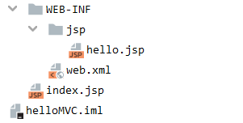

6. 启动Tomcat进行测试

   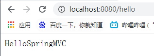

---

可能遇到的问题:

1. 出现访问404

   - 查看控制台输出,是不是缺少Jar包

   - 查看项目输出结构，看IDEA有没有自动生成lib文件夹，如果没有，手动添加

     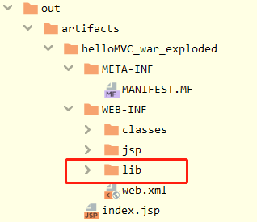

   - 重启Tomcat


## 2、SpringMVC执行流程


**SpringMVC执行流程:**

1. 用户发送请求至前端控制器DispatcherServlet
2. DispatcherServlet收到请求调用处理器映射器HandlerMapping。
3. 处理器映射器根据请求url找到具体的处理器，生成处理器执行链HandlerExecutionChain(包括处理器对象和处理器拦截器)一并返回给DispatcherServlet。
4. DispatcherServlet根据处理器Handler获取处理器适配器HandlerAdapter执行HandlerAdapter处理一系列的操作，如：参数封装，数据格式转换，数据验证等操作
5. 执行处理器Handler(Controller，也叫页面控制器)。
6. Handler执行完成返回ModelAndView
7. HandlerAdapter将Handler执行结果ModelAndView返回到DispatcherServlet
8. DispatcherServlet将ModelAndView传给ViewReslover视图解析器
9. ViewReslover解析后返回具体View
10. DispatcherServlet对View进行渲染视图（即将模型数据model填充至视图中）。
11. DispatcherServlet响应用户。

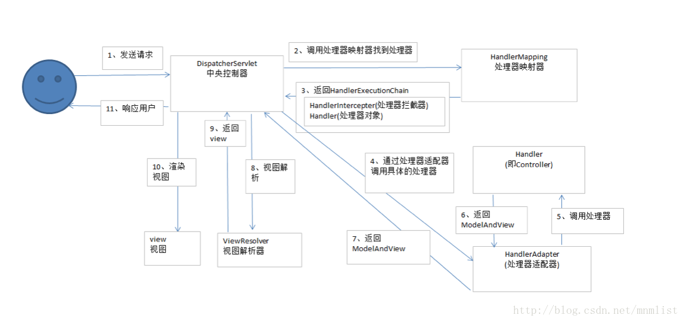

---

自己写的代码的执行流程：

1. `web\WEB-INF\web.xml`注册`DispatcherServlet`

   ```xml
   <!--1.注册DispatcherServlet-->
   <servlet>
       <servlet-name>springmvc</servlet-name>
       <servlet-class>org.springframework.web.servlet.DispatcherServlet</servlet-class>
       <!--关联一个SpringMvc的配置文件:[Servlet-name]-servlet.xml-->
       <init-param>
           <param-name>contextConfigLocation</param-name>
           <param-value>classpath:springmvc-servlet.xml</param-value>
       </init-param>
       <!--启动级别1-->
       <load-on-startup>1</load-on-startup>
   </servlet>
   <!--/ 匹配所有请求:不包括jsp-->
   <!--/* 匹配所有请求:包括jsp-->
   <servlet-mapping>
       <servlet-name>springmvc</servlet-name>
       <url-pattern>/</url-pattern>
   </servlet-mapping>
   ```

2. `src\main\resources\springmvc-servlet.xml`查找中央控制器和处理器映射器，根据请求url找到具体的处理器。

   ```xml
   <!--处理器映射器-->
   <bean class="org.springframework.web.servlet.handler.BeanNameUrlHandlerMapping"/>
   <!--处理器适配器-->
   <bean class="org.springframework.web.servlet.mvc.SimpleControllerHandlerAdapter"/>
    <!--handler-->
   <bean id="/hello" class="com.zhang.controller.HelloController"/>
   ```

3. `src\main\java\com\zhang\controller\HelloController.java` 这一步本来还要处理模型，数据库拿数据等等，最后返回再加上页面，就是所谓的`ModelAndView`

   ```java
   public class HelloController implements Controller {
       public ModelAndView handleRequest(HttpServletRequest httpServletRequest, HttpServletResponse httpServletResponse) throws Exception {
           //业务代码和视图跳转在此处写
           //ModelAndView 视图和模型
           ModelAndView modelAndView = new ModelAndView();
           modelAndView.addObject("msg","HelloSpringMVC");
           modelAndView.setViewName("hello");//WEB_INF/jsp/hello.jsp
           return modelAndView;
       }
   }
   ```

4. `src\main\resources\springmvc-servlet.xml`拼接视图名字，然后调用视图并返回。

   ```xml
   <!--视图解析器:DispatcherServlet给他的ModelAndView 将来可以设置模板引擎Thymeleaf Freemarker-->
   <bean class="org.springframework.web.servlet.view.InternalResourceViewResolver" id="internalResourceViewResolver">
       <!--前缀-->
       <property name="prefix" value="/WEB-INF/jsp/"/>
       <!--后缀-->
       <property name="suffix" value=".jsp"/>
   </bean>
   ```


# 3、注解开发SpringMVC

1. 配置`web\WEB-INF\web.xml`

   ```xml
   <?xml version="1.0" encoding="UTF-8"?>
   <web-app xmlns="http://xmlns.jcp.org/xml/ns/javaee"
            xmlns:xsi="http://www.w3.org/2001/XMLSchema-instance"
            xsi:schemaLocation="http://xmlns.jcp.org/xml/ns/javaee http://xmlns.jcp.org/xml/ns/javaee/web-app_4_0.xsd"
            version="4.0">
       <!--1.注册DispatcherServlet-->
       <servlet>
           <servlet-name>springmvc</servlet-name>
           <servlet-class>org.springframework.web.servlet.DispatcherServlet</servlet-class>
           <!--关联一个SpringMvc的配置文件:[Servlet-name]-servlet.xml-->
           <init-param>
               <param-name>contextConfigLocation</param-name>
               <param-value>classpath:springmvc-servlet.xml</param-value>
           </init-param>
           <!--启动级别1-->
           <load-on-startup>1</load-on-startup>
       </servlet>
       <!--/ 匹配所有请求:不包括jsp-->
       <!--/* 匹配所有请求:包括jsp-->
       <servlet-mapping>
           <servlet-name>springmvc</servlet-name>
           <url-pattern>/</url-pattern>
       </servlet-mapping>
   </web-app>
   ```

2. 配置`src\main\resources\springmvc-servlet.xml`

   ```xml
   <?xml version="1.0" encoding="UTF-8" ?>
   <beans xmlns="http://www.springframework.org/schema/beans"
          xmlns:xsi="http://www.w3.org/2001/XMLSchema-instance"
          xmlns:context="http://www.springframework.org/schema/context"
          xmlns:mvc="http://www.springframework.org/schema/mvc"
          xsi:schemaLocation="http://www.springframework.org/schema/beans
          http://www.springframework.org/schema/beans/spring-beans.xsd
          http://www.springframework.org/schema/context
          https://www.springframework.org/schema/context/spring-context.xsd
          http://www.springframework.org/schema/mvc
          https://www.springframework.org/schema/mvc/spring-mvc.xsd">
   
       <!--自动扫描包,让指定包下的注解生效,由IOC容器统一管理-->
       <context:component-scan base-package="com.zhang.controller"/>
       <!--让SpringMVC不处理静态资源 .css .js .html .MP3-->
       <mvc:default-servlet-handler/>
       <!--支持MVC注解驱动
           在Spring中一般采用@RequestMapping注解来完成映射关系
           想要使@RequestMapping注解生效,必须使上下文中注册DefaultAnnotationHandlerMapping,
           还有一个AnnotationMethodHandlerAdapter实例,这两个实例分别在类级别和方法级别处理.
           而annotation-driven配置帮助我们自动完成上述两个实例的注入
           -->
       <mvc:annotation-driven/>
       <bean class="org.springframework.web.servlet.view.InternalResourceViewResolver" id="internalResourceViewResolver">
           <!--前缀-->
           <property name="prefix" value="/WEB-INF/jsp/"/>
           <!--后缀-->
           <property name="suffix" value=".jsp"/>
       </bean>
   	<!--注解开发不需要配这个处理器映射器、和处理器适配器，只需要支持mvc注解驱动-->
       <!--处理器映射器-->
       <!--<bean class="org.springframework.web.servlet.handler.BeanNameUrlHandlerMapping"/>-->
       <!--处理器适配器-->
       <!--<bean class="org.springframework.web.servlet.mvc.SimpleControllerHandlerAdapter"/>-->
       <!--视图解析器:DispatcherServlet给他的ModelAndView 将来可以设置模板引擎Thymeleaf Freemarker-->
   </beans>
   ```

3. 写`src\main\java\com\zhang\controller\HelloController.java`

   ```java
   @Controller
   @RequestMapping("/Annotation")//是类里面的路径的前缀
   public class HelloController  {
       //真实访问地址:项目名/Annotation/hello
       @RequestMapping("/hello")
       public String Hello(Model model){
           model.addAttribute("msg","Hello,SPring MVCANnotation");
           //web-inf/jsp/hello.jsp
           return "hello";
       }
   }
   ```

4. 访问

   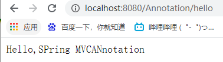

   ​	


# 4、Controller详解

## 1、 实现接口来写Controller

Controller接口源码的定义：

```java
@FunctionalInterface
public interface Controller {
    @Nullable
    ModelAndView handleRequest(HttpServletRequest var1, HttpServletResponse var2) throws Exception;
}
```

最精简方式

1. `web\WEB-INF\web.xml`

   ```xml
   <?xml version="1.0" encoding="UTF-8"?>
   <web-app xmlns="http://xmlns.jcp.org/xml/ns/javaee"
            xmlns:xsi="http://www.w3.org/2001/XMLSchema-instance"
            xsi:schemaLocation="http://xmlns.jcp.org/xml/ns/javaee http://xmlns.jcp.org/xml/ns/javaee/web-app_4_0.xsd"
            version="4.0">
       <servlet>
           <servlet-name>springmvc</servlet-name>
           <servlet-class>org.springframework.web.servlet.DispatcherServlet</servlet-class>
           <init-param>
               <param-name>contextConfigLocation</param-name>
               <param-value>classpath:spring-servlet.xml</param-value>
           </init-param>
           <load-on-startup>1</load-on-startup>
       </servlet>
       <servlet-mapping>
           <servlet-name>springmvc</servlet-name>
           <url-pattern>/</url-pattern>
       </servlet-mapping>
   </web-app>
   ```

2. `src\main\resources\spring-servlet.xml`

   ```xml
   <?xml version="1.0" encoding="UTF-8" ?>
   <beans xmlns="http://www.springframework.org/schema/beans"
          xmlns:xsi="http://www.w3.org/2001/XMLSchema-instance"
          xmlns:mvc="http://www.springframework.org/schema/mvc"
          xsi:schemaLocation="http://www.springframework.org/schema/beans
          http://www.springframework.org/schema/beans/spring-beans.xsd
          http://www.springframework.org/schema/mvc
          https://www.springframework.org/schema/mvc/spring-mvc.xsd">
       <mvc:default-servlet-handler/>
       <bean class="org.springframework.web.servlet.view.InternalResourceViewResolver" id="internalResourceViewResolver">
           <property name="prefix" value="/WEB-INF/jsp/"></property>
           <property name="suffix" value=".jsp"/>
       </bean>
       <bean name="/test1" class="com.zhang.controller.ControllerDemo1"></bean>
   </beans>
   ```

3. `src\main\java\com\zhang\controller\ControllerDemo1.java`

   ```java
   //只要实现了Controller接口的类,说明这就是一个控制器了
   public class ControllerDemo1 implements Controller {
       public ModelAndView handleRequest(HttpServletRequest httpServletRequest, HttpServletResponse httpServletResponse) throws Exception {
           ModelAndView modelAndView = new ModelAndView();
           modelAndView.addObject("msg","Controller1");
           modelAndView.setViewName("test");
           return modelAndView;
       }
   }
   ```

4. 页面`web\WEB-INF\jsp\test.jsp`

   ```jsp
   <%@ page contentType="text/html;charset=UTF-8" language="java" %>
   <html>
   <head>
       <title>Title</title>
   </head>
   <body>
   ${msg}
   </body>
   </html>
   ```


## 2、	使用注解来写Controller

- 下面几个注解作用相同，是在不同的控制器中使用的注解。

```java
@Controller
@Component
@Repository
@Service
```

- 为了使注解生效，需要在`src\main\resources\spring-servlet.xml`中使用扫描机制来找到所有基于注解的控制器类。

  ```xml
  <context:component-scan base-package="com.zhang.controller"/>
  <!-- 最好加上-->
  <mvc:annotation-driven/>
  ```

- 对应的JavaController的编写

  ```java
  @Controller
  //代表这个类会被Spring接管,被这个注
  // 解的类,如果方法返回值为String,并且有具体的页面可以跳转,那么就会自动被视图解析器解析。
  public class ControllerDemo2 {
      @RequestMapping("/t1")
      //放到方法上是return的页面的访问路径http://localhost:8080/t1
      //放到类上是页面的访问指增加了父路径http://localhost:8080/t1/test
      public String Demo2(Model model){
          model.addAttribute("msg","ControllerTest2");
          return "test";//  /WEB-INF/jsp/test.jsp
      }
  }
  ```


# 5、RESTful风格

`REST`（英文：**`Representational State Transfer`**，简称REST）描述了一个架构样式的网络系统。

RESTFUL是一种网络应用程序的设计风格和开发方式，基于HTTP，可以使用XML格式定义或JSON格式定义。

RESTFUL适用于移动互联网厂商作为业务接口的场景，实现第三方[OTT](https://baike.baidu.com/item/OTT/9960940)调用移动网络资源的功能，动作类型为新增、变更、删除所调用资源。

---

传统的URL带参访问方式：

```java
@RequestMapping("/add")
public String test(int a, int b, Model model){
    int res = a + b;
    model.addAttribute("msg","answer is "+res);
    return "test";
}
```

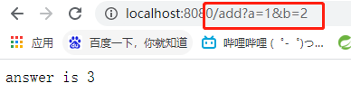

---

主要使用`@PathVariable`注解

RESTFUL风格的URL带参访问方式：

```java
@RequestMapping("/add/{a}/{b}")
public String test(@PathVariable int a,@PathVariable int b, Model model){
    int res = a + b;
    model.addAttribute("msg","answer is "+res);
    return "test";
}
```

输入URL后回车，默认调用的是GET方法：

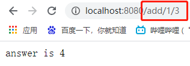

如果想要调用DELET，UPDATE等方法：

```java
    //这种显示的定义
    //@RequestMapping(value = "/add/{a}/{b}",method = RequestMethod.DELETE)
    //也可以使用组合的注解,
	//@GetMapping()、@PutMapping()、 @PostMapping()
	//下面这种只会处理POST请求
    @PostMapping("/add/{a}/{b}")
    public String test(@PathVariable int a,@PathVariable int b, Model model){
        int res = a + b;
        model.addAttribute("msg","answer is "+res);
        return "test";
    }
```

---

RESTful风格最大的好处是安全，并且也使代码简介，高效。


# 6、重定向和转发

在servlet中的重定向和转发的方式也可以使用，但是需要在Controller中传入`HttpServletRequest` `HttpServletResponse` 参数，然后调用方式就和以前一致。

```java
@Controller
public class ModelTest {
    @RequestMapping("/m1")
    public void test(HttpServletRequest request, HttpServletResponse response) throws IOException, ServletException {
        HttpSession session = request.getSession();
        System.out.println(session.getId());
        request.getRequestDispatcher("WEB-INF/jsp/test.jsp").forward(request,response);
        //return "test";
    }
}
```

---

SpringMVC中的转发和重定向，本身不需要视图解析器。

1. 先注释掉视图解析器`src\main\resources\spring-servlet.xml`

   ```xml
   <!--    <bean class="org.springframework.web.servlet.view.InternalResourceViewResolver" id="internalResourceViewResolver">-->
   <!--        <property name="prefix" value="/WEB-INF/jsp/"></property>-->
   <!--        <property name="suffix" value=".jsp"/>-->
   <!--    </bean>-->
   ```

2. 在Controller中写转发和重定向，没有视图解析器，需要加上前后缀：

   ```java
   @RequestMapping("/m2")
   public String test2(){
       //URL不变,说明是转发方式
       return "/WEB-INF/jsp/test.jsp";
   }
   @RequestMapping("/m3")
   public String test3(){
       //URL不变,转发方式
       return "forward:/WEB-INF/jsp/test.jsp";
   }
   @RequestMapping("/m4")
   public String test4(){
       //重定向
       return "redirect:index.jsp";
   }
   ```

加上视图解析器后的转发和重定向：

```java
@RequestMapping("/m2")
public String test2(){
    //是转发方式
    return "test";
}
@RequestMapping("/m4")
public String test4(){
    //重定向
    return "redirect:index.jsp";
}
```


# 7、数据处理

## 1、数据传入

1. 提交的域名中参数名和Controller方法中变量名一致

   ```shell
   http://localhost:8080/test5?name=zhang
   ```

   不需要特殊处理:

   ```java
   @RequestMapping("/test5")
   public String test5(String name){
       System.out.println(name);
       //输出zhang
       return "test";
   }
   ```

2. 提交的域名中参数名称和方法中变量名不一致

   ```bash
   http://localhost:8080/test6?username=zhangF
   ```

   使用注解`@RequestParam("username")`进行参数名的映射

   ```java
   @RequestMapping("/test6")
   public String test6(@RequestParam("username") String name){
       System.out.println(name);
       return "test";
   }
   ```

3. 提交的参数是一个对象

   ```java
   //http://localhost:8080/user/t2?id=213&name=zafd&age=13
   //如果传入的是对象,在URL传入的参数和POJO类匹配时,则可以正常传入
   //如果一致,则返回null或0
   @GetMapping("/t2")
   public String test2(User user){
       System.out.println(user);
       //User(age=13, name=zafd, id=213)
       return "test";
   }
   ```

## 2、数据传出

1. 通过`ModelAndView`

   ```java
   public ModelAndView handleRequest(HttpServletRequest httpServletRequest, HttpServletResponse httpServletResponse) throws Exception {
       ModelAndView modelAndView = new ModelAndView();
       modelAndView.addObject("msg","Controller1");
       modelAndView.setViewName("test");
       return modelAndView;
   }
   ```

2. 通过`Model`

   ```java
   //http://localhost:8080/user/t1?name=zasd
   @GetMapping("/t1")
   public String test1(String name, Model model){
       //1.接收前端参数
       System.out.println("前端接收的参数为"+name);
       //2.将返回结果传递给前端
       model.addAttribute("msg",name);
       //3.视图跳转
       return "test";
   }
   ```

3. 通过`ModelMap`

   使用方式和`Model`基本一致

   ```java
   public class ModelMap extends LinkedHashMap<String, Object>
   public class ExtendedModelMap extends ModelMap implements Model
   ```

   `ModelAndView`				-- 	可以在存储数据`ModelMap`的同时，进行设置返回的视图

   `ModelMap`							--	继承了`LinkedHashMap`

   `Model`									--	精简了`ModelMap`


## 3、乱码处理

乱码问题可遇不可求，所以看运气。

但是一些常见的乱码问题一般都可以解决。

---

1. Tomcat乱码，`apache-tomcat-9.0.45\conf\server.xml`

   ```xml
   <Connector URIEncoding="utf-8" port="8080"  protocol="HTTP/1.1"
                  connectionTimeout="20000"
                  redirectPort="8443" />
   ```

2. Tomcat日志乱码，`apache-tomcat-9.0.45\conf\logging.properties`

   将其中的`UTF-8`替换为`GBK`

3. 前端传入的数据乱码，就是前端输入汉字，到后台变成乱码，可以通过过滤器进行设置。

   - 自定义Servlet过滤器

     1. 重写`Filter`类方法`src\main\java\com\zhang\filter\EncodingFilter.java`

        ```java
        public class EncodingFilter implements Filter {
            public void init(FilterConfig filterConfig) throws ServletException { }
            public void doFilter(ServletRequest servletRequest, ServletResponse servletResponse, FilterChain filterChain) throws IOException, ServletException {
                servletRequest.setCharacterEncoding("utf-8");
                servletResponse.setCharacterEncoding("utf-8");
                filterChain.doFilter(servletRequest,servletResponse);
            }
            public void destroy() { }
        }
        ```

     2. 在web.xml中进行声明

        ```xml
        <filter>
            <filter-name>encoding</filter-name>
            <filter-class>com.zhang.filter.EncodingFilter</filter-class>
        </filter>
        <filter-mapping>
            <filter-name>encoding</filter-name>
            <url-pattern>/*</url-pattern>
        </filter-mapping>
        ```

        注意最后的为 `<url-pattern>/*</url-pattern>`为/*否则不会过滤jsp

   - 使用SpringMVC过滤器

     在web.xml中进行声明

     ```xml
     <filter>
         <filter-name>encoding</filter-name>
         <filter-class>org.springframework.web.filter.CharacterEncodingFilter</filter-class>
         <init-param>
             <param-name>encoding</param-name>
             <param-value>utf-8</param-value>
         </init-param>
     </filter>
     
     <filter-mapping>
         <filter-name>encoding</filter-name>
         <url-pattern>/*</url-pattern>
     </filter-mapping>
     ```

     注意最后的为 `<url-pattern>/*</url-pattern>`为/*否则不会过滤jsp


# 8、JSON

`JSON`(JavaScript Object Notation, JS 对象简谱) 是一种轻量级的数据交换格式。

- 简洁和清晰的层次结构使得 JSON 成为理想的数据交换语言。 

- 易于人阅读和编写，同时也易于机器解析和生成，并有效地提升网络传输效率。

## JSON 和 JS 对象互转

要实现从JSON字符串转换为JS对象，使用 JSON.parse() 方法：

```javascript
var obj = JSON.parse('{"a": "Hello", "b": "World"}'); 
//结果是 {a: 'Hello', b: 'World'}
```

要实现从JS对象转换为JSON字符串，使用 JSON.stringify() 方法：

```js
var json = JSON.stringify({a: 'Hello', b: 'World'});
//结果是 '{"a": "Hello", "b": "World"}'
```

## Jackson

主要是使用Jackson的ObjectMapper，将

```java
ObjectMapper mapper = new ObjectMapper();
String str = mapper.writeValueAsString(user);
```


首先要引入依赖包:

```xml
<dependency>
    <groupId>com.fasterxml.jackson.core</groupId>
    <artifactId>jackson-databind</artifactId>
    <version>2.12.3</version>
</dependency>
```

然后创建POJO类，创建Controller类

```java
@Controller
public class UserController {
    @RequestMapping("/j1")
    @ResponseBody//配合类的@Controller注解使用,加这个注解,不会走视图解析器,会直接返回一个字符串
    public String json1() throws JsonProcessingException {
        User user = new User(1312,"张",123);
        //Jackson的ObjectMapper
        ObjectMapper mapper = new ObjectMapper();
        String str = mapper.writeValueAsString(user);
        return str;
    }
}
```

在`src\main\resources\springmvc-servlet.xml`解决乱码问题

```xml
<!--JSON解决乱码问题-->
<mvc:annotation-driven>
    <mvc:message-converters>
        <bean class="org.springframework.http.converter.StringHttpMessageConverter">
            <constructor-arg value="UTF-8"/>
        </bean>
        <bean class="org.springframework.http.converter.json.MappingJackson2HttpMessageConverter">
            <property name="objectMapper">
                <bean class="org.springframework.http.converter.json.Jackson2ObjectMapperFactoryBean">
                    <property name="failOnEmptyBeans" value="false"/>
                </bean>
            </property>
        </bean>
    </mvc:message-converters>
</mvc:annotation-driven>
```

访问后对象变为字符串

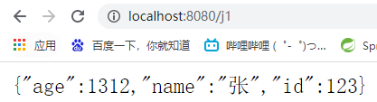

日期类型的操作:

```java
@RequestMapping("/j2")
public String json2() throws JsonProcessingException {
    Date date = new Date();
    SimpleDateFormat simpleDateFormat = new SimpleDateFormat("yyy-mm-dd HH-mm-ss");
    
    //Jackson的ObjectMapper
    ObjectMapper mapper = new ObjectMapper();
    return mapper.writeValueAsString(simpleDateFormat.format(date));
}
```

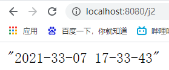


## FastJson

首先导入依赖:

```xml
<dependency>
    <groupId>com.alibaba</groupId>
    <artifactId>fastjson</artifactId>
    <version>1.2.76</version>
</dependency>
```

使用直接调用即可`JSON.toJSONString(objects)`:

```java
@RequestMapping("/j4")
public String json4(){
    ArrayList<User> objects = new ArrayList<>();
    User user = new User(1312,"张",123);
    User user1 = new User(1312,"张1",123);
    User user2 = new User(1312,"张2",123);
    User user3 = new User(1312,"张3",123);
    User user4 = new User(1312,"张4",123);
    objects.add(user);
    objects.add(user1);
    objects.add(user2);
    objects.add(user3);
    objects.add(user4);

    String string = JSON.toJSONString(objects);
    return string;
}
```

常用方法:

```java
JSON.parse()
JSON.parseObject()
JSON.parseArray()
JSON.toJSONString()
JSON.toJSON()
```

